**Last updated 18th July 2022**

## Objective

This guide details how to set up advanced replication and disaster recovery plans with **Nutanix Leap** in **Prism Central**.

## Introduction

Nutanix Leap allows:

- Asynchronous and synchronous replication based on the chosen licence pack
- Test replicas
- Advanced disaster recovery plans with virtual machine startup and, in some cases, cluster-to-cluster failover automation (only with synchronous replication and a cluster witness)
- a destination to the Nutanix cloud with **Xi Leap** (note that this solution is not available with licences provided by OVHcloud)

> [!warning]
> OVHcloud provides services for which you are responsible, with regard to their configuration and management. It is therefore your responsibility to ensure that they work properly.
>
> This guide is designed to assist you as much as possible with common tasks. Nevertheless, we recommend contacting a specialist provider if you experience any difficulties or doubts when it comes to managing, using or setting up a service on a server.
>

## Requirements

- Two Nutanix clusters in your OVHcloud account
- Access to the [OVHcloud Control Panel](https://www.ovh.com/auth/?action=gotomanager&from=https://www.ovh.de/&ovhSubsidiary=de)
- Access to your clusters via **Prism Central**
- An interconnection between two clusters, for example using these technologies:
    - via an IPsec VPN as detailed in the guide [Interconnecting IPsec between two sites](https://docs.ovh.com/de/nutanix/ipsec-interconnection/)
    - or via a [vRack](https://www.ovh.de/loesungen/vrack/) connection.
- **Prism Central** needs more resources depending on the mode:
    - Single Mode: 4GB additional RAM.
    - Scale Mode with 3 **Prism Central** virtual machines: 8 GB additional RAM per virtual machine.

## Instructions

Our Disaster Recovery Plan via **Nutanix Leap** will be set up between two clusters, both of which are located in remote OVHcloud datacentres, one in Canada and the other in France. The two clusters are connected by an IPSec VPN with this network configuration:

- Cluster administration LAN in France: **192.168.0.0/24**.
- Cluster administration LAN in Canada: **192.168.10.0/24**.

- Production LAN for VMs, common to both clusters: **192.168.50.0/24** on VLAN 50.
- Test LAN common to both clusters: **192.168.51.0/25** on VLAN 51.

### Commissioning of Nutanix Leap

#### Adding an iSCSI IP address on each cluster

Before you enable **Nutanix Leap**, you must add an IP address for iSCSI connections on each cluster.

Using **Prism Central**, connect to **Prism Element** on the cluster in France. You can use the [Nutanix Hyperconvergence guide](https://docs.ovh.com/de/nutanix/nutanix-hci/) for more information.

In the top left-hand corner of the **Prism Element** dashboard, click `the cluster name`{.action}.

{.thumbnail}

Enter an unused IP `address from the management network `in the **iSCSI Data Service IP** field and click `Save`{.action}.

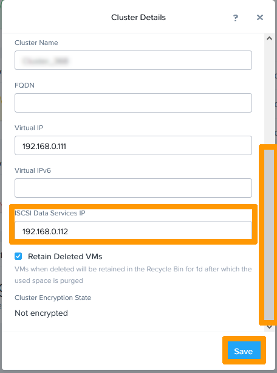{.thumbnail}

Also via **Prism Central**, now perform the same operation on the cluster in Canada.

In the top left-hand corner of the **Prism Element** dashboard, click `The cluster`{.action} name.

{.thumbnail}

Enter `an unused IP address from the management network `in the **iSCSI Data Service IP** field and click `Save`{.action}.

{.thumbnail}

#### Enabling Leap

Go back to the **Prism Central** interface for the cluster in France.

From the main menu, click `Recovery Plans`{.action} in the `Data Protection` submenu.

{.thumbnail}

Click `Enable Leap`{.action}.

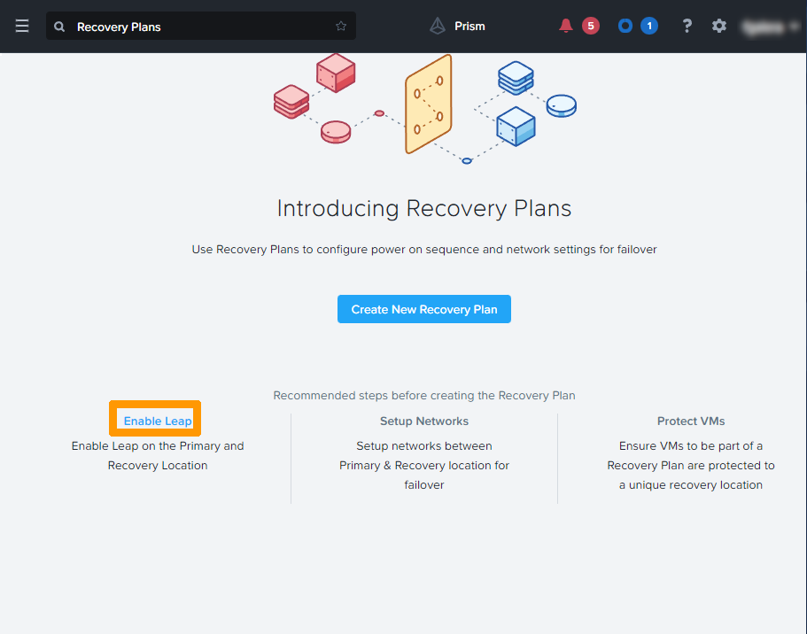{.thumbnail}

When you see `Prechecks successful`, click `Enable`{.action}.

{.thumbnail}

Now go back to the **Prism Central** interface of the cluster in Canada and do the same.

Click `Recovery Plans`{.action}.

{.thumbnail}

Click `Enable Leap`{.action}.

{.thumbnail}

Again, when `Prechecks successful` appears on the screen, click `Enable`{.action}.

{.thumbnail}

Each cluster now has an **Availability zone**, which allows them to be interconnected.

### Connecting both clusters.

Stay on **Prism Central** in the cluster in Canada.

From the main menu, click `Availability Zones`{.action} under `Administration`.

{.thumbnail}

Then click `Connect to Availability Zone`{.action}.

{.thumbnail}

Enter this information:

- **Availability Zone Type**: `Physical Location`.
- **IP Address for Remote PC**: `IP address of the remote` Prism Central.
- **Username**: `Remote` Central Prism administrator account.
- **Password** `Remote` Central Prism account password.

Then click `Connect`{.action}.

{.thumbnail}

The remote cluster is named after the private IP address of the **Prism Central** in France, preceded by **PC_**.

{.thumbnail}

Connect to the cluster in France with **Prism Central**. 

From the main menu, click `Availability Zones`{.action} on the `Administration` submenu. You will see that the remote site in Canada appears with the private IP address of the **Prism Central** in Canada preceded by **PC_**.

{.thumbnail}

### Implementation of replication from Canada to France

> [!warning]
> Virtual machines that will be protected with **Nutanix Leap** should not be members of a **Domain Protection** created from **Prism Element**. There is a procedure on the Nutanix website to perform this migration: [Migrating from a Domain Protection](https://portal.nutanix.com/page/documents/details?targetId=Leap-Xi-Leap-Admin-Guide-v6_1:ecd-ecdr-migratevm-protectiondomaintoprotectionpolicy-pc-t.html){.external}. 
>

#### Creating a category containing the virtual machines to replicate

From the main menu, click `Categories`{.action} on the `Administration` submenu.

{.thumbnail}

Click `New Category`{.action}.

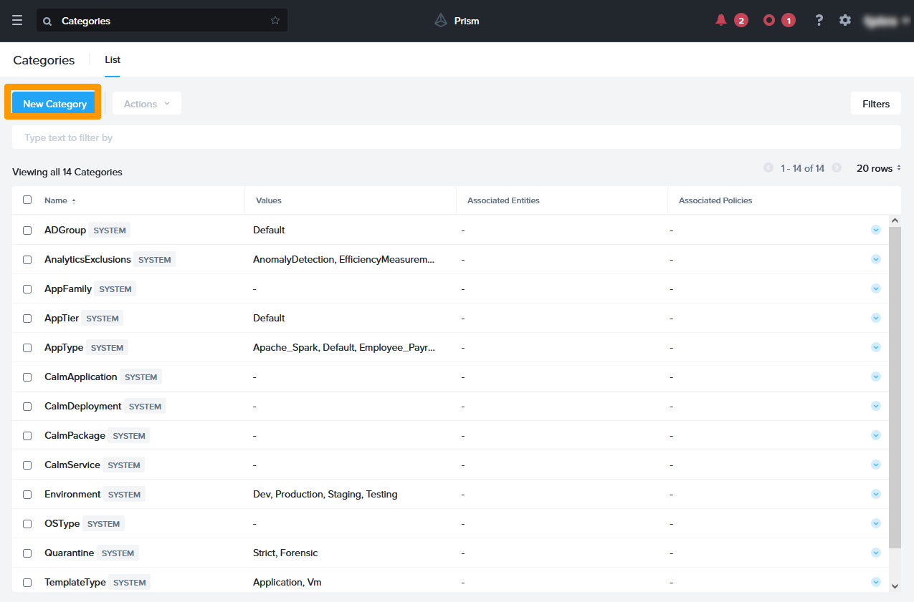{.thumbnail}

Enter this information:

- **Name**: `replicated-vm`
- **values**: `from-canada`

Then click `Save`{.action}.

{.thumbnail}

Go back to the main menu and select `VMs`{.action} under `Compute and Storage`.

{.thumbnail}

Select the virtual machine by using the `check box`{.action} to its left, then click the `Actions`{.action} button.

{.thumbnail}

In this menu, click `Manage Categories`{.action}.

{.thumbnail}

Select the category you created and click the blue `+`{.action} button.

{.thumbnail}

Click `Save`{.action}.

{.thumbnail}

#### Creating the protection policy

A protection policy creates a scheduled replication between two *Availability zones*. You can choose this type of schedule depending on your licence: 

- asynchronous every hour
- *nearsync* between 1 and 15 minutes
- synchronous with a delay of 0 seconds (this mode requires a network latency of less than 5ms between the two clusters)

From the main menu, click `Protection Policies`{.action} under `Data Protection`.

{.thumbnail}

Click `Create Protection Policy`{.action}. 

{.thumbnail}

Enter a name in the **Policy name** field.

In the **Primary location** box, choose these options: 

- **Location**: `Local AZ` to choose the zone containing the local cluster.
- **Cluster**: `Cluster containing the virtual machines to be replicated`.

Click `Save`{.action}.

{.thumbnail}

In the **Recovery location** frame, choose these options:

- **Location**: `Remote cluster zone`.
- **Cluster**: `Destination cluster`.

Click `Save`{.action}.

{.thumbnail}

Then click `+ Add schedule`{.action}.

{.thumbnail}

Choose `Asynchronous` as **Protection Type**.

Change the **Take Snapshot Every** option to `Minutes: 15` to do *nearsync* replication.

Select the `Take App-Consistent Snapshots` checkbox and click `Save Schedule`{.action}.

{.thumbnail}

Click `Next`{.action}.

{.thumbnail}

Select the `category` where the virtual machine was added and click `Add`{.action}.

{.thumbnail}

Click `Create`{.action}.

{.thumbnail}

The protection policy is enabled and appears in the **Protection Policies** dashboard.

{.thumbnail}

### Disaster Recovery Plan Management

#### Introduction 

Disaster recovery plans can be created with various options: 

- Manually launch disaster recovery plan if there is no cluster witness.
- Synchronous replication disaster recovery plan automation with a cluster witness.
- Choose how virtual machines start when the disaster recovery plan is activated with the ability to run a script.

In our example, this will be a manual disaster recovery plan that includes automatic startup of virtual machines.

#### Creating Disaster Recovery Plan

From the main menu, choose `Recovery Plans`{.action} under `Data Protection`.

{.thumbnail}

Click `Create New Recovery Plan`{.action}. 

{.thumbnail}

Enter these values: 

- **Recovery Plan Name**: `the name of the disaster recovery plan`.
- **Primary Location**: `Local AZ` to choose the zone containing the local cluster.
- **Recovery Location**: `Name of the Remote Area` that will be used for the disaster recovery plan.

Click `Next`{.action}. 

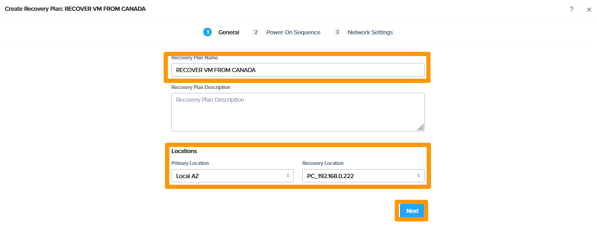{.thumbnail}

Click `Add Entities`{.action}. 

{.thumbnail}

Select the `checkbox`{.action} next to the virtual machine that is part of the disaster recovery plan, then click `Add`{.action}.

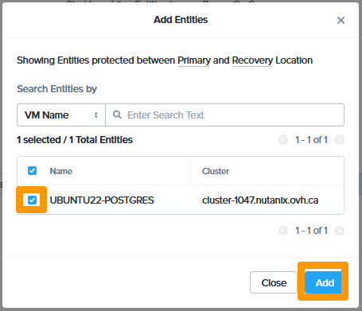{.thumbnail}

Select the `checkbox`{.action} next to the virtual machine that should start automatically when the disaster recovery plan is enabled.

Then click `Next`{.action}. 

{.thumbnail}

After reviewing the Disaster Recovery Plan presentation, click `OK, Got it`{.action}. 

{.thumbnail}

On the primary site, choose these options:

- **Production**: `Production VLAN`
- **Test Failback**: `Test VLAN` 

On the recovery site, choose these options:

- **Production**: `Production VLAN`
- **Test Failback**: `Test VLAN` 

Then click `Done`{.action}.

{.thumbnail}

The disaster recovery plan appears in the list.

{.thumbnail}

#### Scheduled migration 

##### **Migrating a site in Canada to France**

Connect with **Prism Central** on the cluster in France to switch the virtual machine from Canada to France.

From the main menu, choose `Recovery Plans`{.action} in the `Data Protection` section.

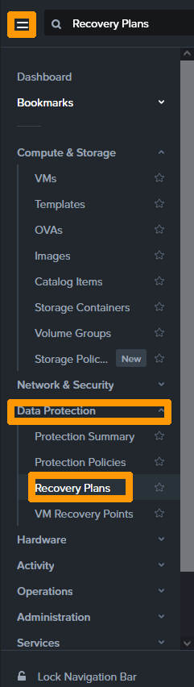{.thumbnail}

Select the disaster recovery plan by using the `checkbox` to the left of it, then click the `Actions`{.action} button to open the menu.

{.thumbnail}

Click `Failover`{.action}. 

{.thumbnail}

Select `Planned Failover`{.action} as the type of Failover and click the `Failover`{.action} button.

{.thumbnail}

Type `Failover`{.action} in the confirmation field and click the `Failover`{.action} button.

{.thumbnail}

The migration steps are described below:

1. Stopping the virtual machine on the original cluster.
2. Synchronising the latest changes.
3. Deleting the virtual machine on the original cluster.
4. Adding the virtual machine on the destination cluster.
5. Starting the virtual machine on the destination cluster.

The result of the migration appears in the **Last Failover Status** column with the status `Succeeded` if everything went well.

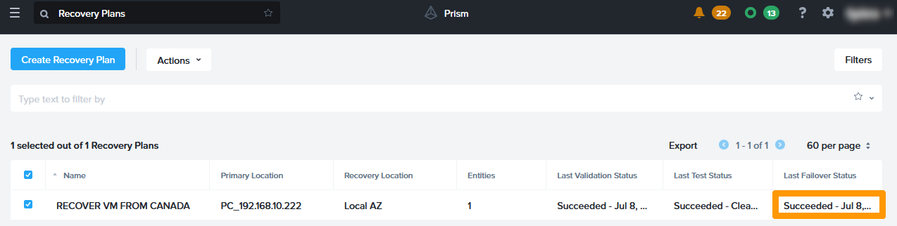{.thumbnail}

##### **Reverse Replication**

In the case of scheduled failover, you must reverse replication to continue to have redundancy between the two sites.

Using **Prism Central**, log in to the destination cluster in France.

From the main menu, choose `Protection Policies`{.action} from the `Data Protection` submenu.

{.thumbnail}

Select the `checkbox`{.action} to the left of the protection policy and click the `Actions`{.action} button.

{.thumbnail}

Click the `Update`{.action} button.

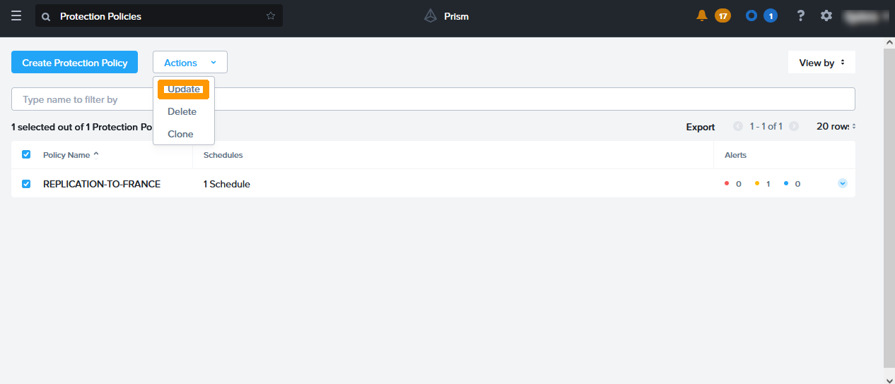{.thumbnail}

Move left under `Primary Location` until a menu appears. Click `Edit`{.action}.

{.thumbnail}

Edit the following information in the **Primary Location** frame:

- **Location**: `Local AZ`
- **Cluster**: `local area cluster`

Then click `Save`{.action}.

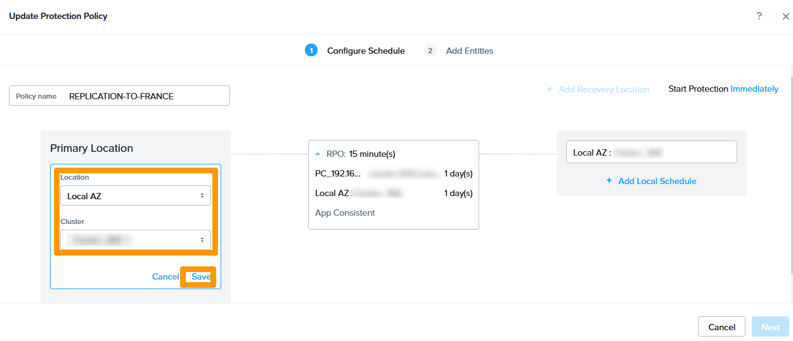{.thumbnail}

Click `Update Location`{.action}.

{.thumbnail}

Move to the right below the destination until a menu appears. Click `Edit`{.action}.

{.thumbnail}

Then edit the following information as part of **Recovery Location**:

- **Location**: `destination area`.
- **Cluster**: `cluster of the destination area`.

Click `Save`{.action}.

{.thumbnail}

Click `Update Location`{.action}.

{.thumbnail}

Click `Next`{.action}. 

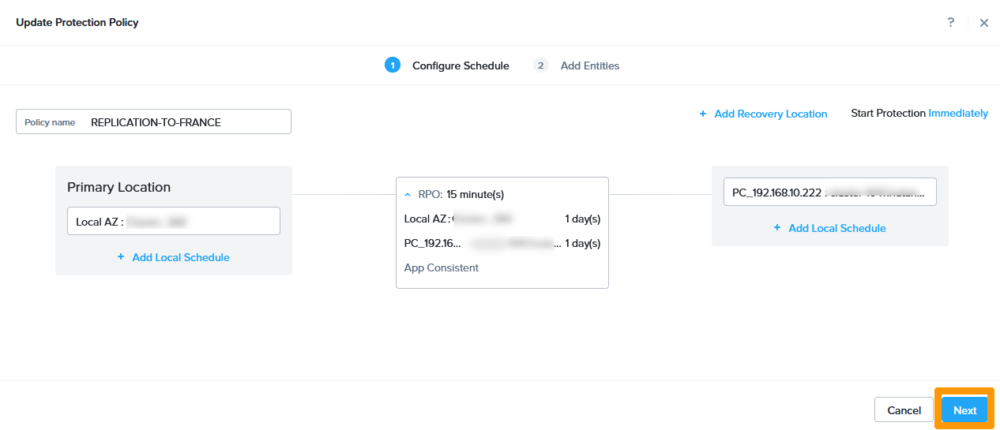{.thumbnail}

Click `Update`{.action} to complete the inversion.

{.thumbnail}

##### **Modifying Disaster Recovery Plan**

You must also change the disaster recovery plan by reversing the source and destination.

From the main menu, choose `Recovery Plans`{.action} from the `Data Protection` submenu.

{.thumbnail}

Select the disaster recovery plan by using the `checkbox`{.action} to the left of the plan, then click the `Actions`{.action} button.

{.thumbnail}

From the actions menu, click `Update`{.action}.

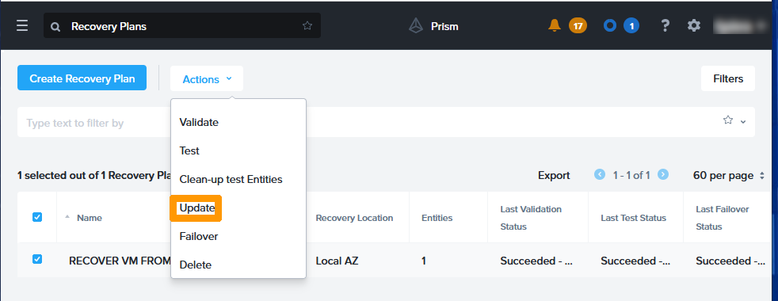{.thumbnail}

In the **Primary Location** drop-down menu on the left, replace the remote cluster with `Local AZ`{.action}.

{.thumbnail}

Choose `The remote area`{.action} in **Recovery Location** on the right instead of Local AZ.

{.thumbnail}

Now that the source and destination of the disaster recovery plan have changed, click `Next`{.action}.

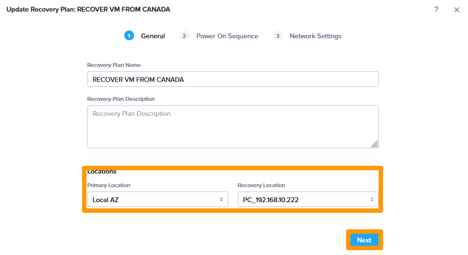{.thumbnail}

Click `Proceed`{.action}.

{.thumbnail}

Select the `Virtual Machine` that you want to start during the disaster recovery plan and click `Next`{.action}.

{.thumbnail}

On the primary site, choose these options:

- **Production**: `Production VLAN`
- **Test Failback**: `Test VLAN` 

At the destination site, choose these options:

- **Production**: `Production VLAN`
- **Test Failover**: `Test VLAN` 

Then click `Done`{.action}. 

{.thumbnail}

The disaster recovery plan has been modified to allow the virtual machines in the cluster to be switched from the French to the Canadian virtual machines. 

If you want to return to the original operation, you will need to failover, change replication, and change the disaster recovery plan.

{.thumbnail}

#### Enabling disaster recovery plan following an incident on the original cluster

The disaster recovery plan is also used in the event of a problem with the original cluster. In this case, the activation will be done without the data modified since the last synchronisation.

If a synchronous replication solution is used, no data loss will occur.

In our case, replication is scheduled every 15 minutes, the risk of data loss can, in the worst case, corresponds to this duration.

From **Prism Central**, connect to the cluster that is receiving replicas.

From the main menu, choose `Recovery Plan`{.action} from the `Data Protection` submenu.

{.thumbnail}

Select the Disaster Recovery Plan with the `checkbox`{.action} and click the `Actions`{.action} button. 

{.thumbnail}

Choose `Failover`{.action} from the menu. 

{.thumbnail}

Check `Unplanned Failover`{.action} and click `Failover`{.action}

{.thumbnail}

Type `Failover` in the confirmation field and click `Failover`{.action}

{.thumbnail}

The virtual machine that is a member of the disaster recovery plan will boot to the destination cluster with the contents of the last replication.

## Go further

[Disaster Recovery Plan on Nutanix](https://docs.ovh.com/de/nutanix/disaster-recovery-plan-overview/)

[IPsec interconnect between two sites](https://docs.ovh.com/de/nutanix/ipsec-interconnection/)

[OVHcloud vRack](https://www.ovh.de/loesungen/vrack/)

[Nutanix Leap documentation](https://portal.nutanix.com/page/documents/details?targetId=Leap-Xi-Leap-Admin-Guide-v6_1:Leap-Xi-Leap-Admin-Guide-v6_1)

Join our community of users on <https://community.ovh.com/en/>.
