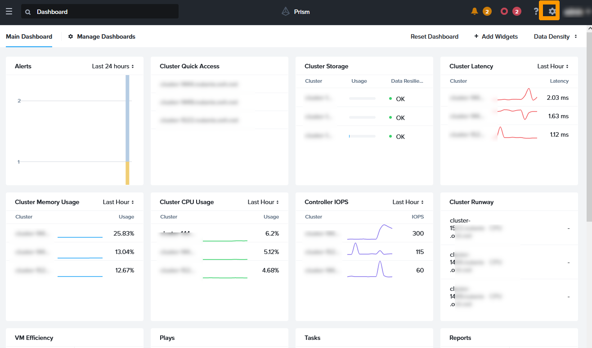

**Last updated 15th november 2022**

## Objective

**This guide introduces Metro Availability, which provides an automated disaster recovery plan.** 

> [!warning]
> OVHcloud provides services for which you are responsible, with regard to their configuration and management. It is therefore your responsibility to ensure that they work properly.
>
> This guide is designed to assist you as much as possible with common tasks. Nevertheless, we recommend contacting a specialist provider if you experience any difficulties or doubts when it comes to managing, using or setting up a service on a server.
>

## Requirements

- Access to the [OVHcloud Control Panel](https://ca.ovh.com/auth/?action=gotomanager&from=https://www.ovh.com/world/&ovhSubsidiary=ws)
- Access to your clusters via Prism Central
- You need to have 3 Nutanix clusters within the OVHcloud infrastructure with **Pack Advanced** licences, if you have a package offer on both clusters in the P.R.A. These 3 clusters will need to be at remote sites for maximum security.
- You must have less than 5 ms of latency between the two replicated clusters.

## Introduction

We will set up a two-way disaster recovery plan between two clusters with this hardware:

- A Nutanix cluster in Roubaix, France, with virtual machines replicated in Gravelines.
- A Nutanix cluster in Gravelines, France, with virtual machines replicated in Roubaix.
- A Nutanix cluster in Erith, England with Prism Central to serve as a witness in the disaster recovery plan.

We will only use one vRack, which will contain:

- The three Nutanix clusters.
- Load balancers.
- Additional IP addresses on the **rtvRack**.

Below is the diagram showing the three sites:

{.thumbnail}

## Instructions

- [Step 1 Configuration](#configuration)
    - [Step 1.1 Interconnection of the three clusters](#connectcl)
    - [Step 1.2 Delete the Prism Central records for the Roubaix and Gravelines clusters](#delpc)
    - [Step 1.3 Register both clusters on Prism Central in Erith](#regpc)
    - [Step 1.4 Adding IP Addresses for iSCSI Connections on All Three Clusters](#configiscsi)
    - [Step 1.5 Creating two Storage Containers](#addsc)
    - [Step 1.6 Move virtual machines to the Storage Container](#movevm)
    - [Step 1.7 Creation of a category to be used when implementing the P.R.A.](#creacat)
    - [Step 1.8 Add virtual machines in categories](#addvmcat)
    - [Step 1.9 Setting up synchronous replications between Roubaix and Gravelines](#confreplsync)
    - [Step 1.10 Create Subnets for Disaster Recovery Plan](#addsublan)
    - [Step 1.11 Implementation of disaster recovery plans](#adddr)
- [Step 2 - Validate Disaster Recovery Plan](#validation)
    - [Step 2.1 Monitoring the Disaster Recovery Plan](#ctrldr)
    - [Step 2.2 Live migration of virtual machines from Roubaix to Gravelines](#livemigration)
    - [Step 2.3 Operations after a migration](#aftermigration)
    - [Step 2.4 Execute the Disaster Recovery Plan in Real Condition](#epmcr)

We will implement this disaster recovery plan step by step.

The cluster configuration information used in our guide is as follows:

- Roubaix cluster:
    - Server 1: VM address **CVM** `192.168.0.21`, hypervisor IP address **AHV** `192.168.0.1`.
    - Server 2: VM address **CVM** `192.168.0.22`, hypervisor IP address **AHV** `192.168.0.2`.
    - Server 3: VM address **CVM** `192.168.0.23`, hypervisor IP address **AHV** `192.168.0.3`.
    - Prism Element virtual address: `192.168.0.100`.
    - Prism Element iSCSI address: `192.168.0.102`.
    - Prism Central IP address: `192.168.0.101`.
    - Gateway: `192.168.3.254`.
    - Mask: `255.255.252.0`
    - Cluster version: `6.5`

- Gravelines cluster:
    - Server 1: VM address **CVM** `192.168.1.21`, hypervisor IP address **AHV** `192.168.1.1`.
    - Server 2: VM address **CVM** `192.168.1.22`, hypervisor IP address **AHV** `192.168.1.2`.
    - Server 3: VM address **CVM** `192.168.1.23`, hypervisor IP address **AHV** `192.168.1.3`.
    - Prism Element virtual address: `192.168.1.100`.
    - Prism Element iSCSI address: `192.168.1.102`.
    - Prism Central IP address: `192.168.1.101`.
    - Gateway: `192.168.3.254`.
    - Mask: `255.255.252.0`
    - Cluster version: `6.5`.
 
- Erith Cluster:
    - Server 1: VM address **CVM** `192.168.2.21`, hypervisor IP address **AHV** `192.168.2.1`.
    - Server 2: VM address **CVM** `192.168.2.22`, hypervisor IP address **AHV** `192.168.2.2`.
    - Server 3: VM address **CVM** `192.168.2.23`, hypervisor IP address **AHV** `192.168.2.3`.
    - Prism Element virtual address: `192.168.2.101`.
    - Prism Element iSCSI address: `192.168.2.102`.
    - Prism Central IP address: `192.168.2.100`.
    - Gateway: `192.168.3.254`.
    - Mask: `255.255.252.0`
    - Cluster version: `6.5`.

In addition to this guide, you can use these documents:

- [Nutanix hyperconvergence](https://docs.ovh.com/us/es/nutanix/nutanix-hci/) 
- [advanced tools](https://docs.ovh.com/us/es/nutanix/advanced-tools/)

<a name="configuration"></a>

### Step 1 - Configuration

<a name="connectcl"></a>

#### Step 1.1 - Interconnection of the three clusters

The first step is to interconnect the three clusters on the same OVHcloud vRack. 

Use this guide to connect your clusters: [Interconnect clusters through the vRack](https://docs.ovh.com/us/es/nutanix/nutanix-vrack-interconnection/). To connect the three clusters, use the instructions provided in the guide:

- Roubaix clusters in the vRack dedicated to Gravelines.
- Erith clusters in the vRack dedicated to Gravelines.

When you have finished configuring your vRack, you will have these elements in your vRack:

- 9 dedicated servers (3 per cluster)
- 3 public IP addresses
- 3 Load Balancers

{.thumbnail}

The three clusters are currently accessible from the Prism Central URL of each cluster.

<a name="delpc"></a>

#### Step 1.2 - Delete the Prism Central records for the Roubaix and Gravelines clusters

To implement a disaster recovery plan solution with **Metro Availability**, a cluster witness is required to automate tasks in the event of one of the clusters becoming unavailable. The cluster witness is located on a Prism Central virtual machine.

The Erith cluster will host the Prism Central virtual machine for the three clusters, and serve as a cluster witness for the disaster recovery plan between Roubaix and Gravelines. 

##### **Disabling Prism Central on the Roubaix cluster**

Connect via SSH to the Prism Element cluster in Roubaix:

```bash
ssh nutanix@private_ip_address_prism_element_Roubaix
Enter Prism Element password
```

Run this command to remove Prism Element from the Prism Central configuration:

```bash
ncli multicluster remove-from-multicluster external-ip-address-or-svm-ips=private_ip_address_central_roubaix\
username=admin password=pwd_pe_Roubaix force=true
```

This message appears when disconnecting from Prism Central.

```console
Cluster unregistration is currently in progress. This operation may take a while.
```

Enter this command:

```bash
ncli cluster info
```

Note the value of the  **Cluster UUID** that must have this form **xxxxxxxx-xxxx-xxxx-xxxx-xxxxxxxxxxxx**.

Disconnect from Prism Element and connect via SSH on the Prism Central virtual machine in Roubaix.

```bash
ssh nutanix@private_ip_address_prism_central_roubaix
Enter Prism Central password
```

Enter this command:

```bash
python /home/nutanix/bin/unregistration_cleanup.py cluster_uuid_prism_element_Roubaix
```

##### **Disabling Prism Central on the Gravelines cluster**

Log in to the Prism Element cluster in Gravelines via SSH.

```bash
ssh nutanix@private_ip_address_prism_element_Gravelines
Enter Prism Element password
```

Enter this command:

```bash
ncli multicluster remove-from-multicluster external-ip-address-or-svm-ips=private_ip_address_prism_central_Gravelines\
username=admin password=pwd_pe_Gravelines force=true
```

This message appears when disconnecting from Prism Central.

```console
Cluster unregistration is currently in progress. This operation may take a while.
```

Enter this command:

```bash
ncli cluster info
```

Note the value of **Cluster UID** that should be in this form **xxxxxxxx-xxxx-xxxx-xxxx-xxxxxxxxxxxx**

Disconnect from Prism Element and connect via SSH on the Prism Central virtual machine in Gravelines.

```bash
ssh nutanix@private_ip_address_prism_central_Gravelines
enter Prism Central password
python /home/nutanix/bin/unregistration_cleanup.py cluster_uuid_prism_element_Gravelines
```

<a name="regpc"></a>

#### Step 1.3 - Registration of the two clusters on the Prism Central in Erith

Log in to the Prism Element in Roubaix via SSH:

```bash
ssh nutanix@private_ip_address_prism_element_Roubaix
enter Prism Element password
```

Run this command:

```bash
ncli multicluster register-to-prism-central username=admin password=passwod_admin\ external-ip-address-or-svm-ips=private_ip_address_prism_central_Erith
```

This message appears:

```console
Cluster registration is currently in progress. This operation may take a while.
```

Wait and enter this command:

```bash
ncli multicluster get-cluster-state
```

If the cluster is connected to Prism Central in Erith, you will see this information:

```console
Registered Cluster Count: 1

    Cluster Id                : xxxxxxxx-xxxx-xxxx-xxxx-xxxxxxxxxxxx
    Cluster Name              : Prism-Central-Erith-FQDN
    Is Multicluster           : true
    Controller VM IP Addre... : [private_ip_address_prism_central_Erith]
    External or Masqueradi... :
    Cluster FQDN              :
    Controller VM NAT IP A... :
    Marked for Removal        : false
    Remote Connection Exists  : true
```

Log in to Prism Element in Gravelines via SSH:

```bash
ssh nutanix@adresse_ip_prism_element_Gravelines
Enter Prism Element password from Gravelines
```

Run this command:

```bash
ncli multicluster register-to-prism-central username=admin password=passwod_admin_Erith external-ip-address-or-svm-ips=private_ip_address_central_Erith
```

This message appears:

```console
Cluster registration is currently in progress. This operation may take a while.
```

Wait and enter this command:

```bash
ncli multicluster get-cluster-state
```

If the cluster is connected to the Prism Central in Erith, you will see this information:

```console
Registered Cluster Count: 1

    Cluster Id                : xxxxxxxx-xxxx-xxxx-xxxx-xxxxxxxxxxxx
    Cluster Name              : Prism-Central-Erith-FQDN
    Is Multicluster           : true
    Controller VM IP Addre... : [private_ip_address_prism_central_Erith]
    External or Masqueradi... :
    Cluster FQDN              :
    Controller VM NAT IP A... :
    Marked for Removal        : false
    Remote Connection Exists  : true
```

From a web browser, log in to the URL from Prism-Central to Erith, you will see the three clusters.

{.thumbnail}

The Prism Central virtual machines in Gravelines and Roubaix are no longer being used. You can stop them.

In the main menu, click `Vms`{.action} in the **Compute & Storage** submenu.

{.thumbnail}

Select the Prism Central virtual machines in Gravelines and Roubaix and click `Guest Shutdown`{.action} from the `Actions`{.action} menu.

{.thumbnail}

<a name="configiscsi"></a>

#### Step 1.4 - Adding IP Addresses for iSCSI Connections on All Three Clusters

From the Prism Central dashboard, click the link to the `Erith cluster`{.action} .

{.thumbnail}

On the Prism Element dashboard, click the `cluster name`{.action} in the top left-hand corner.

{.thumbnail}

Scroll down the window, add an "unused IP address" to `ISCSI Data Services IP`, and click `Save`{.action}.

{.thumbnail}

From the Prism Central dashboard, click the link to the "Gravelines cluster".

{.thumbnail}

On the Prism Element dashboard, click "the cluster name" in the top left-hand corner.

{.thumbnail}

Scroll down the window, add an "unused IP" address to `ISCSI Data Services IP`, and click `Save`{.action}.

{.thumbnail}

From the Prism Central dashboard, click on the link to the "Roubaix cluster".

{.thumbnail}

On the Prism Element dashboard, click the "cluster name" in the top left-hand corner.

{.thumbnail}

Scroll down the window, add an « unused IP address » to `ISCSI Data Services IP`, and click `Save`{.action}.

{.thumbnail}

<a name="addsc"></a>

#### Step 1.5 - Creating Two Storage Containers

We will create two Storage Containers with the same name, one in Roubaix and the other in Gravelines. 
 
From the Prism Element main menu, click `Storage Containers`{.action} in the `Compute & Storage`{.action} submenu.

{.thumbnail}

Click `Create Storage Container`{.action}.

{.thumbnail}

Type `UsedForDR` in **Name**, choose the Roubaix `cluster` in **Cluster**, and click `Create`{.action}.

{.thumbnail}

Click `Create Storage Container`{.action}.

{.thumbnail}

Type `UsedForDR` in **Name**, choose the **Gravelines cluster** in `Cluster`, and click `Create`{.action}.

{.thumbnail}

In the list of `Storage Containers`, you will see two Storage Containers with the same name. One on the Roubaix cluster and the other on the Gravelines cluster.

{.thumbnail}

<a name="movevm"></a>

#### Step 1.6 - Moving virtual machines to the Storage Container

We will move the virtual machine storage to the `Storage Container` we have created.

Connect via SSH on the Prism Element of the Roubaix cluster:

```bash
ssh nutanix@private_ip_address_Prism_element_Roubaix
Enter the Nutanix account password of Prism Element
```

Run this command for each VM we will move to the `Storage Container`, replacing **vmname** with the name of the virtual machine (in our disaster recovery plan, we have two virtual machines in Roubaix, one on Windows and one on Linux).

```bash
acli vm.update_container vmname container=UsedForDR
Enter the Nutanix account password of Prism Element
```

Log in to the Prism Element of the Gravelines cluster via SSH:

```bash
ssh nutanix@private_ip_address_Prism_element_Gravelines
Enter the Nutanix account password of Prism Element
```

Execute this command for each VM that we will move to the `Storage Container`, replacing **vmname** with the name of the virtual machine (in our disaster recovery plan, we have three virtual machines in Gravelines, one on Windows, another on Linux and the gateway that gives access to the Internet). 

```bash
acli vm.update_container vmname container=UsedForDR
Enter the Nutanix account password of Prism Element
```
<a name="creacat"></a>

#### Step 1.7 - Creation of a category to be used when implementing the P.R.A

We will create a category with two values in Prism Central to assign the virtual machines involved in replication.

Scroll through the main menu, click `Categories`{.action} on the `Administration`{.action} submenu.

{.thumbnail}

Click `New Category`{.action}.

{.thumbnail}

Type `Protected VM` in **Name**, add the `Roubaix` and `Gravelines` values in **Values** and click on the next button `Save`{.action}.

{.thumbnail}

The category appears in the list and is ready to use.

{.thumbnail}

<a name="addvmcat"></a>

#### Step 1.8 - Adding virtual machines in categories

We will assign two virtual machines on the Roubaix cluster in one category and three virtual machines on the Gravelines cluster in another category.

From the Prism Central main menu, click `Vms`{.action} in the `Compute & Storage`{.action} submenu.

{.thumbnail}

**Select the two virtual machines** in Roubaix on the left, then on the `Actions`{.action} menu, click `Manage Categories`{.action}.

{.thumbnail}

Add the category `ProtectedVM: Roubaix`, then click `Save`{.action}.

{.thumbnail}

Select `the three virtual machines`{.action} in Gravelines on the left, and on the `Actions`{.action} menu, click `Manage Categories`{.action}.

{.thumbnail}

Add the category `ProtectedVM: Gravelines`, then click `Save`{.action}.

{.thumbnail}

<a name="confreplsync"></a>

#### Step 1.9 - Setting up synchronous replications between Roubaix and Gravelines

Synchronous replication allows permanent replication with 0 seconds of data loss.

##### **Replication setup between Roubaix and Gravelines**

On the Prism Central main menu, click `Protection Policies`{.action} in the `Data Protection`{.action} submenu.

{.thumbnail}

Click `Create Protection Policy`{.action}.

{.thumbnail}

Type `ROUBAIX-TO-GRAVELINES` in **Policy name**, keep `Local AZ`, and click `Select Cluster`{.action} in **Primary Location**.

{.thumbnail}

Choose the Roubaix cluster and click `Save`{.action}.

{.thumbnail}

In the top left-hand corner next to **Disaster Recovery**, click `Enable`{.action}. 

{.thumbnail}

The system checks that everything is correct before enabling **Disaster Recovery**.

{.thumbnail}

Click `Enable`{.action} to enable the **Disaster Recovery** option. 

{.thumbnail}

Click `Enable`{.action} again. 

{.thumbnail}

Your **Disaster Recovery** option is being activated.

Keep `Local AZ`, select the cluster in **Recovery Location** and click `Save`{.action}.

{.thumbnail}

Click `+ Add Schedule`{.action}.

{.thumbnail}

Choose `Synchronous`{.action} for **Protection Type** and `Automatic`{.action} for **Failure Detection Mode**. Then click `Save Schedule`{.action}.

{.thumbnail}

Click `Next`{.action}.

{.thumbnail}

Select the category `ProtectedVM : Roubaix`{.action} and click `Add`{.action}.

{.thumbnail}

Click `Create`{.action}.

{.thumbnail}

Virtual machines in Roubaix are now replicated to Gravelines. You must wait for a first full replication to have permanent replication.

{.thumbnail}

##### **Replication setup between Gravelines and Roubaix**

Replication can be two-way. We will now create replication from Gravelines to Roubaix.

Click `Create Protection Policy`{.action}.

{.thumbnail}

Choose as name `GRAVELINES-TO-ROUBAIX` in **Policy Name**, keep `Local AZ` and choose Gravelines cluster in **Primary Location**. Then click `Save`{.action}.

{.thumbnail}

Keep **Local AZ**, select the Roubaix cluster and click `Save`{.action}.

{.thumbnail}

Click `+ Add Schedule`{.action}.

{.thumbnail}

Choose `Synchronous`{.action} for **Protection Type** and `Automatic`{.action} for **Failure Detection Mode**. Then click `Save Schedule`{.action}.

{.thumbnail}

Click `Next`{.action}.

{.thumbnail}

Select the category `ProtectedVM: Gravelines`{.action} and click `Add`{.action}.

{.thumbnail}

Click `Create`{.action}.

{.thumbnail}

A second protection strategy is in place.

{.thumbnail}

<a name="addsublan"></a>

#### Step 1.10 - Create Subnets for Disaster Recovery Plan

We will create subnets that will be used to test disaster recovery plans.

For each existing subnet, a test network is required. On the two clusters of the Disaster Recovery Plan, we have three production subnets.

- **based** on VLAN 0.
- **infrastructure** on VLAN 1.
- **production** on VLAN 2.

We will therefore create 3 additional subnets on the Gravelines and Roubaix clusters with these names:

- **testing** on VLAN 100.
- **testinfra** on VLAN 101.
- **production** on VLAN 102.

Use this guide to create VLANs on your Nutanix clusters: [isolate production management machines](https://docs.ovh.com/us/es/nutanix/nutanix-isolate-management-machines/).

In the Prism Central `Subnets` dashboard, you will see six new subnets.

{.thumbnail}

<a name="adddr"></a>

#### Step 1.11 - Implementation of disaster recovery plans

Now that the replications and subnets are in place, we will implement automated or manual disaster recovery plans on demand to:

- migrate virtual machines on the fly between the two clusters
- Test that replication is working properly
- Automatically restart the VMs that are members of the P.R.A in the event of a failure of one of two clusters.

##### **Creation of a disaster recovery plan for the Roubaix cluster**

In the main menu of Prism Central, click `Recovery Plans`{.action} in the `Data Protection`{.action} submenu. 

{.thumbnail}

Click on `Enable Disaster Recovery`{.action} on the left.

{.thumbnail}

Normally, the recovery plan must be activated as indicated with the message **Disaster Recovery enabled**. Click on the <i class="icons-close icons-gray"></i>right to close this window. 

{.thumbnail}

Click `Create New Recovery Plan`{.action}.

{.thumbnail}

Choose this information:

- **Recovery Plan Name**: `Recovery VM from ROUBAIX to GRAVELINES`.

- **Primary Location**: `Local AZ`.
- **Primary Cluster**: `cluster in Roubaix`.

- **Recovery Location**: `Local AZ`.
- **Recovery Cluster**: `cluster in Gravelines`.

- **Failure Execution Mode**: `Automatic`.
- **Execute failover after disconnectivity of**: `30 seconds`.

Then click `Next`{.action}.

{.thumbnail}

Click `+ Add VM(s)`{.action}.

{.thumbnail}

Select both virtual machines and click `Add`{.action}.

{.thumbnail}

Click `Next`{.action}.

{.thumbnail}

Click `OK. Got it`{.action}.

{.thumbnail}

Click `Stretch networks`{.action}.

{.thumbnail}

Click `Proceed`{.action}.

{.thumbnail}

Choose the VLANs that will be used during the IP like this:

- **Primary**
    - **Production** : `production`
    - **Test Failback** : `testproduction`
- **Recovery**
    - **Production** : `production`
    - **Test Failback** : `testproduction`

Then click `Done`{.action}.

{.thumbnail}

##### **Creation of a disaster recovery plan for the Roubaix cluster**

The Disaster Recovery Plan has been created for the Roubaix site. Click `Create Recovery Plan`{.action} to create the Gravelines Disaster Recovery Plan.

{.thumbnail}

Choose this information:

- **Recovery Plan Name**: `Recovery VM from Gravelines to Roubaix`.

- **Primary Location**: `Local AZ`.
- **Primary Cluster**: `cluster in Gravelines`.

- **Recovery Location**: `Local AZ`.
- **Recovery Cluster**: `cluster in Roubaix`.

- **Failure Execution Mode**: `Automatic`.
- **Execute failover after disconnectivity of**: `30 seconds`.

Then click `Next`{.action}.

{.thumbnail}

Click `+ Add VM(s)`{.action}.

{.thumbnail}

Select the three virtual machines and click `Add`{.action}.

{.thumbnail}

Click `Next`{.action}.

{.thumbnail}

Click `Stretch networks`{.action}.

{.thumbnail}

Click `Proceed`{.action}.

{.thumbnail}

Choose this information:

- **Primary**
    - **Production**: `basis`
    - **Failback** test: `test`
- **Recovery**
    - **Production**: `basis`
    - **Failback** test: `test`

Then click `+ Add Network Mapping`{.action}.

{.thumbnail}

Choose this information:

- **Primary**
    - **Production** : `infra`
    - **Test Failback** : `testinfra`
- **Recovery**
    - **Production** : `infra`
    - **Test Failback** : `testinfra`

Then click `+ Add Network Mapping`{.action}.

{.thumbnail}

Choose this information:

- **Primary**
    - **Production** : `production`
    - **Test Failback** : `testproduction`
- **Recovery**
    - **Production** : `production`
    - **Test Failback** : `testproduction`

Then click `Done`{.action}.

{.thumbnail}

> [!primary]
> 3 networks have been added to this disaster recovery plan because the Gateway virtual machine uses these three networks.
>

Both disaster recovery plans are in production.

{.thumbnail}

<a name="validation"></a>

### Step 2 - Validate Disaster Recovery Plan 

<a name="ctrldr"></a>

#### Step 2.1 - Monitoring the Disaster Recovery Plan

##### **Using the Commit to Disaster Recovery Plan Option**

You can validate the disaster recovery plan via Prism Central.

Click on the `Recovery VM from Roubaix`{.action} to validate and test.

{.thumbnail}

Click `Validate`{.action}

{.thumbnail}

Select the Roubaix cluster for **Entity Failing Over From** and the Gravelines cluster for **Entity Failing Over To**. Then click `Proceed`{.action}

{.thumbnail}

The recovery plan has been validated. Click `Close`{.action}

{.thumbnail}

##### **Test Disaster Recovery Plan**

We can test the disaster recovery plan without impacting production. The test creates virtual machines with different names on the destination cluster in the VLANs created earlier.

Click `Test`{.action}.

{.thumbnail}

Select the Roubaix cluster for **Entity Failing Over From** and the Gravelines cluster for **Entity Failing Over To**. Then click `Test`{.action}.

{.thumbnail}

> [!primary]
> Make sure you have the right licences. If you have chosen a cluster with licences at OVHcloud, you need to have signed up to the **Nutanix Advanced** pack for the Roubaix and Gravelines clusters.
>

Click `Execute Anyway`{.action}.

{.thumbnail}

Go to the VM dashboard in Prism Central and you will see the test virtual machines that are created with the replicated data.

{.thumbnail}

Return to your recovery plan and click `Clean-up test entities`{.action} to remove the test virtual machines.

{.thumbnail}

Click `Clean Up`{.action}

{.thumbnail}

<a name="livemigration"></a>

#### Step 2.2 - Live migration of Roubaix virtual machines in Gravelines

On a fully operational infrastructure, it is possible to move virtual machines from one cluster to another without any service downtime.

Go to a virtual machine in Roubaix that is part of the recovery plan. We will ping the OVHcloud DNS server **213.186.33.99**.

{.thumbnail}

Return to your recovery plan and click `Failover`{.action} on the `More`{.action} menu.

{.thumbnail}

Choisissez `Planned Failover`{.action}, cochez `Live Migrate Entities`{.action}.

Take the Roubaix cluster for **Entity Failing Over From** and the Gravelines cluster for **Entity Failing Over To**.

Then click `Failover`{.action}.

{.thumbnail}

Type `Failover` and click `Failover`{.action}.

{.thumbnail}

Hot migration is in progress.

{.thumbnail}

The migration was completed successfully without any service downtime.

{.thumbnail}

You can go back to the virtual machine and see that the ping continues to work even if the virtual machine has been moved from one cluster to another.

{.thumbnail}

<a name="aftermigration"></a>

#### Step 2.3 - Operations after a hot migration

After a migration, it is necessary to reverse the replication and operation of the disaster recovery plan.

##### **Reverse Replication**

On the Prism Central main menu, click `Protections Policies`{.action} in the `Data Protection`{.action} submenu.

{.thumbnail}

Click on the protection plan named `ROUBAIX TO GRAVELINES`{.action}.

{.thumbnail}

Click `Update`{.action}.

{.thumbnail}

Position the mouse below the Roubaix cluster name in **Primary Location** and click `Edit`{.action}.

{.thumbnail}

Check the `Gravelines`{.action} cluster instead of the Roubaix cluster.

{.thumbnail}

Click `Save`{.action}.

{.thumbnail}

Click `Update Location`{.action}.

{.thumbnail}

Position the mouse below the Gravelines cluster name in **Recovery Location** and click `Edit`{.action}.

{.thumbnail}

Select the `Roubaix`{.action} cluster instead of the Gravelines cluster.

{.thumbnail}

Click `Save`{.action}.

{.thumbnail}

Click `Update Location`{.action}.

{.thumbnail}

Click `Next`{.action}.

{.thumbnail}

Click `Update`{.action}.

{.thumbnail}

Replication is reversed, click the button <i class="icons-close icons-gray"></i>to close the protection plan.

##### **Disaster Recovery Plan Reverse**

In the main menu of Prism Central, click `Recovery Plans`{.action} in the `Data Protection`{.action} submenu.

{.thumbnail}

Click `Recovery VM from Roubaix to Gravelines`{.action}.

{.thumbnail}

On the `More`{.action} menu, click `Update`{.action}.

{.thumbnail}

In **locations**, put the Gravelines cluster in **Primary CLusters** and the Roubaix cluster in **Recovery Clusters** and then click `Next`{.action}.

{.thumbnail}

Click `Proceed`{.action}.

{.thumbnail}

Click `Next`{.action}.

{.thumbnail}

Choose this information:

- **Primary**
    - **Production** : `production`
    - **Test Failback** : `testproduction`
- **Recovery**
    - **Production** : `production`
    - **Test Failback** : `testproduction`


Click `Done`{.action}.

{.thumbnail}

> [!primary]
> Replication and recovery plans were reversed following a migration of virtual machines from Roubaix to Gravelines.
>
> To return to the original state, you need to perform a hot migration again and reverse replication and the disaster recovery plan.
> You can use this part of the guide if your disaster recovery plan is triggered because a cluster is unavailable.
>

<a name="epmcr"></a>

#### Step 2.4 - Execute the Disaster Recovery Plan in Real Condition

We will simulate a total loss of connection to Gravelines where three virtual machines are located in the disaster recovery plan (the Internet gateway and two other virtual machines).

Log in to the command line and ping the public address of the gateway.

```bash
## Ping from a remote linux console
ping xx.xx.xx.xx
Reply from xx.xx.xx.xx: bytes=32 time=21ms TTL=58
Reply from xx.xx.xx.xx: bytes=32 time=21ms TTL=58
Reply from xx.xx.xx.xx: bytes=32 time=23ms TTL=58
Reply from xx.xx.xx.xx: bytes=32 time=20ms TTL=58
```

Leave the ping command to run continuously and return to Prism Central.

In the main menu, click `VMs`{.action} in the `Compute & Storage`{.action} submenu.

{.thumbnail}

The three virtual machines in the disaster recovery plan are functional.

{.thumbnail}

All three nodes in the Gravelines cluster will be disconnected.

> [!primary]
> The disconnection is done by deleting the 3 nodes of the Gravelines cluster from the vRack.
>

Return to the console that is pinging to the gateway, and you will see a connection loss.

```bash
Reply from xx.xx.xx.xx: bytes=32 time=20ms TTL=58
Reply from xx.xx.xx.xx: bytes=32 time=21ms TTL=58
Reply from xx.xx.xx.xx: bytes=32 time=20ms TTL=58
Reply from xx.xx.xx.xx: bytes=32 time=20ms TTL=58
Reply from xx.xx.xx.xx: bytes=32 time=20ms TTL=58
Request timed out.
Request timed out.
Request timed out.
Request timed out.
```

In Prism Central, click the top right on the `tasks`{.action} to display the task launch, including **Recovery plan execute**.

{.thumbnail}

> [!warning]
> In the event of an incident on an entire cluster (there are not enough nodes to function, or a network outage), the virtual machines that are part of the IP and that are on this cluster will be started on the other cluster.
> The RPO (Recovery Point Objective) is 0 seconds, which means that no data loss will be reported.
>
> However, it will take a while for the virtual machines to reboot on the other cluster. In this guide, 3 virtual machines are restarted on the remote cluster. It will take you 4 minutes to start the virtual machines. This time can be measured by regularly running tests on disaster recovery plans.
>

Go back to the text console and you will see that the ping works again.

```bash
Request timed out.
Reply from xx.xx.xx.xx: bytes=32 time=20ms TTL=58
Reply from xx.xx.xx.xx: bytes=32 time=19ms TTL=58
Reply from xx.xx.xx.xx: bytes=32 time=18ms TTL=58
Reply from xx.xx.xx.xx: bytes=32 time=18ms TTL=58
Reply from xx.xx.xx.xx: bytes=32 time=19ms TTL=58
Reply from xx.xx.xx.xx: bytes=32 time=19ms TTL=58
```

Go to Prism Central in the virtual machine management, you will see the three virtual machines of the recovery plan in duplicate. They are marked as started, but in reality, only the ones restarted in Roubaix are working.

{.thumbnail}

We will reconnect the three nodes in the vRack to return to normal mode.

After the recovery, the virtual machines on the original cluster are still visible but are turned off. You can delete or keep them if problems occur on the VMs that are being rebooted.

{.thumbnail}

You can view the history of **Disaster Recovery** actions in Prism Central.

Click the button in the <i class="icons-gear-concept icons-gray"></i> top right-hand corner to go to the Prism Central configuration.

{.thumbnail}

Left-click `Witness`{.action} and click `View Usage History`{.action}.

{.thumbnail}

The list of events appears, click `Close`{.action} to close.

{.thumbnail}

<a name="gofurther"></a>

## Go further

[Interconnect clusters through the vRack](https://docs.ovh.com/us/es/nutanix/nutanix-vrack-interconnection/)

[Disaster Recovery Plan for Nutanix](https://docs.ovh.com/us/es/nutanix/disaster-recovery-plan-overview/)

[Asynchronous or NearSync replication through Prism Element](https://docs.ovh.com/us/es/nutanix/prism-element-nutanix-replication/)

[Advanced replication with Leap](https://docs.ovh.com/us/es/nutanix/leap-replication/)

[Introduction to vRacks](https://www.ovhcloud.com/es/network/vrack/)

[Documentation Nutanix AHV Metro - Witness Option](https://portal.nutanix.com/page/documents/details?targetId=Leap-Xi-Leap-Admin-Guide-v2022_6:ecd-ecdr-witness-syncrep-pc-c.html)

Join our community of users on <https://community.ovh.com/en/>.
