**Dernière mise à jour le 21/10/2022**

## Objectif

**Ce guide vous présente Metro Availability qui permet un plan de reprise d'activité automatisé** 

> [!warning]
> OVHcloud vous met à disposition des services dont la configuration, la gestion et la responsabilité vous incombent. Il vous appartient donc de ce fait d’en assurer le bon fonctionnement.
>
> Ce guide a pour but de vous accompagner au mieux sur des tâches courantes. Néanmoins, nous vous recommandons de faire appel à un prestataire spécialisé si vous éprouvez des difficultés ou des doutes concernant l’administration, l’utilisation ou la mise en place d’un service sur un serveur.
>

[Etape 1 Prérequis](#prerequis)<br /> 
[Etape 2 Présentation](#presentation)<br />
[Etape 3 En Pratique](#enpratique)<br />
&ensp;&ensp;[Etape 3.1 Configuration](#configuration)<br />
&emsp;&emsp;[Etape 3.1.1 Inter-connexion des trois clusters](#dedupinstall)<br />
&emsp;&emsp;[Etape 3.1.1 Suppression des enregistrements Prism Central pour les cluster de Roubaix et Gravelines](#supprpc)<br />
&emsp;&emsp;[Etape 3.1.2 Enregistrement des deux clusters au Prism Central se trouvant sur le site d'Erith](#enregpc)<br />
&emsp;&emsp;[Etape 3.1.3 Ajout des adresses IP pour les connexions iSCSI sur les trois clusters](#paramiscsi)<br />
&emsp;&emsp;[Etape 3.1.4 Création de deux Storage Containers sur les clusters de Roubaix et de Gravelines](#addsc)<br />
&emsp;&emsp;[Etape 3.1.5 Déplacement des machines virtuelles dans le Storage Container](#deplst)<br />
&emsp;&emsp;[Etape 3.1.6 Création d'un catégorie qui servira lors de la mise en place du P.R.A](#creacat)<br />
&emsp;&emsp;[Etape 3.1.7 Ajout des machines virtuelles dans les catégories](#addvmcat)<br />
&emsp;&emsp;[Etape 3.1.8 Mise en place des réplications synchrones entre Roubaix et Gravelines](#confreplsync)<br />
&emsp;&emsp;[Etape 3.1.9 Création de sous réseaux de test pour les plans de reprise d'activité](#addsublan)<br />
&emsp;&emsp;[Etape 3.1.10 Mise en place des plans de reprises d'activités](#adddr)<br />
&ensp;&ensp;[Etape 3.2 Validation du plan de reprise d'activité](#validation)<br />
&emsp;&emsp;[Etape 3.2.1 Contrôle du plan de reprise d'activité](#ctrldr)<br />
&emsp;&emsp;[Etape 3.2.2 Live migration des machines virtuelles de Roubaix sur Gravelines](#livemigration)<br />
&emsp;&emsp;[Etape 3.2.3 Opérations à effectuer après une migration](#aftermigration)<br />
&emsp;&emsp;[Etape 3.2.4 Execution du plan de reprise d'activité en condition réélle](#epmcr)<br />
[Etape 3 Aller plus loin](#gofurther)<br />


<a name="prerequis"></a> 
## Etape 1 Prérequis

- Être connecté à votre [espace client OVHcloud](https://www.ovh.com/auth/?action=gotomanager&from=https://www.ovh.com/fr/&ovhSubsidiary=fr).
- Être connecté sur vos clusters via Prism Central.
- Avoir 3 clusters Nutanix au sein de l'infrastructure OVHcloud avoir les licences Pack Advance si vous avez une offre packagée sur les deux clusters du P.R.A.
- Avoir les deux clusters qui seront répliqués avec un latence de moins de 5ms.
- Avoir les licences requises sur tous vos clusters.

<a name="presentation"></a>
## Etape 2 Présentation

Nous allons mettre en place un plan de reprise d'activité bi-directionnel entre deux clusters avec ce matériel :

- Un cluster Nutanix à Roubaix en France avec des machines virtuelles répliquées à Gravelines.
- Un cluster Nutanix à Gravelines en France avec des machines virtuelles répliquées à Roubaix.
- Un cluster Nutanix à Erith en Angleterre pour Prism Central.

Nous n'utiliserons qu'un seul vRack qui contiendra :

- Les trois clusters Nutanix.
- Les loadbalancers.
- Le serveur Standalone avec Prism Central.
- les adresses IP additionnelles sur le rtvRack.

Vous trouverez ci-dessous le schéma de cette configuration sur trois sites:

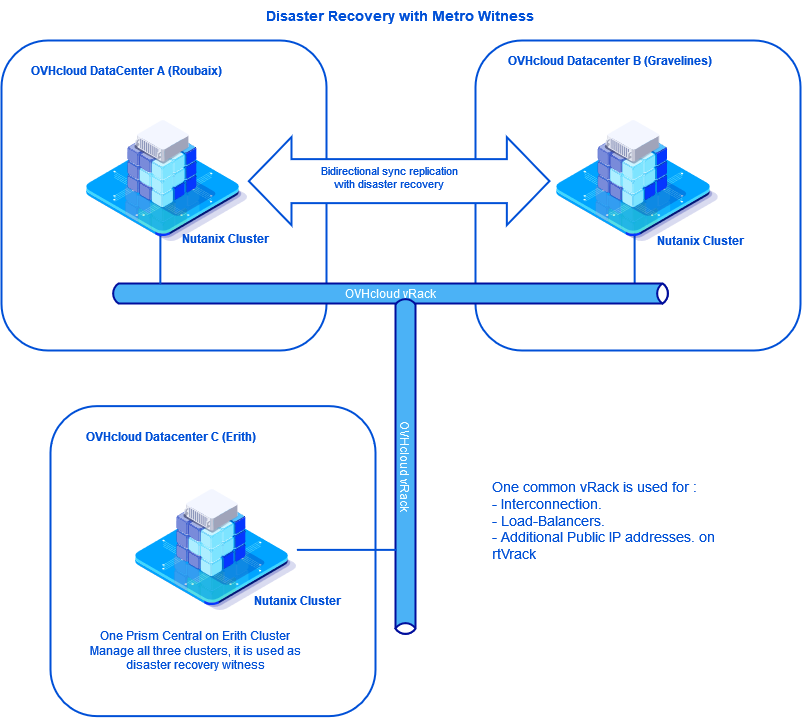{.thumbnail}

<a name="enpratique"></a>
## Etape 3 En pratique

Nous allons étape par étape mettre en place ce P.R.A (Plan de reprise d'activité).

Le informations techniques utilisés par notre guide sont les suivantes :

- Cluster de Roubaix :
    + Serveur 1 : adresse VM **CVM** `192.168.0.1`, adresse IP hyperviseur **AHV** `192.168.0.21`.
    + Serveur 2 : adresse VM **CVM** `192.168.0.2`, adresse IP hyperviseur **AHV** `192.168.0.22`.
    + Serveur 3 : adresse VM **CVM** `192.168.0.3`, adresse IP hyperviseur **AHV** `192.168.0.23`.
    + Adresse virtuelle de **Prism Element** : `192.168.0.100`.
    + Adresse iScsi de **Prism Element** : `192.168.0.102`.
    + Adresse IP **Prism Central** :`192.168.0.101`.
    + Passerelle : `192.168.3.254`.
    + Masque : `255.255.252.0`
    + Version du cluster : `6.5`

- Cluster de Gravelines :
    + Serveur 1 : adresse VM **CVM** `192.168.1.1`, adresse IP hyperviseur **AHV** `192.168.1.21`.
    + Serveur 2 : adresse VM **CVM** `192.168.1.2`, adresse IP hyperviseur **AHV** `192.168.1.22`.
    + Serveur 3 : adresse VM **CVM** `192.168.1.3`, adresse IP hyperviseur **AHV** `192.168.1.23`.
    + Adresse virtuelle de **Prism Element** : `192.168.1.100`.
    + Adresse iScsi de **Prism Element** : `192.168.1.102`.
    + Adresse IP **Prism Central** :`192.168.1.101`.
    + Passerelle : `192.168.3.254`.
    + Masque : `255.255.252.0`
    + Version du cluster : `6.5`.
 
- Cluster de Erith :
    + Serveur 1 : adresse VM **CVM** `192.168.2.1`, adresse IP hyperviseur **AHV** `192.168.2.21`.
    + Serveur 2 : adresse VM **CVM** `192.168.2.2`, adresse IP hyperviseur **AHV** `192.168.2.22`.
    + Serveur 3 : adresse VM **CVM** `192.168.2.3`, adresse IP hyperviseur **AHV** `192.168.2.23`.
    + Adresse virtuelle de **Prism Element** : `192.168.2.101`.
    + Adresse iScsi de **Prism Element** : `192.168.2.102`.   
    + Adresse IP **Prism Central** :`192.168.2.100`.
    + Passerelle : `192.168.3.254`.
    + Masque : `255.255.252.0`
    + Version du cluster : `6.5`.


Une partie du  paramètrage est faite à partir des interfaces WEB **Prism Central** & **Prism Element**, une autre à partir de l'espace client OVHcloud et d'autres en ligne de commande sur les machines virtuelles **Prism Central** ou **Prism Element**. 

En plus de ce guide vous pouvez vous appuyer sur ces documentations [Hyperconvergence Nutanix](https://docs.ovh.com/fr/nutanix/nutanix-hci/) et [outils avancées](https://docs.ovh.com/fr/nutanix/advanced-tools/) pour vous aider.

<a name="configuration"></a>
### Etape 3.1 Configuration

<a name="connectcl"></a>
#### Etape 3.1.1 Inter-connexion des trois clusters

La première étape est de réaliser l'interconnexion des trois clusters sur le même vRack OVHcloud. 

Aidez-vous de ce guide pour interconnecter vos clusters [Interconnexion de clusters au travers du vRack](https://docs.ovh.com/fr/nutanix/nutanix-vrack-interconnection/).

Le guide explique la connexion entre deux clusters dans notre cas il faut connecter 3 serveurs suivez les instructions dans ce sens :

- Les clusters de Roubaix dans le vRack dédié à Gravelines.
- Les clusters de Erith dans le vRack dédié à Gravelines.

Lorsque vous aurez terminé la configuration vous verrez dans votre vRack ces éléments :

- 9 Dedicated servers (3 par cluster)
- 3 adresses IP publiques
- 3 Load Balancers

{.thumbnail}

Les trois clusters sont pour l'instant accessible à partir des l'URL **Prism Central** de chaques clusters.

<a name="supprpc"></a>
#### Suppression des enregistrements **Prism Central** pour les cluster de Roubaix et Gravelines.

Pour pouvoir mettre en place une solution de plan de reprise d'activité avec **Metro Availability** il est est nécessaire de n'utiliser qu'une Machine virtuelle **Prism Central** commune aux 3 clusters. **Prism Central** sera sur le site d'Erith qui ne contient pas de machines virtuelles concernées par le P.R.A.

Dans un premier temps il faut retirer **Prism Element** des clusters des machines virtuelles **Prism Central** de Roubaix et Gravelines.


##### Désactivation de **Prism Central** sur le cluster de Roubaix

Connectez-vous en SSH au cluster **Prism Element** de Roubaix.

```bash
ssh nutanix@adresse_ip_privee_prism_element_Roubaix
Saisissez le mot de passe de Prism Element
```
Exécutez cette commande pour retirer Prism Element de la configuration de Prism Central:

```
ncli multicluster remove-from-multicluster external-ip-address-or-svm-ips=adresse_ip_privee_prism_central\
username=admin password=mdp_pe_Roubaix force=true
```

Ce message apparait lors de la deconnexion à Prism Central.

```console
Cluster unregistration is currently in progress. This operation may take a while.
```

Saisissez cette commande :

```bash
ncli cluster info
```

Notez la valeur de **Cluster UUID** qui doit avoir cette forme **xxxxxxxx-xxxx-xxxx-xxxx-xxxxxxxxxxxx**.

Déconnectez-vous de **Prism Element** et connectez vous en SSH sur la machine virtuelle **Prism Central** de Roubaix.

```bash
ssh nutanix@adresse_ip_privee_prism_central
saisissez le mot de passe de Prism Central
```

Saisissez cette commande :

```bash
python /home/nutanix/bin/unregistration_cleanup.py cluster_uuid_prism_element_Roubaix
```

###### Désactivation de **Prism Central** sur le cluster de Gravelines

Connectez-vous en SSH au cluster **Prism Element** de Gravelines.

```bash
ssh nutanix@adresse_ip_pe_Gravelines
saisissez le mot de passe de Prism Element
```
Saisissez cette commande :

```bash
ncli multicluster remove-from-multicluster external-ip-address-or-svm-ips=adresse_ip_privee_prism_central_Gravelines\
username=admin password=mdp_pe_Gravelines force=true
```

Ce message apparait lors de la deconnexion à Prism Central.

```console
Cluster unregistration is currently in progress. This operation may take a while.
```

Saisissez cette commande

```bash
ncli cluster info
```

Notez la valeur de **Cluster UUID* qui doit avoir cette forme **xxxxxxxx-xxxx-xxxx-xxxx-xxxxxxxxxxxx**

Deconnectez-vous de **Prism Element** et connectez vous en SSH sur la machine virtuelle **Prism Central** de Gravelines

```bash
ssh nutanix@adresse_ip_privee_prism_central_Gravelines
saisissez le mot de passe de Prism Central
python /home/nutanix/bin/unregistration_cleanup.py cluster_uuid_prism_element_Gravelines
```
<a name="enregpc"></a>                                               
#### Etape 3.1.2 Enregistrement des deux clusters au Prism Central se trouvant sur le site d'Erith

Connectez-vous en ssh sur **Prism Element** de Roubaix :

```bash
ssh nutanix@adresse_ip_privee_prism_element_Roubaix
saisissez le mot de passe de Prism Element
```

Executer cette commande :

```bash
ncli multicluster register-to-prism-central username=admin password=passwod_admin\ external-ip-address-or-svm-ips=adresse_ip_privee_prism_central_Erith
```

Ce message apparait :

```console
Cluster registration is currently in progress. This operation may take a while.
```

Patientez et saisissez cette commande

```bash
ncli multicluster get-cluster-state
```

Si le cluster est bien connecté à **Prism Central** d'Erith vous verrez appparaitre ces informations :

```console
Registered Cluster Count: 1

    Cluster Id                : xxxxxxxx-xxxx-xxxx-xxxx-xxxxxxxxxxxx
    Cluster Name              : Prism-Central-Erith-FQDN
    Is Multicluster           : true
    Controller VM IP Addre... : [adresse_ip_privee_prisme_central_Erith]
    External or Masqueradi... :
    Cluster FQDN              :
    Controller VM NAT IP A... :
    Marked for Removal        : false
    Remote Connection Exists  : true
```


Connectez-vous en ssh sur **Prism Element** de Gravelines :

```bash
ssh nutanix@adresse_ip_prism_element_Gravelines
Saisissez le mot de passe de Prism Element de Gravelines
```

Executez cette commande :

```bash
ncli multicluster register-to-prism-central username=admin password=passwod_admin_Erith external-ip-address-or-svm-ips=adresse_ip_privee_prism_central_Erith
```

Ce message apparait :

```console
Cluster registration is currently in progress. This operation may take a while.
```

Patientez et saisissez cette commande

```bash
ncli multicluster get-cluster-state
```

Si le cluster est bien connecté au **Prism Central** d'Erith vous verrez appparaitre ces informations :

```console
Registered Cluster Count: 1

    Cluster Id                : xxxxxxxx-xxxx-xxxx-xxxx-xxxxxxxxxxxx
    Cluster Name              : Prism-Central-Erith-FQDN
    Is Multicluster           : true
    Controller VM IP Addre... : [adresse_ip_privee_prism_central_Erith]
    External or Masqueradi... :
    Cluster FQDN              :
    Controller VM NAT IP A... :
    Marked for Removal        : false
    Remote Connection Exists  : true
```

A partir d'un navigateur WEB connectez vous sur l'URL de Prism-Central à Erith, vous verrez les trois clusters.

{.thumbnail}

<a name="paramiscsi"></a>
#### Etape 3.1.3 Ajout des adresses IP pour les connexions iSCSI sur les trois clusters

A partir du tableau de bord **Prism Central** cliquez sur le lien vers le `cluster d'Erith`{.action}.

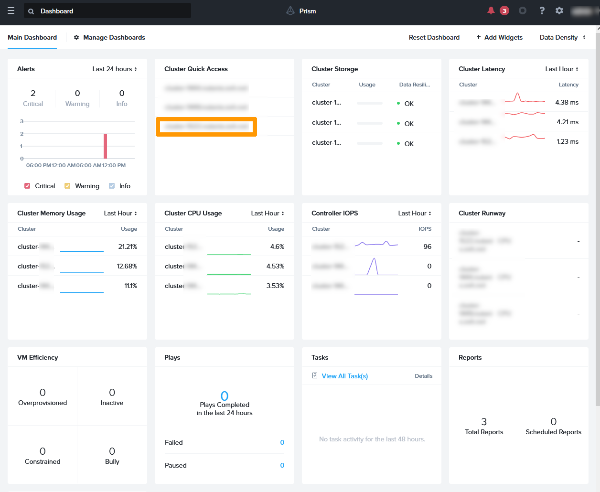{.thumbnail}

Sur le tableau de bord de **Prism Element** cliquez en haut à gauche sur le `nom du cluster`{.action}.

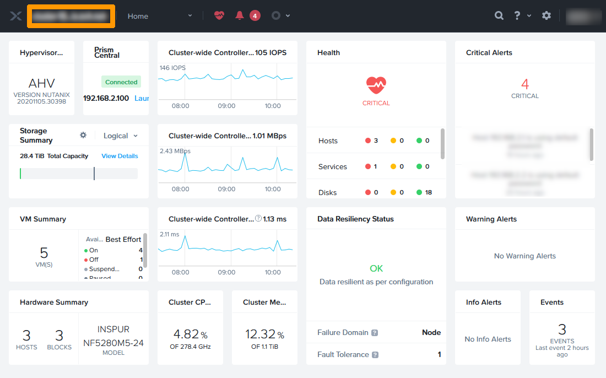{.thumbnail}

Faites défilez la fenêtre, ajouter une `adresse IP non utilisée`{.action} à **ISCSI Data Services IP** et cliquez sur  `Save`{.action}.

{.thumbnail}

A partir du tableau de bord **Prism Central** cliquez sur le lien vers le `cluster de Gravelines`{.action}.

{.thumbnail}

Sur le tableau de bord de **Prism Element** cliquez en haut à gauche sur le `nom du cluster  `{.action}.

{.thumbnail}

Faites défilez la fenêtre, ajouter une `adresse IP non utilisée`{.action} à **ISCSI Data Services IP** et cliquez sur  `Save`{.action}.

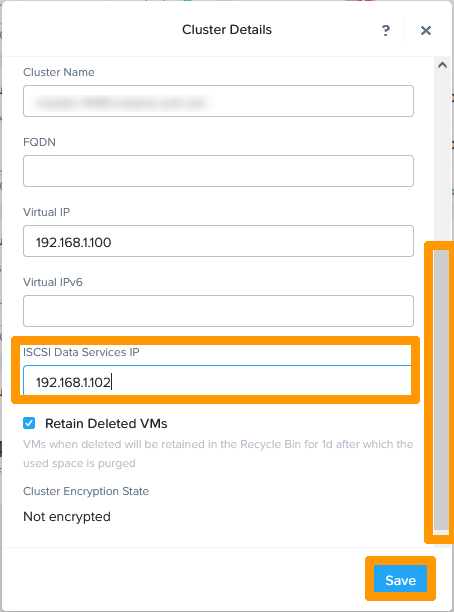{.thumbnail}

A partir du tableau de bord **Prism Central** cliquez sur le lien vers le `cluster de Roubaix`{.action}.

{.thumbnail}

Sur le tableau de bord de **Prism Element** cliquez en haut à gauche sur le `nom du cluster  `{.action}.

{.thumbnail}

Faites défilez la fenêtre, ajouter une `adresse IP non utilisée`{.action} à **ISCSI Data Services IP** et cliquez sur  `Save`{.action}.

{.thumbnail}

<a name="addsc"></a>
#### Création de deux **Storage Containers** sur les clusters de Roubaix et de Gravelines

Nous allons créer deux **Storage Containers** portant le même nom à Roubaix et Gravelines. 
 
Depuis le menu principal de **Prism Elemetn** cliquez sur `Storage Containers`{.action} dans le sous-menu **Compute & Storage**.

{.thumbnail}

Cliquez sur `Create Storage Container`{.action}.

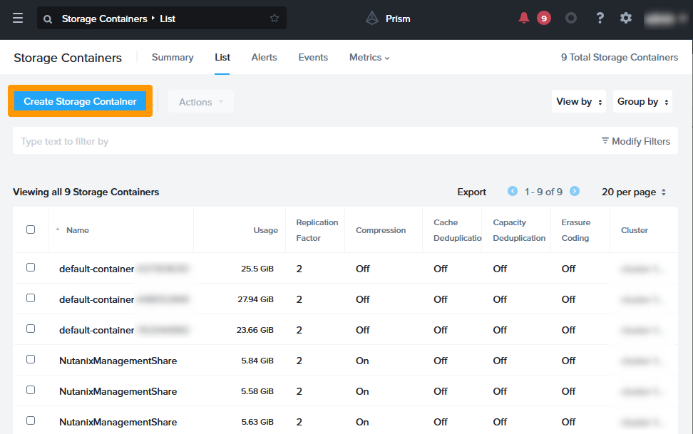{.thumbnail}

Saisissez `UsedForDR` dans **Name**, Choisissez le `cluster de Roubaix` dans **Cluster** et cliquez sur `Create`{.action}.

{.thumbnail}

Cliquez sur `Create Storage Container`{.action}.

{.thumbnail}

Saisissez `UsedForDR` dans **Name**, Choisissez le `cluster de Gravelines` dans **Cluster** et cliquez sur `Create`{.action}.

{.thumbnail}

Dans la liste des **Storages Containers** vous verrez deux **Storage Containers** portant le même Nom.

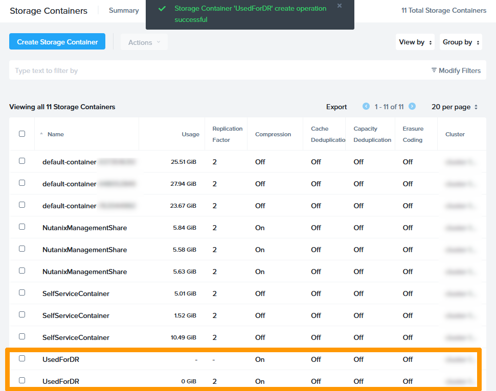{.thumbnail}

<a name="deplst"></a>
#### Etape 3.1.5 Déplacement des machines virtuelles dans le **Storage Container**

Nous allons déplacer le stockage des machines virtuelles sur les **Storage Container** que nous avons créé.

Connectez-vous en SSH sur **Prism Element** du cluster de Roubaix :

```bash
ssh nutanix@adresse_ip_privee_Prism_element_Roubaix
Saisissez le mot de passe du compte Nutanix de Prism Element
```

Executez cette commmande pour chaque VM que nous allons déplacer dans le **Storage Container** en remplaçant **nomvm** par le nom de la machine virtuelle (Dans notre Plan de reprise d'activité nous avons deux machines virtuelles à Roubaix une avec Windows et un autre sous Linux).

```bash
acli vm.update_container nomvm container=UsedForDR
Saisissez le mot de passe du compte Nutanix de Prism Element
```

Connectez-vous en SSH sur **Prism Element** du cluster de Gravelines :

```bash
ssh nutanix@adresse_ip_privee_Prism_element_Gravelines
Saisissez le mot de passe du compte Nutanix de Prism Element
```

Executez cette commmande pour chaque VM que nous allons déplacer dans le **Storage Container** en remplaçant **nomvm** par le nom de la machine virtuelle (Dans notre Plan de reprise d'activité nous avons trois machines virtuelles à Gravelines une avec Windows et un autre sous Linux ainsi que la gateway qui donne accès à Internet). 

```bash
acli vm.update_container nomvm container=UsedForDR
Saisissez le mot de passe du compte Nutanix de Prism Element
```
<a name="creacat"></a>
#### Etape 3.1.6 Création d'un catégorie qui servira lors de la mise en place du P.R.A

Nons allons créer une catégorie avec deux valeurs dans **Prism Central** pour affectuer les machines virtuelles concernées par la réplications.

Faites défiler le menu principal cliquez sur `Categories`{.action} dans le sous menu `Administration`.

{.thumbnail}

Cliquez sur `New Category`{.action}.

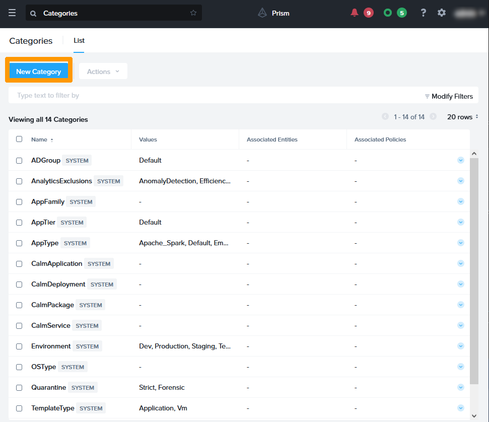{.thumbnail}

Saisissez `Protected VM` dans **Name** ajouter ces valeurs `Roubaix` et `Gravelines` dans **Values** ensuite cliquez sur `Save`{.action}.

{.thumbnail}

La catégorie apparait dans la liste et elle est prête à être utilisé.

{.thumbnail}

<a name="addvmcat"></a>
#### Etape 3.1.7 Ajout des machines virtuelles dans les catégories

Nous allons affecter deux machines virtuelles sur le cluster de Roubaix dans une catégorie et trois machines virtuelles sur le cluster de Gravelines dans une autre catégorie.

Au travers du menu principal de **Prism Central** cliquez sur `Vms`{.action} dans le sous menu **Compute & Storage**.

{.thumbnail}

Sélectionnez à gauche `les deux machines virtuelles`{.action} de Roubaix, Ensuite au travers du menu **Actions** cliquez sur `Manage Categories`{.action}

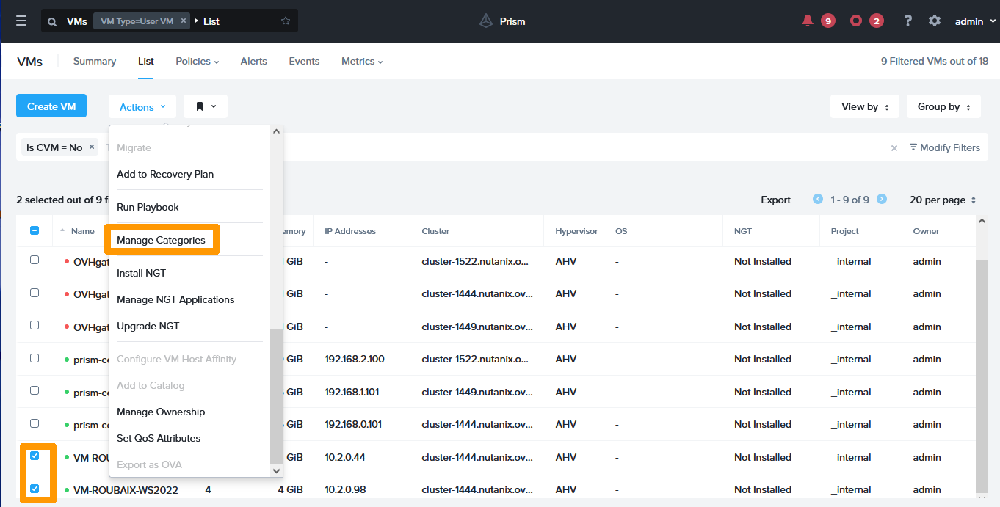{.thumbnail}

Ajouter la catégorie `ProcectedVM: Roubaix`, ensuite cliquez sur `Save`{.action}

{.thumbnail}

Sélectionnez à gauche `les trois machines virtuelles`{.action} de Gravelines, Ensuite au travers du menu **Actions** cliquez sur `Manage Categories`{.action}

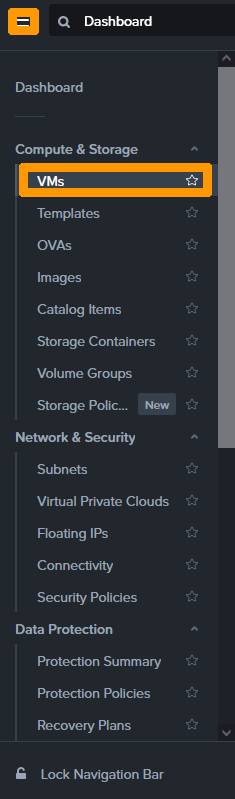{.thumbnail}

Ajouter la catégorie `ProcectedVM: Gravelines`, ensuite cliquez sur `Save`{.action}

{.thumbnail}

<a name="confreplsync"></a>
#### Etape 3.1.8 Mise en place des réplications synchrones entre Roubaix et Gravelines

Nous allons mettre en place la réplication synchrone entre Roubaix et Gravelines.

##### Mise en place de réplication entre Roubaix et Gravelines

Au travers du menu principal de **Prism Central** cliquez sur `Protection Policies`{.action} dans le sous menu **Data Protection**

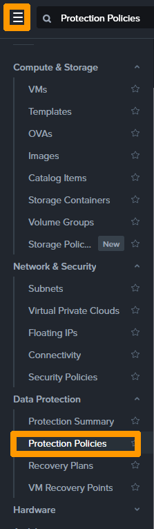{.thumbnail}

Cliquez sur `Create Protection Policy`{.action}

{.thumbnail}

Saisissez `ROUBAIX-TO-GRAVELINES`{.action} dans **Policy name**, gardez **Local AZ** et cliquez sur `Select Cluster`{.action} dans **Primary Location**.

{.thumbnail}

Choisissez le cluster de Roubaix et cliquez sur `Save`{.action}.

{.thumbnail}

En haut à gauche à coté de Disaster Recovery cliquez sur `Enable`{.action}. 

{.thumbnail}

Le système contrôle que tout est correct avant d'activer l'option **Disaster Recovery**

{.thumbnail}

Cliquez sur `Enable`{.action} pour activer l'option **Disaster Recovery**. 

{.thumbnail}

Cliquez à nouveau sur `Enable`{.action}. 

{.thumbnail}

L'activation de l'option **Disaster Recovery** est en cours.

Garder **Local AZ**, sélectionnez le cluster dans **Recovery Location** et cliquez sur `Save`{.action}.

{.thumbnail}

Cliquez sur `+ Add Schedule`{.action}.

{.thumbnail}

Choisissez ces options  `Synchronous`{.action} pour **Protection Type** et  `Automatic`{.action} pour **Failure Detection Mode**, ensuite cliquez sur `Save Schedule`{.action}.

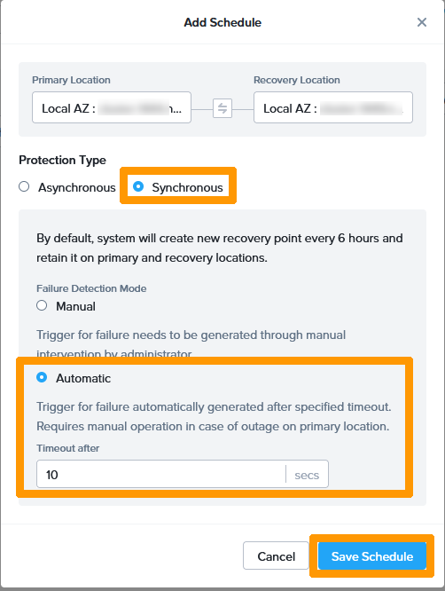{.thumbnail}

Cliquez sur `Next`{.action}.

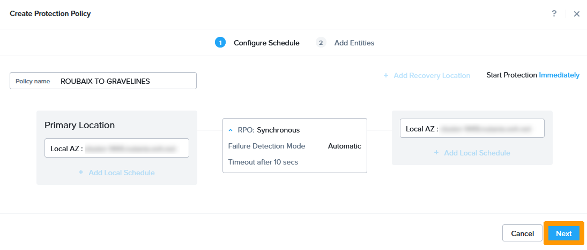{.thumbnail}

Sélectionnez la catégorie `ProtectedVM : Roubaix`{.action} et cliquez sur `Add`{.action}.

{.thumbnail}

Cliquez sur `Create`{.action}.

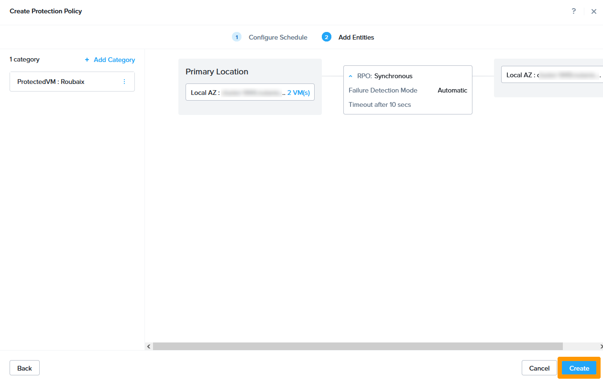{.thumbnail}

Les machines virtuelles de Roubaix sont à présent répliquées vers Gravelines, après une première réplication complête les données seront synhronisés en permanence de Roubaix vers Gravelines.

{.thumbnail}

##### Mise en place de réplication entre Gravelines et Roubaix

La réplication peut être bidirectionnelle nous allons maintenant créer une réplication de Gravelines vers Roubaix.

Cliquez sur `Create Protection Policy`{.action}.

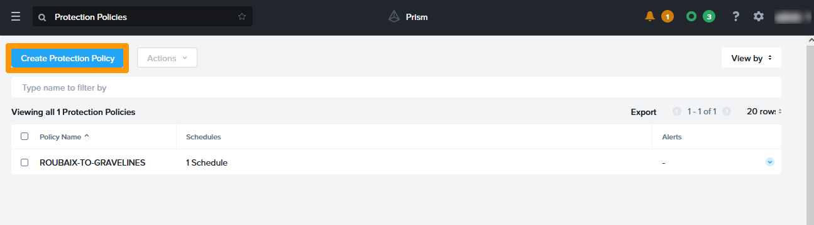{.thumbnail}

Choisissez comme nom `Gravelines-TO-Roubaix` dans **Policy Name**, gardez **Local AZ** et choisissez le cluster de Gravelines dans **Primary Location**, ensuite cliquez sur `Save`{.action}.

{.thumbnail}

Conservez **Local AZ** , sélectionnez le cluster de Roubaix et cliquez sur  sur `Save`{.action}.

{.thumbnail}

Cliquez sur `+ Add Schedule`{.action}.

{.thumbnail}

Choisissez ces options  `Synchronous`{.action} pour **Protection Type** et  `Automatic`{.action} pour **Failure Detection Mode**, ensuite cliquez sur `Save Schedule`{.action}.

{.thumbnail}

Cliquez sur `Next`{.action}.

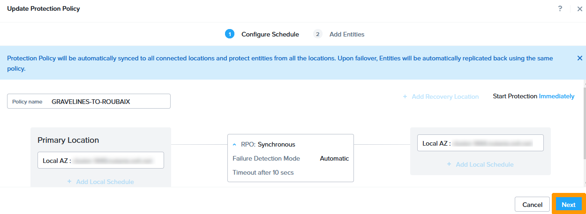{.thumbnail}

Sélectionnez la catégorie `ProtectedVM : Gravelines`{.action} et cliquez sur `Add`{.action}.

{.thumbnail}

Cliquez sur `Create`{.action}.

{.thumbnail}

Une deuxième stratégie de protection est en place.

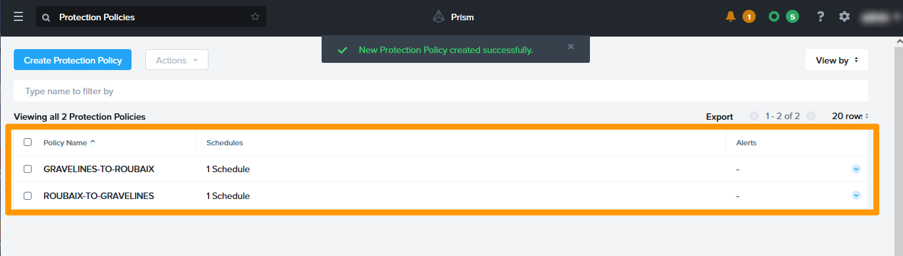{.thumbnail}

<a name="addsublan"></a>
#### Etape 3.1.9 Création de sous réseaux de test pour les plan de reprise

Nous allons créer des sous-réseaux qui serviront pour les test de plan de reprises intégrés dans Nutanix

Il faut un sous réseau de test par sous réseau de production sur nos clusters noux avons 3 sous réseaux de production.

- **base** sur le VLAN 0
- **infra** sur le VLAN 1
- **production*** sur le VLAN 2

Nous allons donc créer 3 sous-réseaux supplémentaires sur les cluster de gravelines et de Roubaix avec ces noms :

- **testbase** sur le VLAN 100
- **testinfra** sur le VLAN 101
- **production** sur le VLAN 102

Aidez-vous de ce guide pour créer des VLAN sur vos clusters Nutanix [Isoler les machines de gestion de la production](https://docs.ovh.com/fr/nutanix/nutanix-isolate-management-machines/).

six nouveaux sous-réseaux sont visibles au travers de votre interface **Prism Central** dans le tableau de bord **Subnets**

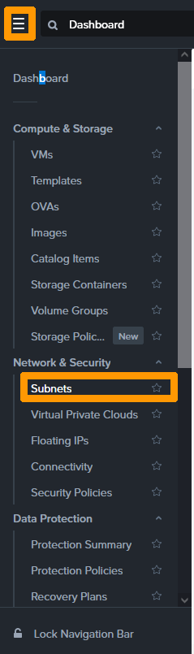{.thumbnail}

<a name="adddr"></a>
#### Etape 3.1.10 Mise en place des plans de reprises d'activités

Maintenant que les réplications et les sous réseaux de test sont en place nous allons mettre en oeuvre des plans de reprises d'activités automatisés ou manuel à la demande pour :

- Migrer des machines virtuelles à chaud entre les deux clusters.
- Tester que la réplication fonctionne correctement.
- Redémarrer automatiquement en cas de défaillance d'un deux deux clusters de P.R.A.

##### Création du plan de reprise d'activité pour le cluster de Roubaix

Au travers du menu principal de **Prism Central** cliquez sur `Recovery Plans`{.action} dans le sous-menu **Data Protection**. 

{.thumbnail}

Cliquez à Gauche sur `Enable Disaster Recovery`{.action}.

{.thumbnail}

Normalement le plan de de reprise doit être activé comme indiqué par le message **Disaster Recovery enabled**, cliquez sur la `croix`{.action} à droite pour fermer cette fenêtre. 

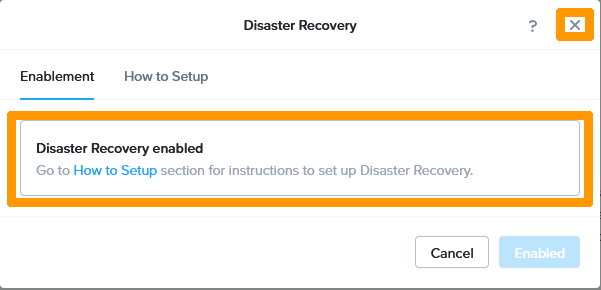{.thumbnail}

Cliquez sur `Create New Recovery Plan`{.action}.

{.thumbnail}

Choisissez ces informations :

* **Recovery Plan Name** : `Recovery VM from ROUBAIX to GRAVELINES`.

* **Primary Location**: `Local AZ`.
* **Primary Cluster**: `cluster de Roubaix`.

* **Recovery Location**: `Local AZ`.
* **Recovery Cluster**: `cluster de Gravelines`.

* **Failure Execution Mode** : `Automatic`.
* **Execute failover after disconnectivity of** : `30 seconds`.

Ensuite cliquez sur `Next`{.action}.

{.thumbnail}

Cliquez sur `+ Add VM(s)`{.action}.

{.thumbnail}

Sélectionnez les deux machines virtuelles et cliquez sur `Add`{.action}.

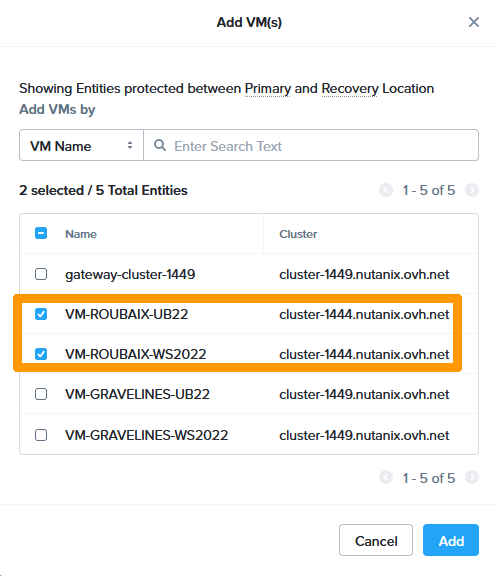{.thumbnail}

Cliquez sur `Next`{.action}.

{.thumbnail}

Cliquez sur `OK. Got it`{.action}.

{.thumbnail}

Cliquez sur `Stretch networks`{.action}.

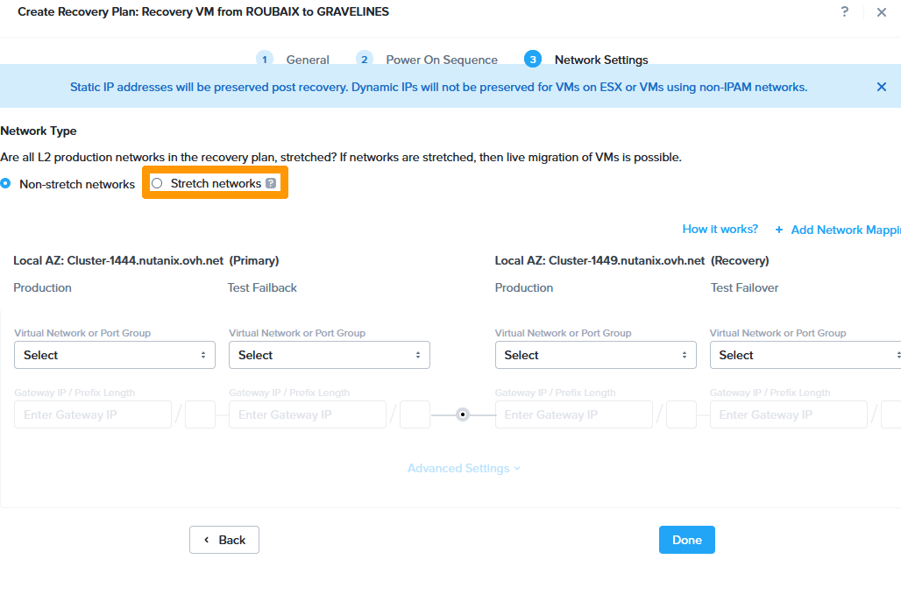{.thumbnail}

Cliquez sur `Proceed`{.action}.

{.thumbnail}

Choisissez les VLAN qui seront utilisés lors du P.R.A comme ceci

* **Primary**
    + **Production** : `production`
    + **Test Failback** : `testproduction`
* **Recovery**
    + **Production** : `production`
    + **Test Failback** : `testproduction`

Ensuite cliquez sur `Done`{.action}.

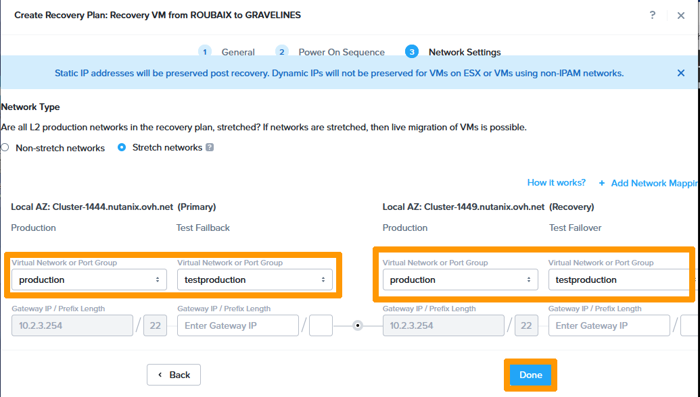{.thumbnail}

##### Création du plan de reprise d'activité pour le cluster de Roubaix

Le plan de reprise d'activité est créé pour le site de Roubaix. cliquez sur `Create Recovery Plan`{.action} pour créer le plan de reprise d'activité de Gravelines.

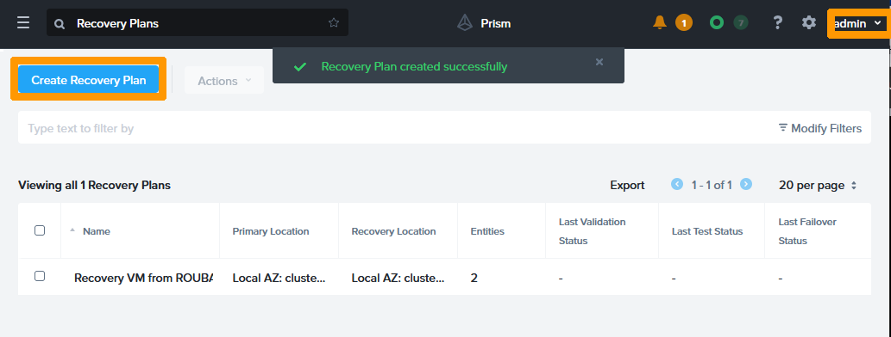{.thumbnail}

Choisissez ces informations :

* **Recovery Plan Name** : `Recovery VM from Gravelines to Roubaix`.

* **Primary Location**: `Local AZ`.
* **Primary Cluster**: `cluster de Gravelines`.

* **Recovery Location**: `Local AZ`.
* **Recovery Cluster**: `cluster de Roubaix`.

* **Failure Execution Mode** : `Automatic`.
* **Execute failover after disconnectivity of** : `30 seconds`.

Ensuite cliquez sur `Next`{.action}.

{.thumbnail}

Cliquez sur `+ Add VM(s)`{.action}.

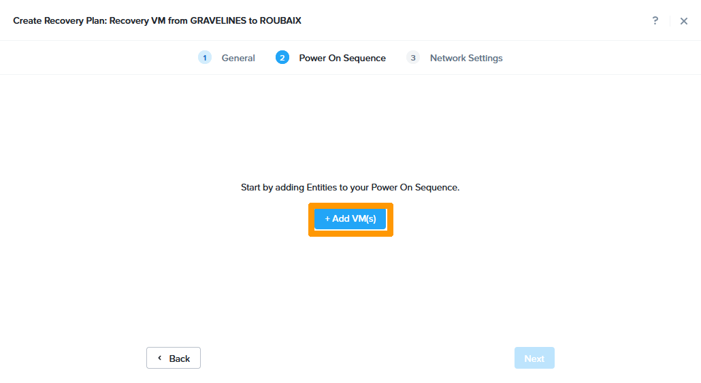{.thumbnail}

Sélectionnez les trois machines virtuelles et cliquez sur `Add`{.action}.

{.thumbnail}

Cliquez sur `Next`{.action}.

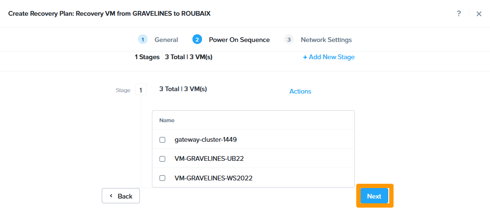{.thumbnail}

Cliquez sur `Stretch networks`{.action}.

{.thumbnail}

Cliquez sur `Proceed`{.action}.

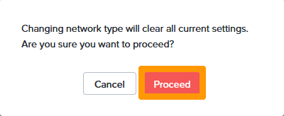{.thumbnail}

Choisissez ces informations :

* **Primary**
    + **Production** : `base`
    + **Test Failback** : `testbase`
* **Recovery**
    + **Production** : `base`
    + **Test Failback** : `testbase`

Ensuite cliquez sur `+ Add Network Mapping`{.action}.

{.thumbnail}

Choisissez ces informations :

* **Primary**
    + **Production** : `infra`
    + **Test Failback** : `testinfra`
* **Recovery**
    + **Production** : `infra`
    + **Test Failback** : `testinfra`

Ensuite cliquez sur `+ Add Network Mapping`{.action}.

{.thumbnail}

Choisissez ces informations :

* **Primary**
    + **Production** : `production`
    + **Test Failback** : `testproduction`
* **Recovery**
    + **Production** : `production`
    + **Test Failback** : `testproduction`

Ensuite cliquez sur `Done`{.action}.

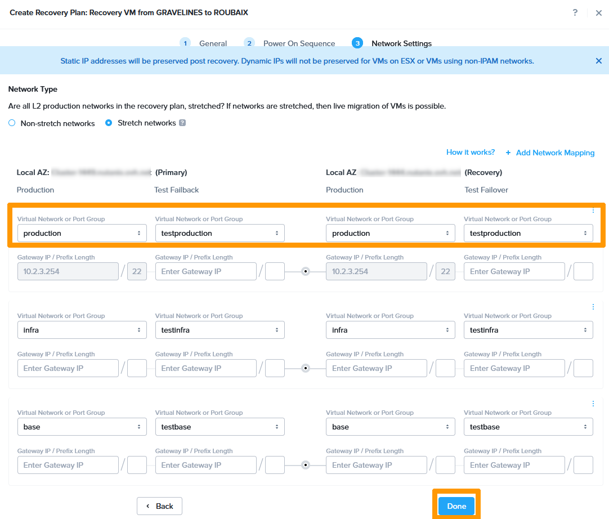{.thumbnail}

> [!primary]
> 3 réseaux ont été rajoutés dans ce plan de reprise d'activité pour la machine virtuelle Gateway qui utilise ces trois réseaux.
>

Les deux plans de reprises d'activités sont en productions.

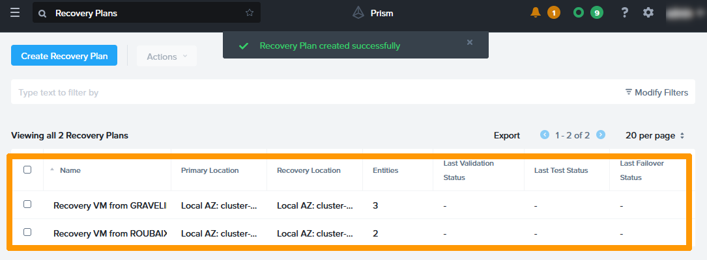{.thumbnail}


<a name="validation"></a>
### Etape 3.2 Validation du plan de reprise d'activité 

<a name="ctrldr"></a>
#### Etape 3.2.1  Contrôle du plan de reprise d'activité

##### Utilisation de l'option validation dans le plan de reprise d'activité

Il est possible de demander à Prism Central de valider le plan de reprise d'activités.

Cliquez sur le `Recovery VM from Roubaix`{.action} à valider et tester.

{.thumbnail}

Cliquez sur `Validate`{.action}

{.thumbnail}

Sélectionnez le cluster de Roubaix pour **Entity Failing Over From** et le cluster de Gravelines pour **Entity Failing Over To**. Ensuite cliquez sur `Proceed`{.action}

{.thumbnail}

Le plan de de reprise est validé, cliquez sur `Close`{.action}

{.thumbnail}

##### Test du plan de reprise d'activité

Il est possible de tester le plan de reprise d'activité sans impacter la production, lorsque l'on active un test des machines virtuelles de tests sont activés sur le cluster de secours dans les VLAN de test.

Cliquez sur `Test`{.action}

{.thumbnail}

Sélectionnez le cluster de Roubaix pour **Entity Failing Over From** et le cluster de Gravelines pour **Entity Failing Over To**. Ensuite cliquez sur `Test`{.action}

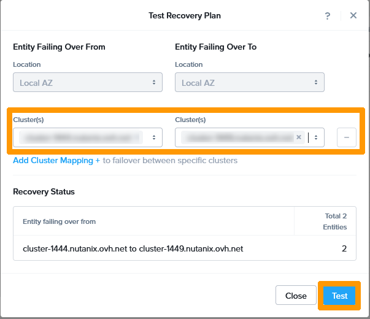{.thumbnail}

> [!primary]
> Assurez-vous d'avoir les bonnes licences, Si vous avec choisi un cluster avec des licences chez OVHcloud il est nécessaire d'avoir souscrit le pack Advanced sur le cluster de Roubaix et Gravelines.
>

Cliquez sur `Execute Anyway`{.action}

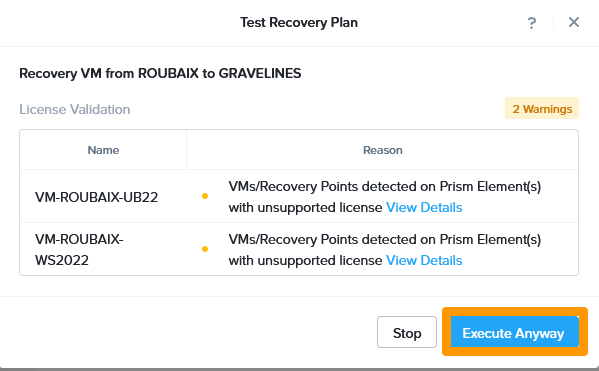{.thumbnail}

Allez dans le tableau de bord des VM dans **Prism Central** et vous verrez les machines virtuelles de tests qui sont créés avec les données répliquées.

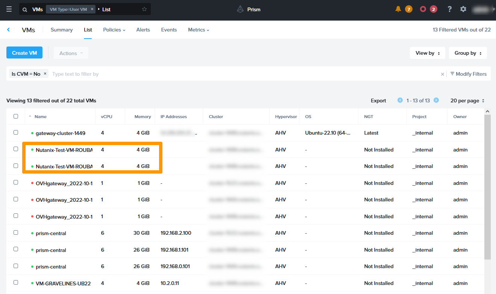{.thumbnail}

Revenez sur votre plan de reprise et cliquez sur `Clean-up test Entities`{.action}

{.thumbnail}

cliquez sur `Clean Up`{.action}

{.thumbnail}

<a name="livemigration"></a>
#### Etape 3.2.2 Live migration des machines virtuelles de Roubaix sur Gravelines

Si l'infrastructure est entirèrement opérationnelle il est possible de faire des migrations à chaud sans coupure des machines virtuelles qui sont sur un cluster vers l'autre cluster du plan de reprise.

Allez sur une machine virtuelle qui se trouve à Roubaix et qui fait partie du plan de reprise nous allons lancer un ping vers le serveur DNS OVHcloud **213.186.33.99**.

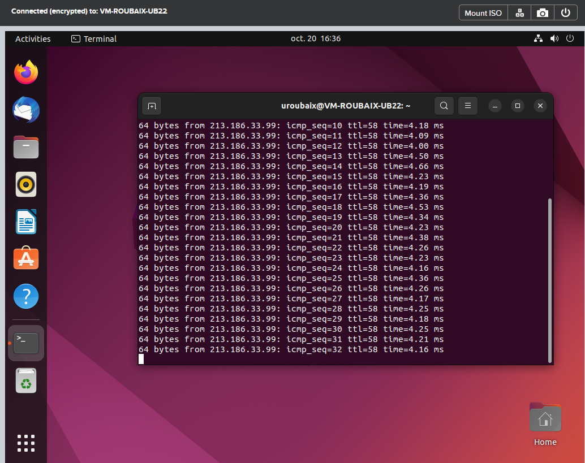{.thumbnail}

Revenez sur votre plan de reprise et cliquez sur `Failover`{.action} dans le menu `More`.

{.thumbnail}

Choisissez `Planned Failover`{.action}, cochez `Live Migrate Entities`{.action}.

Prenez le cluster de Roubaix pour **Entity Failing Over From** et le cluster de Gravelines pour **Entity Failing Over To**.

Ensuite cliquez sur `Failover`{.action}

{.thumbnail}

Saisissez `Failover`{.action} et cliquez sur `Failover`

{.thumbnail}

La migration à chaud est en cours.

{.thumbnail}

La migration s'est terminée avec succès sans coupure de service.

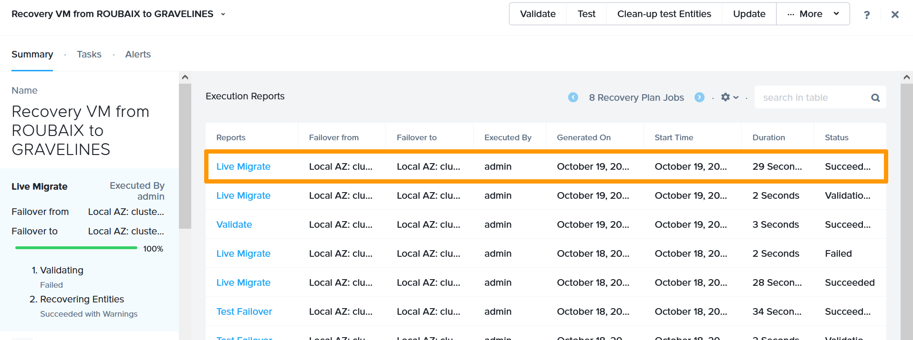{.thumbnail}

Vous pouvez revenir sur la machine virtuelle et constater que le ping continue à fonctionner même si la machine virtuelle a été déplacé d'un cluster à l'autre.

{.thumbnail}

<a name="aftermigration"></a>
#### Etape 3.2.3 Opérations à effectuer après une migration à chaud

Après une migration à chaud il est nécessaire d'inverser la réplication et le fonctionnement du plan de reprise d'activité


##### Inversion du de la réplication

Au travers du menu principal de **Prism Central** cliquez sur `Protections Policies`{.action} dans le sous-menu **Data Protection**.

{.thumbnail}

Cliquez sur le plan de protection nommé `ROUBAIX TO GRAVELINES`{.action}.

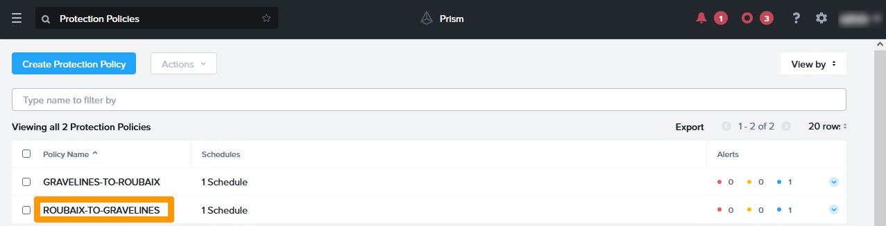{.thumbnail}

cliquez sur `Update`{.action}.

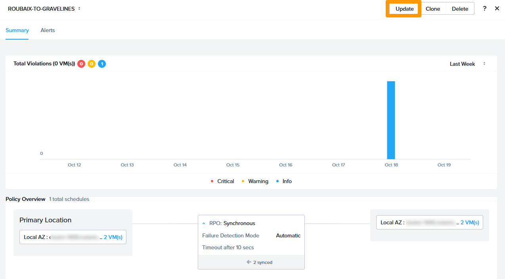{.thumbnail}

Positionnez la souris en dessous du nom du cluster de Roubaix dans **Primary Location** et cliquez sur `Edit`{.action}.

{.thumbnail}

Cochez le cluster de `Gravelines`{.action} à la place de celui de Roubaix.

{.thumbnail}

Cliquez sur `Save`{.action}.

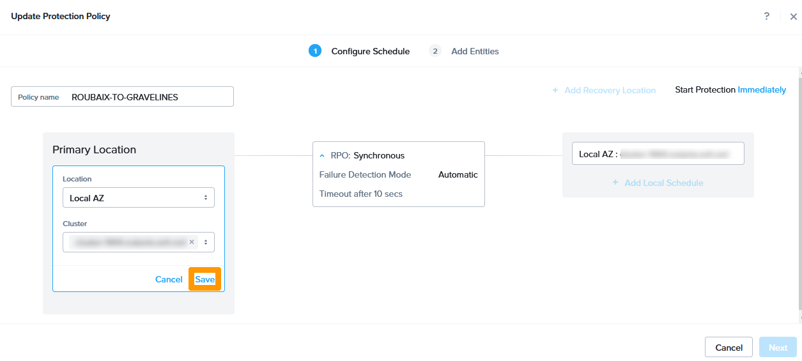{.thumbnail}

Cliquez sur `Update Location`{.action}.

{.thumbnail}

Positionnez la souris en dessous du nom du cluster de Graveline dans **Recovery Location** et cliquez sur `Edit`{.action}.

{.thumbnail}

Sélectionnez le cluster de `Roubaix`{.action} à la place de celui de Gravelines.

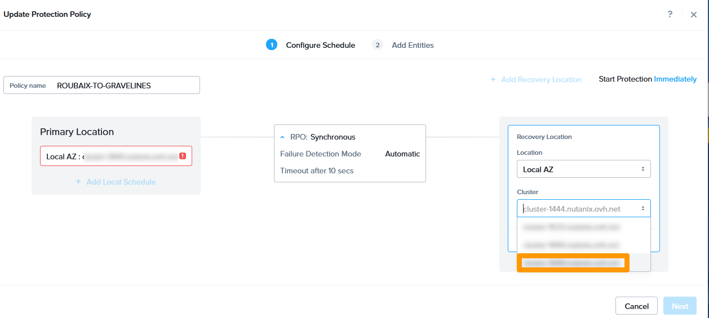{.thumbnail}

Cliquez sur `Save`{.action}.

{.thumbnail}

Cliquez sur `Update Location`{.action}.

{.thumbnail}

Cliquez sur `Next`{.action}.

{.thumbnail}

Cliquez sur `Update`{.action}.

{.thumbnail}

La réplication est inversée cliquez sur la `croix`{.action} pour fermer le plan de protection.

##### Inversion du plan de reprise

Au travers du menu principal de **Prism Central** cliquez sur `Recovery Plans`{.action} dans le sous menu **Data Protection**.

{.thumbnail}

Cliquez sur Cliquez sur `Recovery VM from Roubaix to Gravelines`{.action}.

{.thumbnail}

Au travers du menu **More** cliquez sur `Update`{.action}.

{.thumbnail}

Dans locations modifiez mettez le cluster de Gravelines dans **Primary CLusters** et le cluster de Roubaix dans **Recovery Clusters**. et cliquez sur `Next`{.action}.

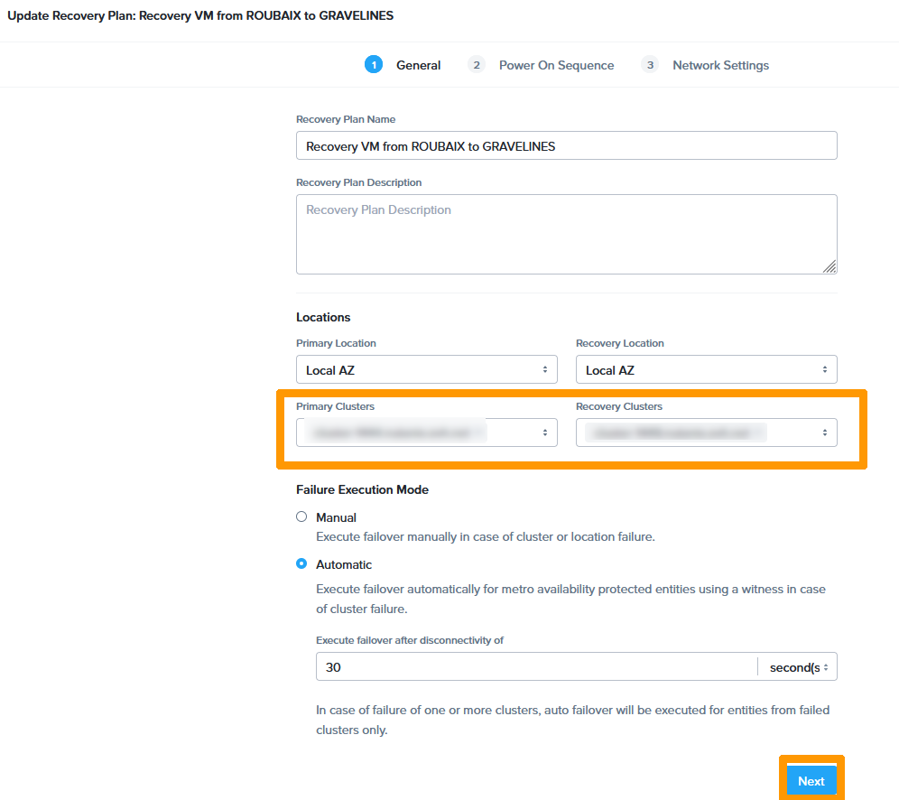{.thumbnail}

Cliquez sur `Proceed`{.action}.

{.thumbnail}

Cliquez sur `Next`{.action}.

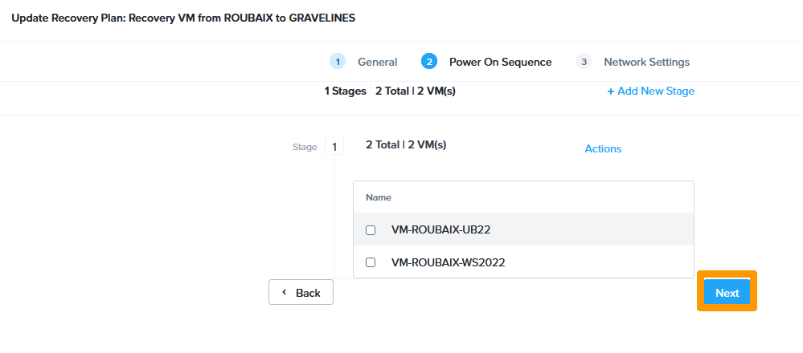{.thumbnail}

Choisissez ces informations:

* **Primary**
    + **Production** : `production`
    + **Test Failback** : `testproduction`
* **Recovery**
    + **Production** : `production`
    + **Test Failback** : `testproduction`

Et cliquez sur `Done`{.action}.

{.thumbnail}

> [!primary]
> Les réplications et le plan de reprise ont été inversés suite à un migration des machines virtuelles de Roubaix vers Gravelines.
> Pour revenir à la situation d'origine il faut effectuer à nouveau une migration à chaud et inverser la réplication et le plan de reprise d'activité.
> Il est possible d'utiliser cette partie du guide en cas de déclenchement du plan de reprise d'activité en raison d'une indisponibilité d'un cluster.

<a name="epmcr"></a>
#### Etape 3.2.4 Execution du plan de reprise d'activité en condition réélle

Nous allons simuler une perte totale de connexion à Gravelines où  se trouve trois machines virtuelles dans le plan de reprise d'activité (la passerelle Internet et deux autres machines virtuelles).

connectez-vous en ligne de commande et executer un ping permanent vers l'adresse publique de la passerelle.

```bash
## Ping à partir d'un console linux distante
ping xx.xx.xx.xx
Reply from xx.xx.xx.xx: bytes=32 time=21ms TTL=58
Reply from xx.xx.xx.xx: bytes=32 time=21ms TTL=58
Reply from xx.xx.xx.xx: bytes=32 time=23ms TTL=58
Reply from xx.xx.xx.xx: bytes=32 time=20ms TTL=58
```

Laisser la commande ping tourner permanence et retournez dans **Prism Central**

Au travers du menu principal cliquez sur `VMs`{.action}. dans le sous-menu **Compute & Storage** 

{.thumbnail}

Les trois machines virtuelles du plan de reprise d'activité sont fonctionnelles.

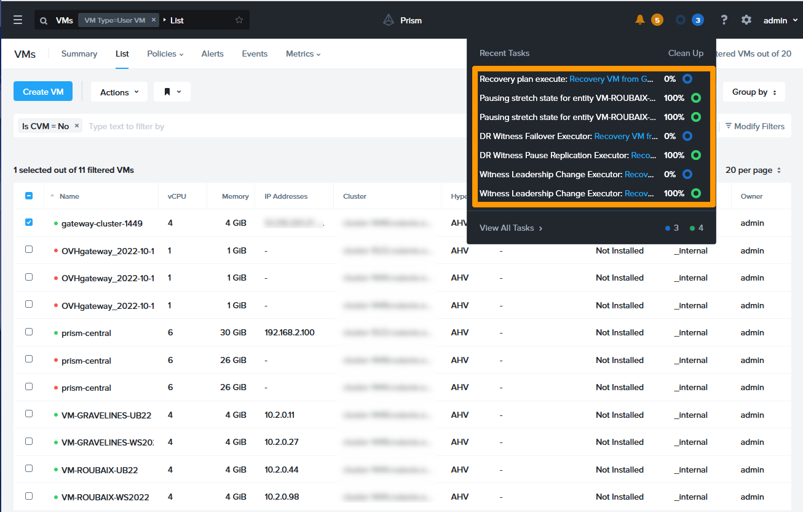{.thumbnail}

Une deconnexion des trois noeuds du cluster de Gravelines a été faites.

> [!primary]
> La deconnexion est effectuée en supprimant des vRack les 3 noeuds du cluster de Gravelines.
>

Revenez sur la console qui exécute le ping vers la passerelle, vous allez constater une perte de connexion.

```bash
Reply from xx.xx.xx.xx: bytes=32 time=20ms TTL=58
Reply from xx.xx.xx.xx: bytes=32 time=21ms TTL=58
Reply from xx.xx.xx.xx: bytes=32 time=20ms TTL=58
Reply from xx.xx.xx.xx: bytes=32 time=20ms TTL=58
Reply from xx.xx.xx.xx: bytes=32 time=20ms TTL=58
Request timed out.
Request timed out.
Request timed out.
Request timed out.
```

Cliquez en haut à droite sur les `tâches`{.action} dans **Prism Central pour afficher le lancement des tâches et notamment **Recovery plan execute**.

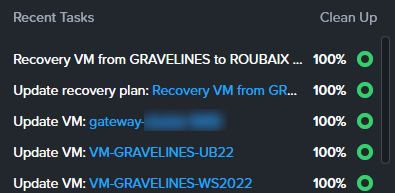{.thumbnail}

> [!warning]
> Lors d'un incident sur la totalité d'un cluster (Nombres de noeud insuffisants pour fonctionner, ou une coupure réseau) les machines virtuelles qui font partie du P.R.A et qui sont sur ce cluster vont être démarré sur l'autre cluster. 
> Le RPO est de 0 (Recovery Point Objective) ce qui signifie qu'aucune perte de données ne sera à déplorer.
> Par contre les machines virtuelles vont mettre un certain temps à redémarrer sur l'autre cluster dans ce guide 3 machines virtuelles sont redemarrés sur le cluster distant , 4 minutes sont necessaire le démarrage des machines virtuelles. Ce temps sera mesurable en effectuant un test sur le plan de reprise d'activité.


Revenez sur la console texte et vous allez voir que le ping fonctionne à nouveau.

```bash
Request timed out.
Reply from xx.xx.xx.xx: bytes=32 time=20ms TTL=58
Reply from xx.xx.xx.xx: bytes=32 time=19ms TTL=58
Reply from xx.xx.xx.xx: bytes=32 time=18ms TTL=58
Reply from xx.xx.xx.xx: bytes=32 time=18ms TTL=58
Reply from xx.xx.xx.xx: bytes=32 time=19ms TTL=58
Reply from xx.xx.xx.xx: bytes=32 time=19ms TTL=58
```

Allez sur **Prism Central** dans la gestion des machines virtuelles, vous verrez les trois machines virtuelles du plan de reprise en double, elles sont notés comme démarrées mais réellement ce ne sont que celles qui ont redemarrés sur Roubaix qui fonctionnent.

{.thumbnail}

Nous allons reconnecter les trois noeuds dans le vRack pour revenir en mode normal.

Après le retour à la normale les machines virtuelles qui se trouvent sur le cluster d'origine sont toujours visibles mais éteinte.

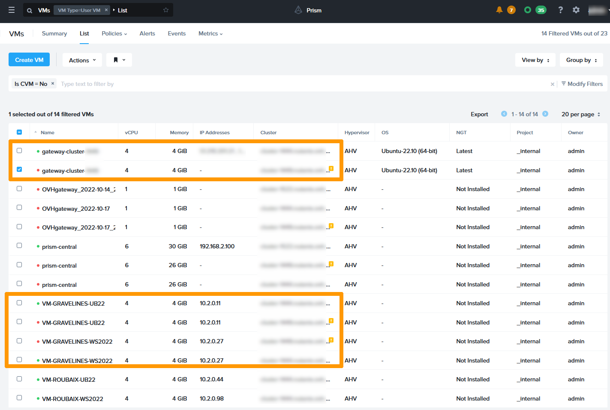{.thumbnail}


<a name="gofurther"></a>
## Aller plus loin

[Interconnexion de clusters au travers du vRack](https://https://docs.ovh.com/fr/nutanix/nutanix-vrack-interconnection/)

[Plan de reprise d'activité sous Nutanix](https://docs.ovh.com/fr/nutanix/disaster-recovery-plan-overview/)

[Réplication asynchrone ou NearSync au travers de Prism Element](https://docs.ovh.com/fr/nutanix/prism-element-nutanix-replication/)

[Réplication avancée avec Leap](https://docs.ovh.com/fr/nutanix/leap-replication/)

[Présentation des vRack](https://www.ovh.com/fr/solutions/vrack/)

[AHV Metro - Witness Option](https://portal.nutanix.com/page/documents/details?targetId=Leap-Xi-Leap-Admin-Guide-v2022_6:ecd-ecdr-witness-syncrep-pc-c.html]


Échangez avec notre communauté d'utilisateurs sur <https://community.ovh.com/>.


