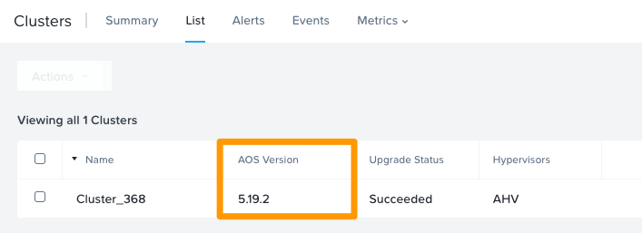
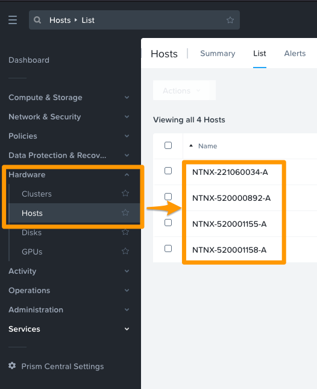
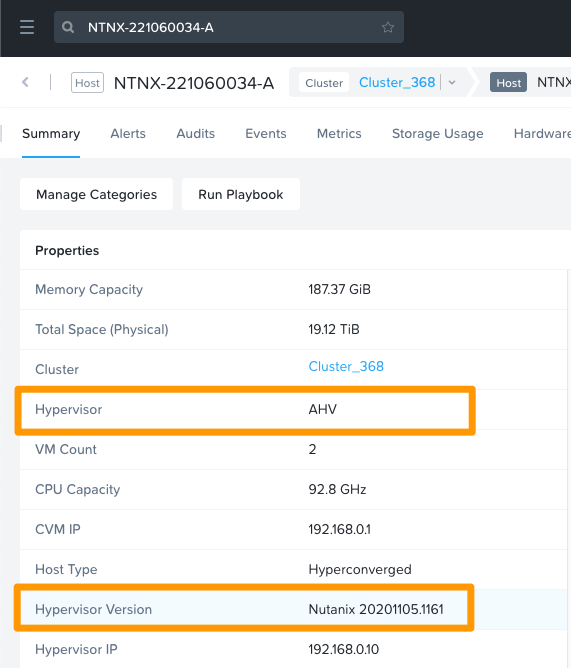
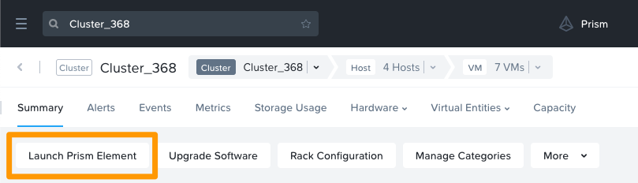
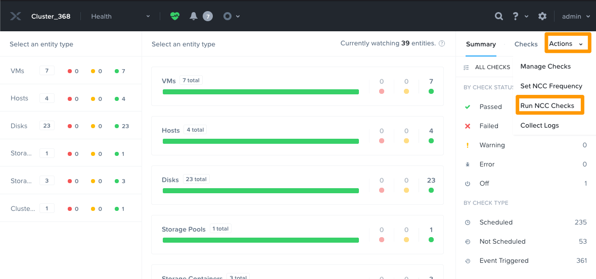
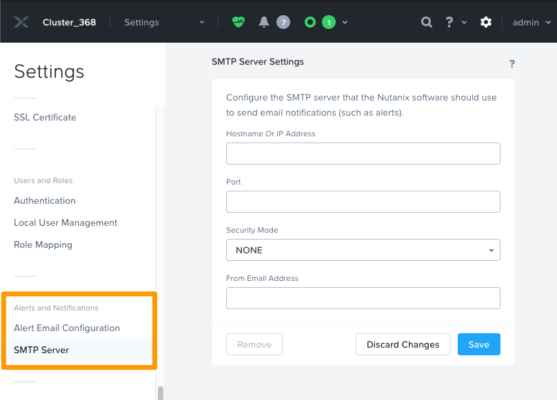
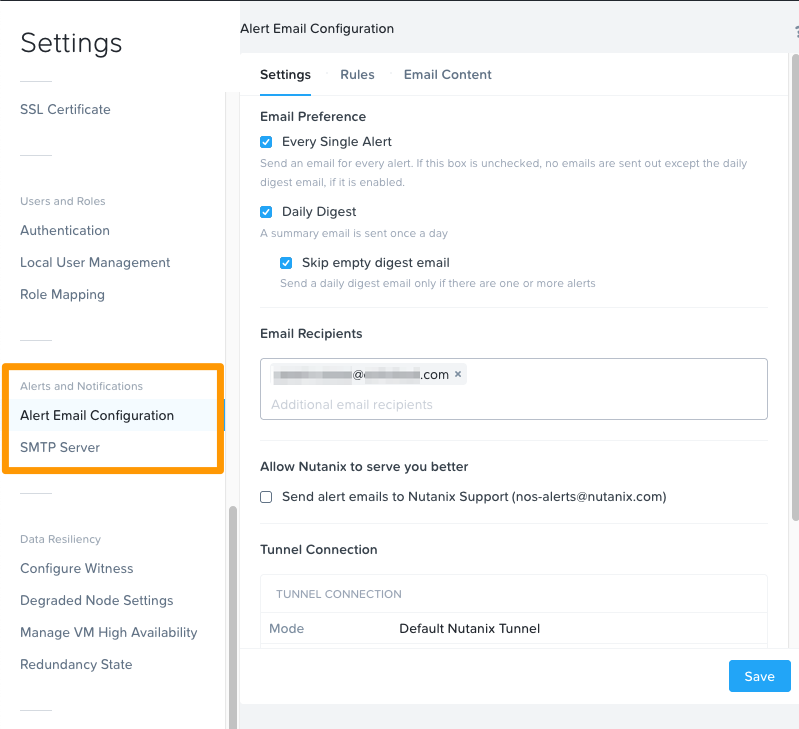

**Last updated 14th March 2022**

## Objective

In order to optimise the handling of support tickets for Nutanix on OVHcloud, it is essential to provide OVHcloud teams with a set of information on the status of your Nutanix installation.

**This guide explains how to retrieve essential information on the status of your Nutanix cluster.**

## Requirements

- A Nutanix cluster in your OVHcloud account
- Login credentials and URL for Prism Central, received via email after the installation

## Instructions

We recommend that you retrieve **all of the information** detailed in this guide before contacting the OVHcloud support.

### Information on the AOS <a name="aos"></a>

Log in to Prism Central, open the main menu in the top left-hand corner and click on `Hardware`{.action}, then `Clusters`{.action}.

{.thumbnail}

Click the `List`{.action} tab and note down the **AOS version** for the cluster concerned.

{.thumbnail}

### Hypervisor information <a name="hypervisor"></a>

Now open the main menu again and click on `Hardware`{.action} then `Hosts`{.action}.<br>
Select a host from the list of hosts in your cluster.

{.thumbnail}

Note the type of **Hypervisor** and the **Hypervisor Version**.<br>
In the example below, the hypervisor type is AHV and the hypervisor version is 20201105.1161.

{.thumbnail}

### Node Serial Number <a name="node-sn"></a>

From the same host summary tab, note the **Node Serial** number.

{.thumbnail}

### Nutanix Cluster Check (NCC) Health Report

The Nutanix Cluster Check (NCC) health report is a comprehensive report on the current state of the cluster, including many hardware and software control points.

This NCC report can help OVHcloud and Nutanix support carry out investigations on any faults found on your cluster.

To get this report, log into Prism Central, open the menu in the top left-hand corner and click `Hardware`{.action}, then `Clusters`{.action}.

{.thumbnail}

Select the cluster concerned to access its details.
<br>From the `Summary`{.action} tab, click `Launch Prism Element`{.action}.

{.thumbnail}

The management interface for your cluster, Prism Element, will then open.

#### Generating NCC checks

From the Prism Element interface, open the drop-down menu in the top left-hand corner, then click `Health`{.action}.

{.thumbnail}

To the right of the window, click on `Actions`{.action}, then `Run NCC checks`{.action}.

{.thumbnail}

In the window that appears, tick the boxes “All Checks” and “Send the cluster check report in the email” (only if you would like to [receive the report by email](#email)), then click `Run`{.action}.

{.thumbnail}

You can track the execution of the NCC verification tasks by clicking `Tasks`{.action} from the Prism Element interface drop-down menu, or by clicking the blue icon for the current tasks and then clicking `View all tasks`{.action}.

{.thumbnail}

Once the verification is complete, click `Succeeded`{.action} in the "Status" column. 

{.thumbnail}

You can then download the NCC report in .txt format by clicking `Download output`{.action}.

{.thumbnail}

Once the report has been downloaded, you can then send it to our teams along with any elements already retrieved:

- [AOS version](#aos)
- [Hypervisor type and version](#hypervisor)
- [Node serial number](#node-sn)

> [!primary]
> Use the [Plik tool](https://ca.plik.ovh/#/) to upload your report and send it to us as a download link. You can find more information on using the Plik tool in [this guide](https://docs.ovh.com/us/es/customer/plik/).
>

#### Receiving NCC report by email <a name="email"></a>

In order to receive the NCC report by email, it is necessary to have pre-populated an SMTP server and at least one email address for notification of alerts and activity reports.

##### **Adding an SMTP server**

In the Prism Element interface, open the drop-down menu in the top left-hand corner and click `Settings`{.action}.

Scroll to the "Alerts and Notifications" submenu on the left and click `SMTP Server`{.action}.

{.thumbnail}

Enter the configuration details for your SMTP server, then click `Save`{.action}.

##### **Adding an email address**

In the Prism Element interface, open the drop-down menu in the top left-hand corner and click `Settings`{.action}.

Scroll to the "Alerts and Notifications" submenu on the left and click `Alert Email Configuration`{.action}.

{.thumbnail}

Check at least the "Every Single Alert" box to receive the NCC report. Enter a valid email address in the field, then click `Save`{.action}.

### Collect all cluster logs

For more accurate analysis, it may be necessary to retrieve logs from nodes and **Prism Central**.

It is possible to collect logs from **Prism Element** but we recommend using the command line on the cluster or on **Prism Central**.

The log recovery tool (Logbay) is available on each **CVM** of a node and on **Prism Central**. 

You can generate the logs and retrieve them via SSH.

> [!primary]
>
> For more information about **Logbay** and **Putty**, see the [Go further](#gofurther) section of this guide.

#### Collect logs about Prism Central

Connect to the IP address of **Prism Central** via SSH with the **ssh** command on Linux, or with the **Putty** tool on Windows.

For example on Linux:

```ssh nutanix@prismcentralipaddress```

Collect logs:

```bash
logbay collect 
```

Display the name of the generated file:

```bash
ls /home/nutanix/data/logbay/bundles
```

Then retrieve the logs collected in a .zip file.<br>
To do this, make a copy of the files from a computer on Linux via the **scp** command, or on Windows with **pscp**:

```bash
scp nutanix@adresseipprismcentral:/home/nutanix/data/logbay/bundlesNTNX-Log-generatedfile.zip
nutanix@adresseipprismcentral's password:
```

#### Collect all node logs from Prism Element IP

Log in on the cluster’s IP address via SSH with the **ssh** command on Linux, or with the **Putty** tool on Windows.

For example on Linux:

```ssh nutanix@prismelementipaddress```

Collect all node logs:

```bash
allssh logbay collect
```

Display the names of all generated files:

```bash
allssh ls /home/nutanix/data/logbay/bundles
```

Then retrieve the logs collected in .zip files.<br>
To do this, copy each generated file onto each node:

```bash
scp nutanix@CVM1:/home/nutanix/data/logbay/bundlesNTNX-Log-generatednumber-PE-prismelementipaddress.zip
nutanix@CVM1's password:
scp nutanix@CVMN:/home/nutanix/data/logbay/bundlesNTNX-Log-numerodemande-PE-prismelementipaddress.zip
nutanix@CVMN's password:
```

> [!primary]
> Use the [Plik tool](https://ca.plik.ovh/#/) tool to upload your .zip files and send them to us as download links. You can find more information on using the Plik tool in [this guide](https://docs.ovh.com/us/es/customer/plik/).
>

## Go further <a name="gofurther"></a>

[Putty](https://www.putty.org/)

[Logbay Nutanix documentation](https://portal.nutanix.com/page/documents/kbs/details?targetId=kA00e000000LM3BCAW)

Join our community of users on <https://community.ovh.com/en/>.
