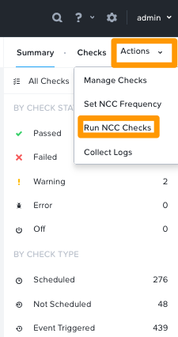
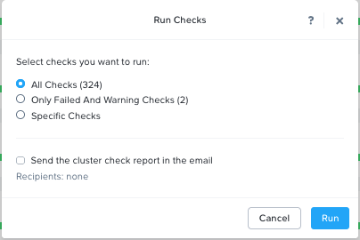
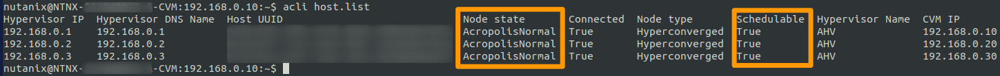
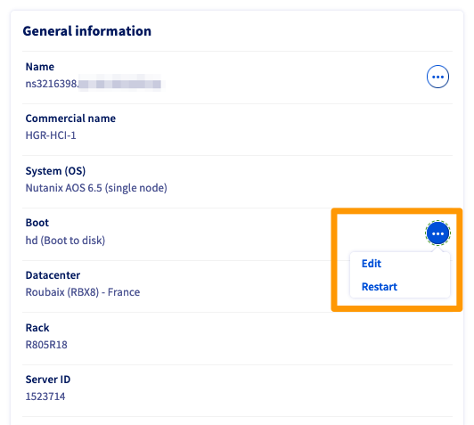

**Last updated 8th March 2023**

## Objective

This article provides you with the steps to update Nutanix clusters firmwares by putting each node in maintenance, before rebooting in rescue mode one node at a time.

Our services will take over to apply updates firmwares and will restart the node once done.

> [!warning]
> Before beginning any action, log in to your [OVHcloud Control Panel](https://www.ovh.com/auth/?action=gotomanager&from=https://www.ovh.co.uk/&ovhSubsidiary=GB) and create a support request ticket to ask a firmware update and provide the OVHcloud support teams with the technical elements regarding your cluster.

**Find out how to update your Nutanix cluster firmware.**

## Requirements

- A Nutanix cluster in your OVHcloud account
- Access to the [OVHcloud Control Panel](https://www.ovh.com/auth/?action=gotomanager&from=https://www.ovh.co.uk/&ovhSubsidiary=GB)
- Consulting the guide [First steps to use the OVHcloud API](https://docs.ovh.com/gb/en/api/first-steps-with-ovh-api/) (to familiarise yourself with the OVHcloud API)

## Instructions

Before any action, log in to your Prism Element interface and perform the following tasks:

- Check that the cluster's "**Data Resiliency Status**" is `OK`

This can be verified on the main dashboard of your Prism Element interface:

{.thumbnail}

- Run a NCC check

In the Prism Element interface, click `Health`{.action} from the main menu.

{.thumbnail}

Then click `Actions`{.action} to the right and click `Run NCC Checks`{.action}.

{.thumbnail}

Select `All checks`{.action} and click `Run`{.action}.

{.thumbnail}

A log file called `/home/nutanix/data/logs/ncc-output-latest.log` will be generated at the end of checks.

Please analyze it carefully. If you find errors or fails about cluster or service state, do not continue and contact the OVHcloud support.

> [!primary]
> It is possible to run NCC checks on the CVM by typing the following command from a terminal.

```bash
ncc health_checks run_all
```

### Enabling maintenance mode

Nodes will be updated one by one, the Nutanix cluster will continue to work properly.

To log in to CVM, you can launch IPMI from your OVHcloud Control Panel or use a terminal.

> [!primary]
> Before putting the host in maintenance, ensure remaining hosts have enough resources to host migrated VMS from it (CPU, Memory, storage).

#### Connect to CVM

At the login prompt, log in with root credentials to access the host terminal.<br>
Then open an SSH connection to any CVM with Nutanix credentials to access the CVM terminal.

{.thumbnail}

#### Check nodes state

Once logged in, check that:

- `Node state` status is set to `AcropolisNormal`.
- `Schedulable` column is set to `True` for all nodes.

Then run the following command to check:

```bash
acli host.list
```

{.thumbnail}

If all checks are OK, you need to check that the current host state can be changed to maintenance. To do so, use the following command:

```bash
acli host.enter_maintenance_mode_check <Hypervisor_IP>
```

{.thumbnail}

#### Put a node in maintenance mode

> [!primary]
> VMs with specific policies (like affinity, CPU passthrough...) shall be stopped manually before running maintenance as they will not migrate.

If all hosts are eligible to maintenance mode, put a first host in maintenance mode with the following command:

```bash
acli host.enter_maintenance_mode 192.168.0.1 wait=true
```

{.thumbnail}

> [!warning]
> When hosts enter maintenance mode, all hosted VMs will be migrated on other hosts without any interruption.

#### Shutdown the CVM

Once the host is in maintenance mode, CVM can be shutdown with the following command:

```bash
cvm_shutdown -P now
```

{.thumbnail}

With root credentials, open a terminal on the node that hosts the CVM and confirm that the CVM is stopped:

```bash
virsh list --all
```

{.thumbnail}

On the main dashboard, the "**Data Resiliency Status**" will become `Critical`, the cluster is now running with 2 nodes.

{.thumbnail}

The CVM is now shut down.

### Reboot to rescue mode

Log in to the [OVHcloud Control Panel](https://www.ovh.com/auth/?action=gotomanager&from=https://www.ovh.co.uk/&ovhSubsidiary=GB), go to the `Hosted Private Cloud`{.action}, choose the `Nutanix`{.action} solution and select your cluster.

{.thumbnail}

Identify the node to boot in rescue mode by using the following OVHcloud API call:

> [!api]
>
> @api {GET} /nutanix/{serviceName}
>

- `serviceName`: enter the cluster name

You can then identify your node name:

{.thumbnail}

Once you have retrieved the name of the node to reboot in rescue mode, select this node in your OVHcloud Control Panel.

In the `Boot` section, click the `...`{.action} button then click `Edit`{.action}.

{.thumbnail}

Change the netboot by choosing `rescue mode`{.action}, choose the `rescue-customer`{.action} version and click `Next`{.action}.

{.thumbnail}

Confirm your choice.

{.thumbnail}

Once confirmed, a green message will confirm that the new netboot has been updated.

Click again the `...`{.action} button and click `Restart`{.action}.

{.thumbnail}

The server will reboot. Optionally, you can open an IPMI session to follow the reboot of your node.

When the node is booted on `rescue-customer`, update the your support ticket with this information to notify the OVHcloud support teams that they can proceed with the firmware update.

Our support teams will finish the necessary updates, meaning they will:

- restart the node on the local disk, which will start the Nutanix system and the CVM automatically.
- update the ticket to let you know you can exit the node from maintenance mode.

At this time, the node will be up and running, follow the next step to exit the maintenance mode.

### Exit from maintenance mode

After updating the node, our services will reboot the node from local disk. The Nutanix software will load AOS and the CVM will automatically start.

Once the system is up and running, log in to the CVM and run the following command:

```bash
acli host.list
```

As you can see in the output image below, the first node is still in maintenance mode.

{.thumbnail}

To exit the node from maintenance mode, run the following command:

```bash
host.exit_maintenance_mode 192.168.0.1
```

The host exits from `maintenance` state and goes back to `Normal` state.

{.thumbnail}

Migrated VMs from this node automatically move from other nodes to it.

On the main dashboard, the "**Data Resiliency Status**" will revert to `OK`, the cluster also returns to its nominal state.

{.thumbnail}

Proceed with the remaining nodes one at a time with the same steps.

Please do not open a new ticket, just add comments on the same ticket for each node, specifying the name server (e.g. `ns123456`).

## Go further <a name="gofurther"></a>

Join our community of users on <https://community.ovh.com/en/>.
