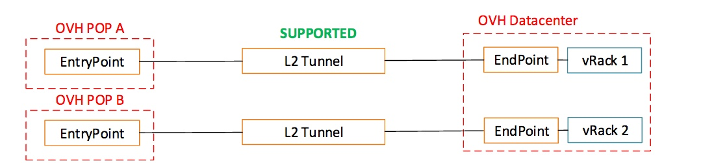

**Last updated 11th May 2020**

## Layer 2 implementation

{.thumbnail}

L2 Tunnel is directly forwarded to/from vRack so all L2 traffic is forwarded to/from customer inter-connection.

By L2 Traffic, it means Ethernet frames, with 802.1q header if present:
* Ethernet broadcast are forwarded
* Unknown Ethernet unicast are forwarded
* Multicast is forwarded (considered broadcast, limited to 20pps)
* Specific point-to-point Ethernet frames (like LLDP or LACP) are not forwarded

Only one OVHcloud Connect L2 is supported per vRack: a POP/EntryPoint can only be associated with one DC/EndPoint.

{.thumbnail}

Following scheme is not supported.

{.thumbnail}

With L2 Mode, redundancy could not be managed between two POP/EntryPoint. The only solution is to proceed with a LAG on a POP/EntryPoint.

## Connection mode details

L2 means operating at Ethernet-level. Customer's vRack is extended "as-is" from OVHcloud and forwarded to customer link. Such mode is transparent to vlans and is the best way to inter-connect customer's legacy network with OVHcloud vRack.

{.thumbnail}

L2 Mode is limited to point-to-point topology: backup link through a second POP is not supported.

{.thumbnail}

LACP is mandatory for aggregation when 2 links are configured with POP.

Jumbo Frames up to 9000 bytes are supported.

Connection between a POP and a datacenter benefit from OVHcloud backbone so an internal link failure is supported and will not impact customer traffic.
