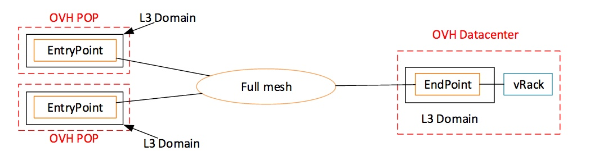
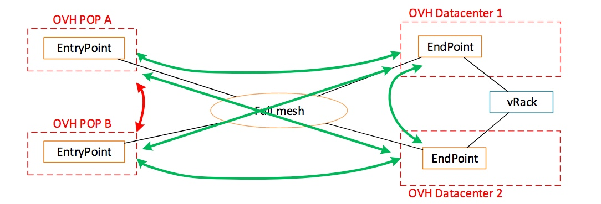
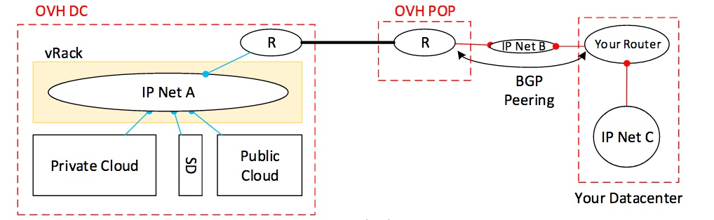

**Last updated 11th May 2020**

## Layer 3 Implementation

OVHcloud Connect configured in Layer 3 differ from Layer 2 as you have to configure L3 Domain on each POP/EntryPoint DC/EndPoint.

{.thumbnail}

A L3 Domain is composed of:

* A subnet
* A BGP ASN

The L3 Domain is an IP Routing instance provided by OVHcloud. Traffic is forwarded between POP/EntryPoint and DC/Endpoint, not between POP/EntryPoint. There’s no need for internal IP addressing between POP/EntryPoint and DC/EndPoint. In the datacenter, the routing instance inside the L3 Domain is composed of two devices, called ‘A’ and ‘B’.

From this principle it’s now possible to manage several OVHcloud Connect:

{.thumbnail}

Now, we are multi-DC capable:

{.thumbnail}

These two examples need to order and configure two OVHcloud Connect as one OVHcloud Connect equal to one POP/EntryPoint.

Rules:

* You can have as many OVHcloud Connect L3 as you want in the same vRack
* You can associate several EntryPoint/POP with one EndPoint/DC
* You can associate several Endpoint/DC with one EntryPoint/POP
* You cannot associate two EntryPoint/POP (i.e you can not forward traffic between them)
* A L3 Domain can only be associated with one EndPoint/DC
* A L3 Domain (i.e subnet) cannot be stretched between two DC or two POP
* An OVHcloud Connect L2 can be mixed with several OVHcloud Connect L3 in the same vRack

{.thumbnail}

The following schema shows the mix of L2 and L3. They can end in the same OVHcloud datacenter or not.

{.thumbnail}

## Connection mode details

{.thumbnail}

On such architecture, two L3 Domains are needed: POP/EntryPoint and DC/EndPoint.

"IP Net A" is part of the L3 Domain in DC, needed information:

* IP Addressing plan (subnet and netmask) with a minimum netmask value “/29”
* The first IP address is reserved for the virtual gateway (if running VRRP)
* The two following IP addresses are reserved for OVHcloud routing instance
* All others IP addresses are available to the customer

| IP Address | Role |
|:-----:|:-----:|
| A.B.C.0 | Subnet |
| A.B.C.1 | OVHcloud Virtual Router Address (if enabled) |
| A.B.C.2 | OVHcloud Router A |
| A.B.C.3 | OVHcloud Router B |

"IP Net B" is part of the L3 Domain in POP, needed information:

* Supported netmask: /30 (CIDR notation)
* First IP address for OVHcloud Routing instance
* Second IP address for customer equipment

| IP Address | Role |
|:-----:|:-----:|
| A.B.C.0 | Subnet |
| A.B.C.1 | OVHcloud Router |
| A.B.C.2 | Customer Router |
| A.B.C.3 | Subnet broadcast |

### VRRP configuration in DC/EndPoint

VRRP allows router redundancy on OVHcloud devices.

* Each EndPoint/DC supports only one VRRP instance,
* The VRRP VRID value is provided by OVHcloud,
* By default, VRRP is master on ‘A’ device,
* Static routes can be configured. 

### BGP configuration

BGP is mandatory in POP/EntryPoint and optional in DC/EndPoint. Enabling BGP in DC/EndPoint disables VRRP configuration.

* Each EntryPoint/POP and EndPoint/DC need an AS. This AS must be independent from Customer BGP AS to form an eBGP relation.
Recommended value in the range 64512-65534.
* Each EntryPoint/POP supports only one BGP session (no eBGP Multihop)
* With two or more EntryPoint/POP, ECMP is automatically enabled. MED and/or AS-PATH must be tuned to have path selection.
* Each EndPoint/DC supports up to 4 BGP peers
* Up to 100 prefixes can be announced per BGP session
* For each EndPoint/DC, you must establish a BGP session with ‘A’ device and ‘B’ device
* By default, BFD is activated on all BGP session, this protocol is higly recommended on DC side to have a faster convergence

For example, IP network 'B' will be announced to OVHcloud router through BGP session.

{.thumbnail}

At a more global level, BGP topology will look like this:

{.thumbnail}

### BGP path selection

By default, all available paths are enabled using ECMP, up to 4 paths are supported. So to have an active/passive topology with two POP/EntryPoint, we can use as-path using prepend or MED.

If as-prepend is configured on customer's devices on POP2, topology will look like:

{.thumbnail}

Note: as-prepend is not configurable on OVHcloud devices

Using MED is another alternative to get the same topology:

{.thumbnail}
