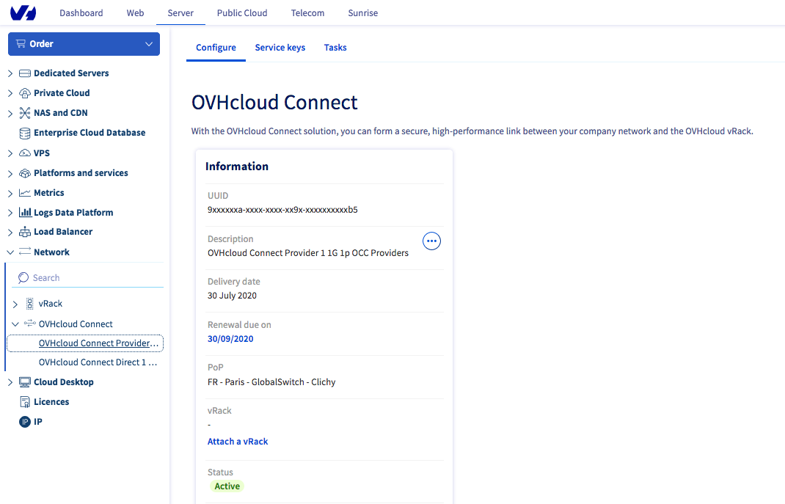
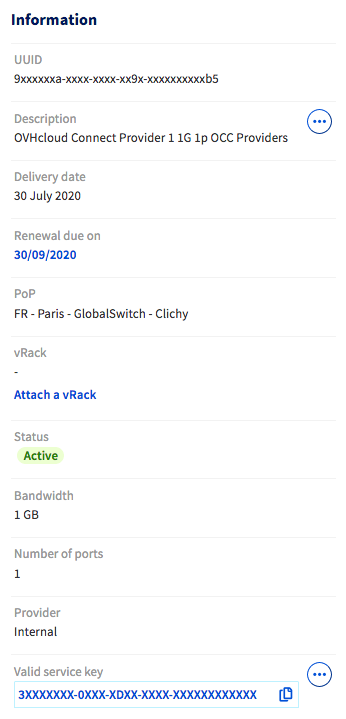

**Dernière mise à jour le 24/08/2020**

## Objectif

OVHcloud Connect permet d’étendre votre réseau d’entreprise avec votre réseau privé OVHcloud vRack sans passer par la création d’un tunnel VPN à travers Internet. Cette connexion sera ainsi plus rapide, plus fiable et avec une bande passante garantie. 

**Ce guide vous présente la mise en service de l'offre OVHcloud Connect Provider depuis l'espace client OVHcloud**

## Prérequis

- Avoir commandé une [offre OVHcloud Connect Provider](https://www.ovh.com/fr/solutions/ovhcloud-connect/) {.external}.
- Disposer d'un [vRack OVHcloud](https://www.ovh.com/fr/solutions/vrack/)
- Être connecté à votre [espace client OVHcloud](https://www.ovh.com/auth/?action=gotomanager){.external}.

## En pratique

### Étape 1 : commande de votre offre

Une fois votre offre OVHcloud Connect Provider commandée, vous recevrez une confirmation de commande par e-mail ainsi qu'une clé de service (ServiceKey).

Selon le fournisseur que vous avez choisi, rendez-vous ensuite sur le portail de celui-ci pour vous identifier, le lien étant fourni dans l'e-mail de confirmation de commande. 
Renseignez alors votre clé de service et validez la commande qui vous sera présentée.

Vérifiez par la suite dans votre  [espace client OVHcloud](https://www.ovh.com/auth/?action=gotomanager){.external} le statut d'activation de votre offre. Pour cela, cliquez sur `Server`{.action} en haut à gauche puis sélectionnez l'onglet `Network`{.action}. Cliquez alors sur `OVHCloud Connect`{.action} puis sur votre offre. Le statut de votre offre passera à « Actif »

### Étape 2 : associer un vRack

Connectez-vous à [l’espace client OVHcloud](https://www.ovh.com/auth/?action=gotomanager){.external}, cliquez sur `Server`{.action} en haut à gauche puis sélectionnez l'onglet `Network`{.action}. Cliquez alors sur `OVHCloud Connect`{.action} puis sur votre offre.

{.thumbnail}

Vous devez commencer par associer un vRack à votre offre. Cliquez sur le bouton  `Associer un vRack`{.action} et sélectionnez un vRack existant dans le menu déroulant. 

{.thumbnail}

{.thumbnail}

Un message vous confirmera l'association du vRack.

{.thumbnail}

### Étape 3 : ajouter une configuration PoP

> [!warning]
> L'offre OVHcloud Connect Provider nécessite une configuration de niveau L3.
>

Une fois votre vRack associé, cliquez sur `Ajouter une configuration PoP`{.action} et sélectionnez la configuration L3 dans le menu déroulant.

{.thumbnail}

Vous devrez saisir votre ASN, l'ASN OVHcloud ainsi que que l'adresse réseau en /30.

{.thumbnail}

Le menu `Configuration PoP` apparaîtra alors.

{.thumbnail}

Vous pouvez également ajouter une seconde configuration PoP L3 via le deuxième menu `Configuration PoP` qui vous sera présenté.

### Étape 4 : ajout d'une configuration Datacentre 

Lorsque votre configuration PoP a été définie, cliquez sur `Ajouter une configuration`{.action} sous le menu `Configuration Datacentre`. Sélectionnez un Datacentre dans le menu déroulant puis renseignez votre ASN OVHcloud ainsi que l'adresse du réseau en /30. 

{.thumbnail}

Vous pouvez ajouter des configurations Datacentre supplémentaires en cliquant sur le bouton `...`{.action} puis sur `Ajouter une configuration`{.action}.

{.thumbnail}

Vous devez également ajouter une configuration de routage.

##### **Ajout d'une configuration de routage**

Cliquez sur le bouton `(...)`{.action} sur le Datacentre voulu puis sur `Ajouter configuration de routage`{.action}.

{.thumbnail}

Choisissez alors le type de routage entre « Network » et « BGP ».

{.thumbnail}

Si vous choisissez le type « BGP », saisissez alors votre ASN OVHcloud ainsi que l'adresse IP Neighbor.

{.thumbnail}

Vous pouvez ajouter plusieurs configurations de routage au sein d'un même Datacentre. Le type de configuration choisi sur votre première configuration s'appliquera alors aux suivantes sur le même Datacentre.

## Aller plus loin

Échangez avec notre communauté d'utilisateurs sur <https://community.ovh.com/>.
