- [Context](#context)
- [DE preparation](#de-preparation)
    - [Segment creation](#segment-creation)
        - [VLAN12 vlan](#vlan12-vlan)
        - [Segment DE (overlay Geneve)](#segment-de-overlay-geneve)
    - [VRF Creation](#vrf-creation)
    - [T1 Creation](#t1-creation)
    - [Connect the "Segment DE" to the T1 GW](#connect-the-segment-de-to-the-t1-gw)
    - [Create your VM in the vSphere](#create-your-vm-in-the-vsphere)
- [UK preparation](#uk-preparation)
    - [Segment creation](#segment-creation-1)
        - [VLAN12 vlan](#vlan12-vlan-1)
        - [Segment UK (overlay Geneve)](#segment-uk-overlay-geneve)
    - [VRF Creation](#vrf-creation-1)
    - [T1 Creation](#t1-creation-1)
    - [Connect the "Segment DE" to the T1 GW](#connect-the-segment-uk-to-the-t1-gw)
    - [Create your VM in the vSphere](#create-your-vm-in-the-vsphere-1)
- [Prepare NSX for BGP routing](#prepare-nsx-for-bgp-routing)
   - [DE preparation](#de-preparation-1)
      - [On the VRF](#on-the-vrf)
         - [Enable BGP and peers](#enable-bgp-and-peers)
         - [Configure a Route Re-distribution](#configure-a-route-re-distribution)
       - [On the T1](#on-the-t1)
   - [UK preparation](#uk-preparation-1)
      - [On the VRF](#on-the-vrf-1)
         - [Enable BGP and peers](#enable-bgp-and-peers-1)
         - [Configure a Route Re-distribution](#configure-a-route-re-distribution-1)
       - [On the T1](#on-the-t1-1)
- [It pings](#it-pings)
   - [From UK to DE](#from-uk-to-de)
   - [From DE to UK](#from-de-to-uk)
- [NSX Network Topology view](#nsx-network-topology-view)
   - [UK](#uk)
   - [DE](#de)

# Context
I want to link 2 VMs from 2 PCCs.

PCC in DE : pcc-145-239-250-146.ovh.de

PCC in UK : pcc-145-239-249-80.ovh.uk

I will use a vlan in vRack for the BGP peer connectivity. Vlan 12.
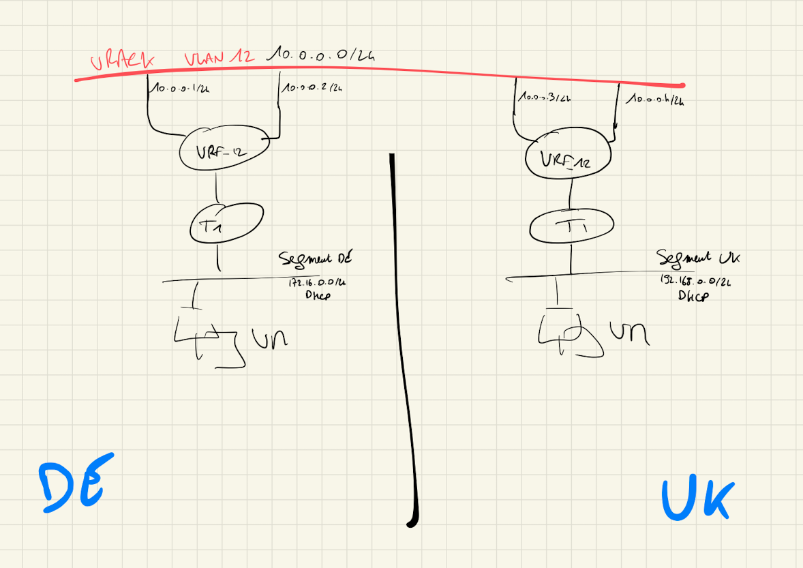

# DE preparation
## Segment creation
### VLAN12 (vlan)
Create a segment in the ovh-tz-vrack transportzone with the vlan ID 12. Give any IP for the Gateway, we are not going to use it.

### Segment DE (overlay Geneve)
Create an overlay segment where we are going to deploy our VM. I will use the 172.16.0.254 as Gateway on that segment. Configure a DHCP server to ease the deployment. This is not mandatory.

Note that we connect our segment to the **ovh-T1-gw** T1, we are going to change that later.

## VRF Creation
On the T0 menu, add a VRF type GW.

I name it VRF-12 and I connect it to the **ovh-T0-gw** gateway. Save it and keep editing.

Create 2 interfaces. One for each edge. On my IP plan, I have chosen 10.0.0.1 and 10.0.0.2, and I connect them to the previously created **vlan12** segment.

## T1 Creation
On the Tier-1 Gateways, add a new T1, name it as you want, I did **T1**, connect it to our VRF, connect it to our Edge cluster.

## Connect the "Segment DE" to the T1 GW
Edit the Segment DE that we have just created, and change the Connected GW to **T1**.

At the end you should have something like this :

## Create your VM in the vSphere
Create a VM, put it in your **Segment DE** portgroup, and you should have an IP. I have 172.16.0.10.

# UK preparation
## Segment creation
### VLAN12 (vlan)
Create a segment in the ovh-tz-vrack transportzone with the vlan ID 12. Give any IP for the Gateway, we are not going to use it.

### Segment UK (overlay Geneve)
Create an overlay segment where we are going to deploy our VM. I will use the 192.168.0.254 as Gateway on that segment. Configure a DHCP server to ease the deployment. This is not mandatory.

Note that we connect our segment to the **ovh-T1-981** T1, we are going to change that later.
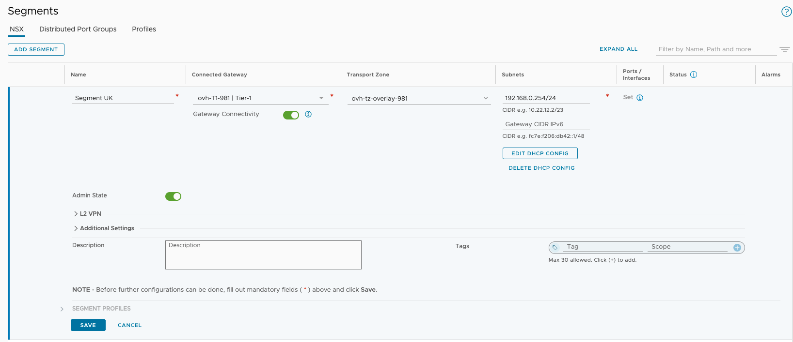

## VRF Creation
On the T0 menu, add a VRF type GW.

I name it VRF-12 and I connect it to the **ovh-T0-gw** gateway. Save it and keep editing.
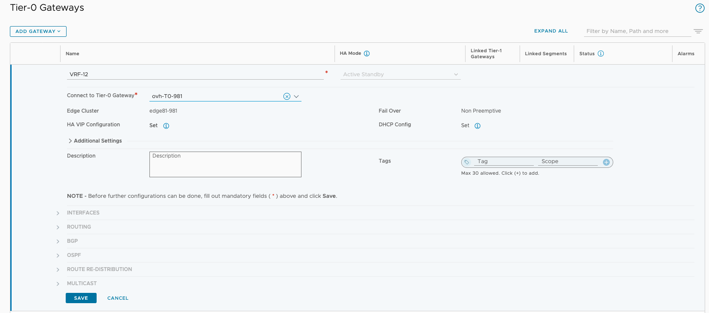

Create 2 interfaces. One for each edge. On my IP plan, I have chosen 10.0.0.3 and 10.0.0.3, and I connect them to the previously created **vlan12** segment

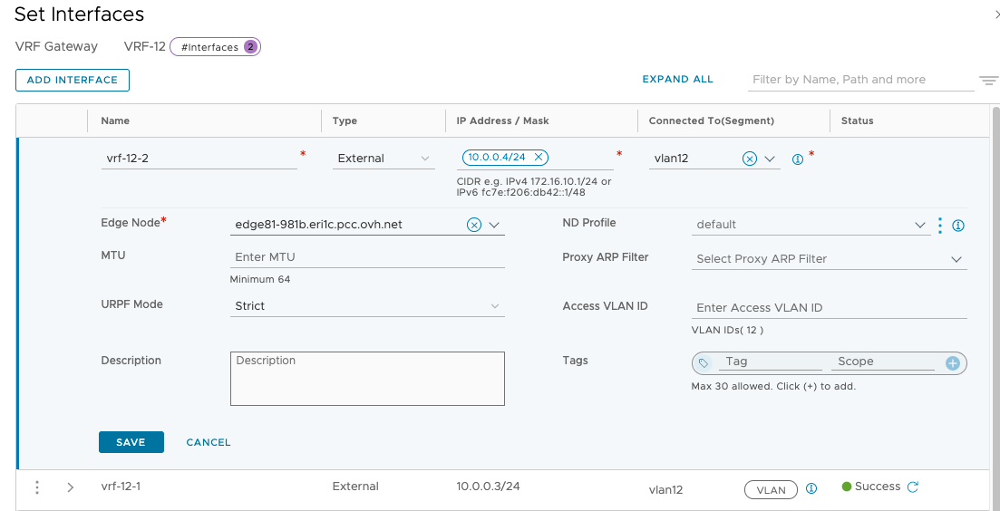

## T1 Creation
On the Tier-1 Gateways, add a new T1, name it as you want, I did **T1**, connect it to our VRF, connect it to our Edge cluster.
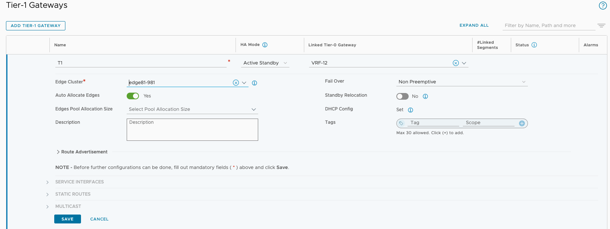

## Connect the "Segment UK" to the T1 GW
Edit the **Segment UK** that we have just created, and change the Connected GW to **T1**.
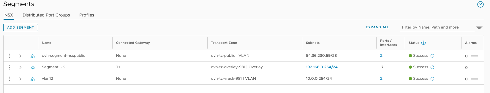

At the end you should have something like this :

## Create your VM in the vSphere
Create a VM, put it in your **Segment UK** portgroup, and you should have an IP. I have 192.168.0.10.

# Prepare NSX for BGP routing
Note the AS Numbers.

Note : As of today ( 11 Jul 2023 ) the feature is not available at the vrf level. It will be available with release 4.1.1 of NSX. The AS is 65000 on both PCC if you do not change anything because natively configured at the T0 level by the automation.

UK is 65000, IPs of my Edges are 10.0.0.3 and 10.0.0.4.

DE is 65005, IPs of my Edges are 10.0.0.1 and 10.0.0.2.

## DE preparation
### On the VRF
#### Enable BGP and peers
Enable BGP and add the Peers from UK.

#### Configure a Route Re-distribution
You need to configure a Route Redistribution of the connected Segments.

On the **Route Re-distribution** section of your VRF.
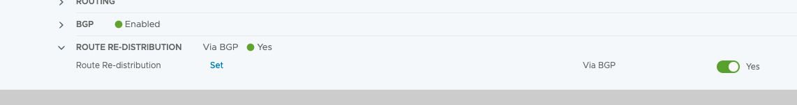

Add one Route Re-distribution rules with the connected segments of your T1.

### On the T1
Allow on the **Route Advertisement** the Connected Segments & Service Ports.

## UK preparation
### On the VRF
#### Enable BGP and peers
Enable BGP and add the Peers from DE.

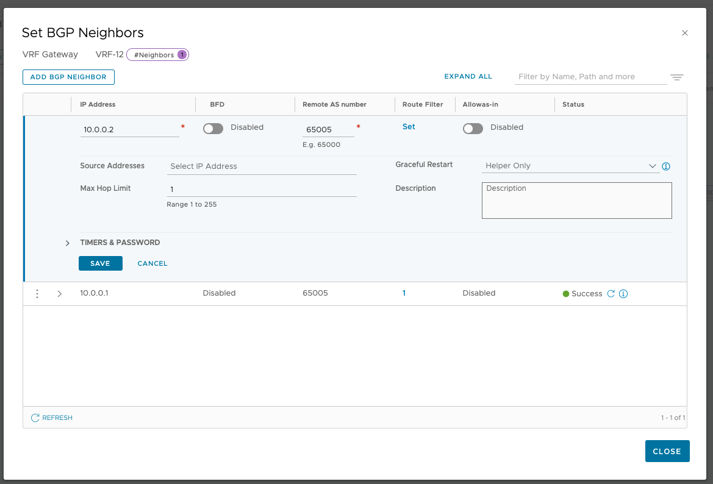

#### Configure a Route Re-distribution
You need to configure a Route Redistribution of the connected Segments.

On the **Route Re-distribution** section of your VRF.

Add one Route Re-distribution rules with the connected segments of your T1.

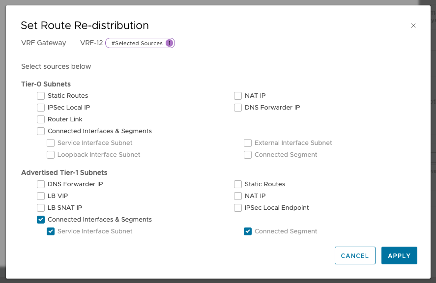

### On the T1
Allow on the **Route Advertisement** the Connected Segments & Service Ports.

# It pings
## From UK to DE

## From DE to UK

# NSX Network Topology view
## UK
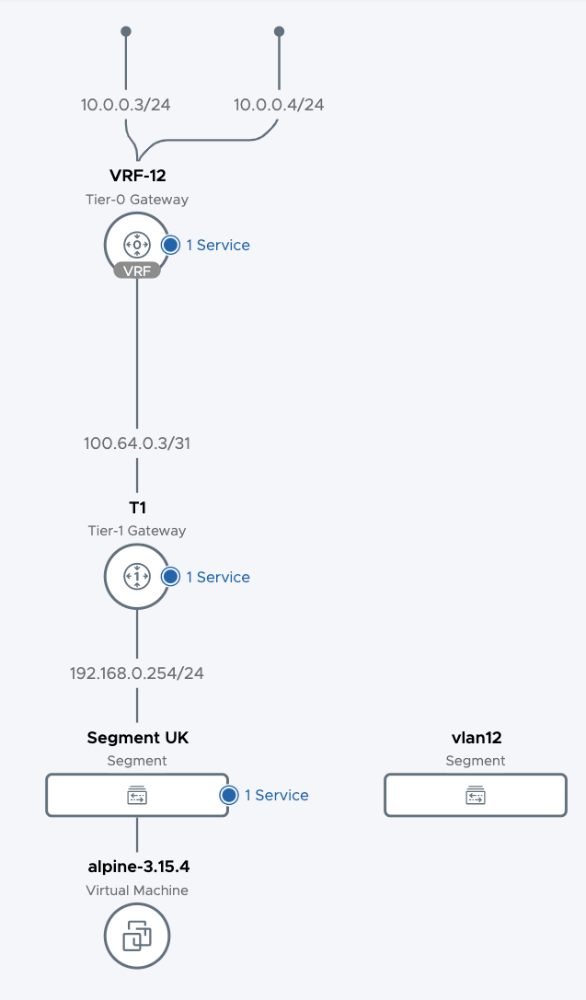

## DE
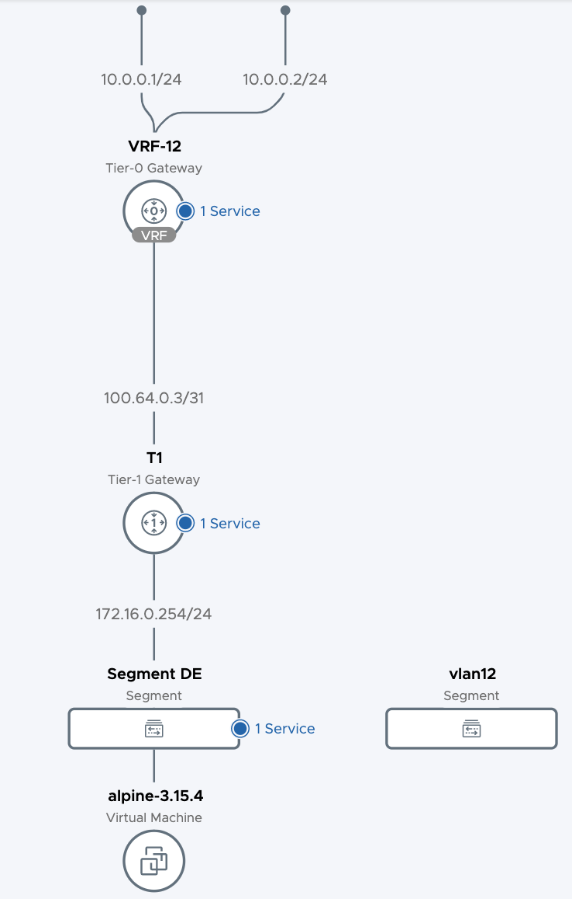
  
Join our community of users on <https://community.ovh.com/en/>.
