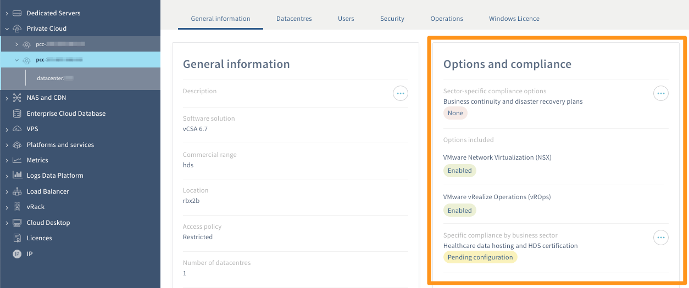
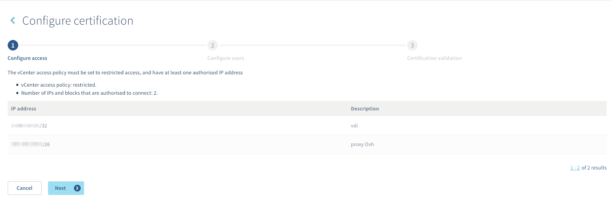
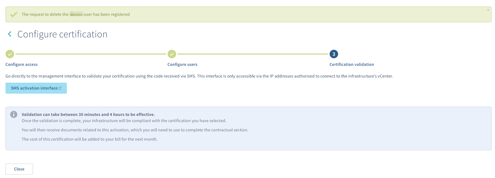

**Last updated 27th May 2020**

## Objective

To configure your Hosted Private Cloud for [healthcare data hosting](https://www.ovhcloud.com/en-gb/enterprise/products/hosted-private-cloud/safety-compliance/hds/) (HDS certification in France as well as regulatory compliance for healthcare data hosting in Italy, United Kingdom, Germany and Poland) or [financial data hosting](https://www.ovhcloud.com/en-gb/enterprise/solutions/certified-cloud-solutions/financial-data-hosting-pci-dss/) with PCI DSS certification, you have to follow the technical activation process below.

**Find out how to host healthcare or payment card data on your Hosted Private Cloud.**

## Requirements

> [!primary]
>
> These options can be activated as part of the hosting of healthcare data or financial data. Currently, a Private Cloud cannot be both PCI DSS and HDS at the same time.
>

- a Private Cloud infrastructure in version 6.0 or higher
- access to the `Server`{.action} section of the [OVHcloud Control Panel](https://www.ovh.com/auth/?action=gotomanager)

## Instructions

### Ensure that the security option is enabled

In order to adapt your Private Cloud for this certification, one of the corresponding security options must be enabled. To verify this, log in to the [OVHcloud Control Panel](https://www.ovh.com/auth/?action=gotomanager), and make sure you are in the “Server” section. Click `Private Cloud`{.action} and select the service concerned. 

In the window that appears, make sure you are on the `General information`{.action} tab. Then check the activation status of the security options in the "Options and compliance" section. 

{.thumbnail}

If the desired security option is not enabled, activate it by clicking on the `...`{.action} button, then on `Activate`{.action}. Several requirements are essential.

- **[NSX](https://www.ovhcloud.com/en-gb/enterprise/products/hosted-private-cloud/nsx-datacenter-vsphere/){.external} and [vROps](https://www.ovhcloud.com/en-gb/enterprise/products/hosted-private-cloud/vrops/){.external} options must be installed**: from the `General information`{.action} tab in the "Options and compliance" section, you can check the activation status of these options. If they are not enabled, activate them by clicking on the `...`{.action} button and then on `Activate`{.action}.

- **The vCenter access policy must be restricted**: from the `Security`{.action} tab, you can check the status of the access policy. If it is not restricted, make the change by clicking on the `Modify vCenter Access Policy`{.action} button, then following the steps. Our documentation “[Introduction to the OVHcloud Private Cloud Control Panel](../control-panel-ovh-private-cloud/)” can assist you in this process.

- **You must have at least one IP address authorised to log in to vCenter**: from the `Security`{.action} tab, make sure you have at least one authorised IP address. If necessary, use the `Add a new IP address range`{.action} button. Our documentation “[Introduction to the OVHcloud Private Cloud Control Panel](../control-panel-ovh-private-cloud/)” can assist you in this process.

To make sure you can always log in, we recommend that you have at least two authorised IP addresses. For reasons of accessibility, the latter must be fixed and not dynamic.

- **The "admin" user information is complete and they have the necessary permission**: from the `Users`{.action} tab, make sure for the "admin" user that the telephone number and email address are correctly filled in and that they have the “**token validator**” permission. If necessary, to change the user, click on the `...`{.action} button, then `Edit`{.action}. Our documentation “[Introduction to the OVHcloud Private Cloud Control Panel](../control-panel-ovh-private-cloud/)” can assist you in this process.

To make sure you can always log in to vCenter, we recommend that you have at least two users with the necessary information and permissions (with different email addresses and telephone number).

The first activation step ensures that the vCenter access policy is restricted and that you have at least one IP that can connect to the vCenter.

{.thumbnail}

The next step ensures that the necessary information of (at least) the admin user is filled in.

{.thumbnail}

Once the activation steps have been completed, you will need to:

- validate the token sent by SMS to users with the "**token validator**" permission. This confirms that you will be able to receive these tokens, which are essential for validating operations
- complete the documents you will receive by email to finalise the contractual part 

{.thumbnail}

In the meantime, we advise you to take your first steps with the secure interface by continuing reading this documentation. 

> [!primary]
>
> Consider that the vSphere interface will not be accessible during activation of the security option.
>

### Start with the secure interface

After the security option activation, you will receive the token validation process by email. It details, among other things, how they work and what you need to do to be able to use them. 

As a security measure following the security option activation:

- all existing users on your Private Cloud are disabled
- you must change your users' passwords to reactivate them
- changing your users' passwords must now be done from the secure interface. You will no longer be able to perform this manipulation from the OVHcloud Control Panel. 

As a reminder, access to the interface will only be possible once the security option has been activated.

Then log in to the secure interface via the link provided in the email you received. This should look like `https://pcc-xxx-xxx-xxx-xxx.ovh.com/secure/password-lost`. Once logged in, you will be able to change the password of the “admin” user and then the password of additional users.

For further details, please refer to our guide on [Using the secure interface](../secure-interface/).

## Go further

[Introduction to the OVHcloud Private Cloud Control Panel](../control-panel-ovh-private-cloud/)

Join our community of users on <https://community.ovh.com/en/>.