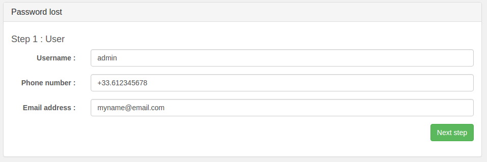

Ces options peuvent être activées dans le cadre de l'hébergement de données de santé, ou encore de données bancaires. Une seule de ces options ne peut être activé sur une même infrastructure.

Afin d'activer une option, rendez-vous dans votre [espace client](https://www.ovh.com/auth/?action=gotomanager&from=https://www.ovh.com/fr/){.external-link}, au niveau de l'infrastructure sur laquelle vous devez activer l'option. L'option ne pourra être activée que si les options NSX et vRops sont activées, que vous avez activé la [politique d'accès au vCenter]({legacy}1442246) (comprenant l'ajout d'au moins [une IP autorisée]({legacy}1442255) à se connectée) et que vous avez [complété les informations du contact admin vSphere]({legacy}1441987) de l'infrastructure.

{.thumbnail}

Cliquez sur le bouton "Enable" associé à l'option souhaitée pour suivre la procédure d'activation.

La première étape vérifie que les options NSX et vRops sont bien installées.

{.thumbnail}

La seconde étape vérifie que la [politique d'accès]({legacy}1442246) au vCenter est bien restreinte et que vous disposez au moins d'[une IP autorisée à se connecter au vCenter]({legacy}1442255).

Attention, si vous ajoutez une IP dynamique en tant que seule IP autorisée et que celle-ci change par la suite, vous ne pourrez plus en ajouter de nouvelles ou modifier la politique d'accès. En effet, ces manipulations devront être effectuées depuis une IP autorisée que vous n'auriez plus dans le cas présenté.

{.thumbnail}

La troisième étape vérifie que les [informations du contact]({legacy}1441987) admin (à minima) sont renseignées.

Dans l'exemple ci-dessous, ce n'est pas le cas, il faut donc quitter la procédure d'activation, corriger cela, et recommencer cette même procédure.

{.thumbnail}

La dernière étape récapitule le montant actuel de chacun de vos hôtes et le montant après activation de l'option.

Pour finaliser l'activation de l'option, vous devez valider le token reçu par SMS par les utilisateurs configurés en tant que "Token Validator". Cela permet de confirmer que vous recevez bien ces SMS que vous recevrez ensuite à chaque action qui nécessitera une validation de votre part.

Sur cette page, vous pouvez voir le nom de l'opération concernée et renseigner votre Token permettant de valider l'opération. La page n'est accessible que depuis les [IPs autorisées à se connecter au vCenter]({legacy}1442255) de l'infrastructure.

Attention, le token fourni n'est valable que 15 minutes. Sans validation de votre part en moins de 15 minutes, la tâche est annulée et vous sera à nouveau proposée par la suite (dans des cas de maintenance) ou vous devrez la relancer (dans le cas où cela fait suite à une action de votre part).

{.thumbnail}

Suite à l'activation de l'option, vous allez recevoir un mail détaillant notre processus de validation de token. Il est entre autre détaillé la façon dont ces tokens fonctionnent et ce qu'il vous faut effectuer avant de les utiliser.

Comme vous le constaterez dans le mail, tous les comptes en place sur l'infrastructure sont désactivés et vous devez changer leur mot de passe pour les réactiver.

Veuillez prendre connaissance du fait que suite à l'activation de l'option, vous ne pourrez plus modifier les mots de passe de vos utilisateurs via l'espace client, pour des questions de sécurité. Vous devrez donc passer par notre interface certifiée

Dans le mail reçu, vous trouverez l'accès à l'interface de changement de mot de passe, qui sera similaire à `https://pcc-xxx-xxx-xxx-xxx.ovh.com/secure/password-lost`.

Commencez par modifier votre mot de passe admin, puis les mots de passe des autres utilisateurs si nécessaire.

Chaque utilisateur peut changer son propre mot de passe via l'interface, mais seuls les utilisateurs "Token Validators" peuvent modifier l'intégralité des mots de passe.

{.thumbnail}

Suite au changement de mot de passe de tous les utilisateurs, votre option est active et totalement fonctionnelle.

Par la suite, vous recevrez des documents par mail concernant cette activation d'option et permettant de finaliser la partie contractuelle.
