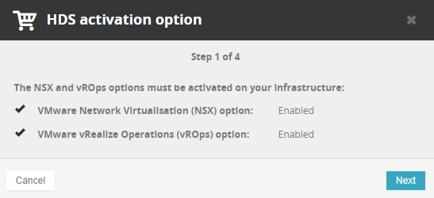
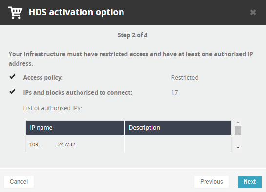
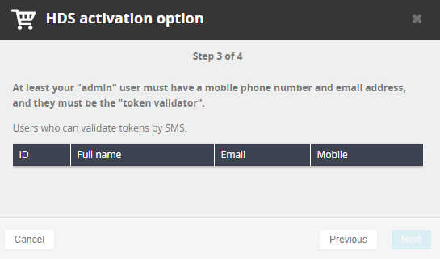
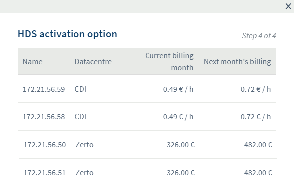

**Dernière mise à jour le 25 janvier 2019**

## Objectif

Pour rendre votre cloud privé conforme aux certifications HDS ou PCIDSS, vous devez réaliser l’activation technique décrite dans ce tutoriel.

## Prérequis

- Disposer d'une infrastructure Private Cloud en version 6.0 minimum.

## Activation

> [!primary]
>
> Ces options peuvent être activées dans le cadre de l'hébergement de données de santé, ou encore de données bancaires. Actuellement, un cloud privé ne peut être en même temps PCIDSS et HDS.
>

Afin d'activer une option, rendez-vous dans votre [espace client](https://www.ovh.com/auth/?action=gotomanager&from=https://www.ovh.com/fr/){.external-link}.

{.thumbnail}

Cliquez sur le bouton `Activer`{.action} (disponible en cliquant sur les 3 points) associé à l'option souhaitée pour suivre la procédure d'activation.

La première étape vérifie que les options NSX et vRops sont bien installées.

{.thumbnail}

La seconde étape vérifie que la [politique d'accès](https://docs.ovh.com/fr/private-cloud/manager-ovh-private-cloud/#securite){.external-link} au vCenter est bien restreinte et que vous disposez au moins d'[une IP autorisée à se connecter au vCenter](https://docs.ovh.com/fr/private-cloud/manager-ovh-private-cloud/#securite){.external-link}.

> [!warning]
>
> Attention, si vous ajoutez une IP dynamique en tant que seule IP autorisée et que celle-ci change par la suite, vous ne pourrez plus en ajouter de nouvelles ou modifier la politique d'accès. En effet, ces manipulations devront être effectuées depuis une IP autorisée que vous n'auriez plus dans le cas présenté.
> 

{.thumbnail}

La troisième étape vérifie que les [informations du contact](https://docs.ovh.com/fr/private-cloud/manager-ovh-private-cloud/#utilisateurs){.external-link} admin (à minima) sont renseignées.

{.thumbnail}

La dernière étape récapitule le montant actuel de chacun de vos hôtes et le montant après activation de l'option.

{.thumbnail}

> [!primary]
>
> Le changement de prix s'effectue sur tous les hôtes des différents datacentres virtuels.
>

> [!success]
>
> Si vous avez déjà souscrit à l'option lors de votre commande, il s'agira ici d'une simple activation technique. Le prix sera donc similaire.
>

Pour finaliser l'activation de l'option, vous devez valider le token reçu par SMS par les utilisateurs ayant le droit `Token Validator`. Cela permet de confirmer que vous recevez bien ces SMS que vous recevrez ensuite à chaque action qui nécessitera une validation de votre part.

## Mise en place

Suite à l'activation de l'option, vous allez recevoir un mail détaillant notre processus de validation de token. Il est entre autre détaillé la façon dont ces tokens fonctionnent et ce qu'il vous faut effectuer avant de les utiliser.

Comme vous le constaterez dans le mail, tous les comptes en place sur le cloud privé sont désactivés et vous devez changer leur mot de passe pour les réactiver.

Veuillez prendre connaissance du fait que suite à l'activation de l'option, vous ne pourrez plus modifier les mots de passe de vos utilisateurs via l'espace client, pour des questions de sécurité. Vous devrez donc passer par notre interface certifiée

Dans le mail reçu, vous trouverez l'accès à l'interface de changement de mot de passe, qui sera similaire à `https://pcc-xxx-xxx-xxx-xxx.ovh.com/secure/password-lost`.

Commencez par modifier votre mot de passe admin, puis les mots de passe des autres utilisateurs si nécessaire.

Chaque utilisateur peut changer son propre mot de passe via l'interface, mais seuls les utilisateurs ayant le droit `Token Validator` peuvent modifier l'intégralité des mots de passe.

Suite au changement de mot de passe de tous les utilisateurs, votre option est active et totalement fonctionnelle.

Vous retrouverez les détails de l'interface securisée sur [ce guide](https://docs.ovh.com/fr/private-cloud/interface-secure/)

Par la suite, vous recevrez des documents par mail concernant cette activation d'option et permettant de finaliser la partie contractuelle.

## Aller plus loin

Échangez avec notre communauté d'utilisateurs sur <https://community.ovh.com>.