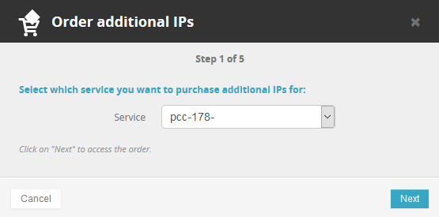
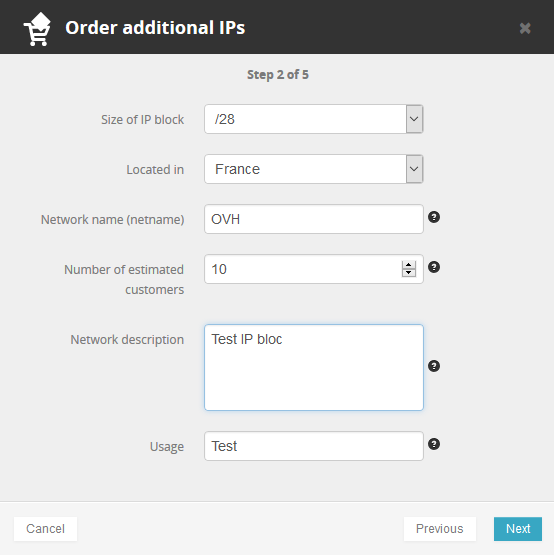
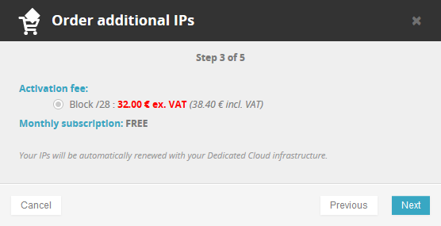
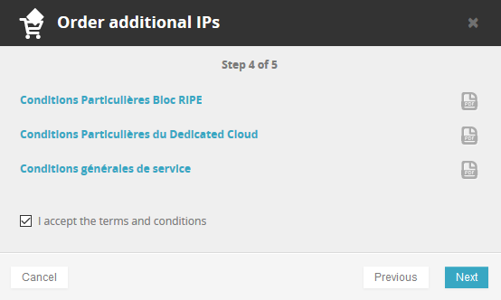
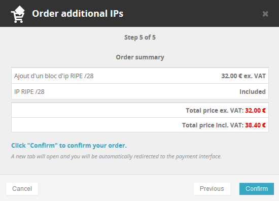
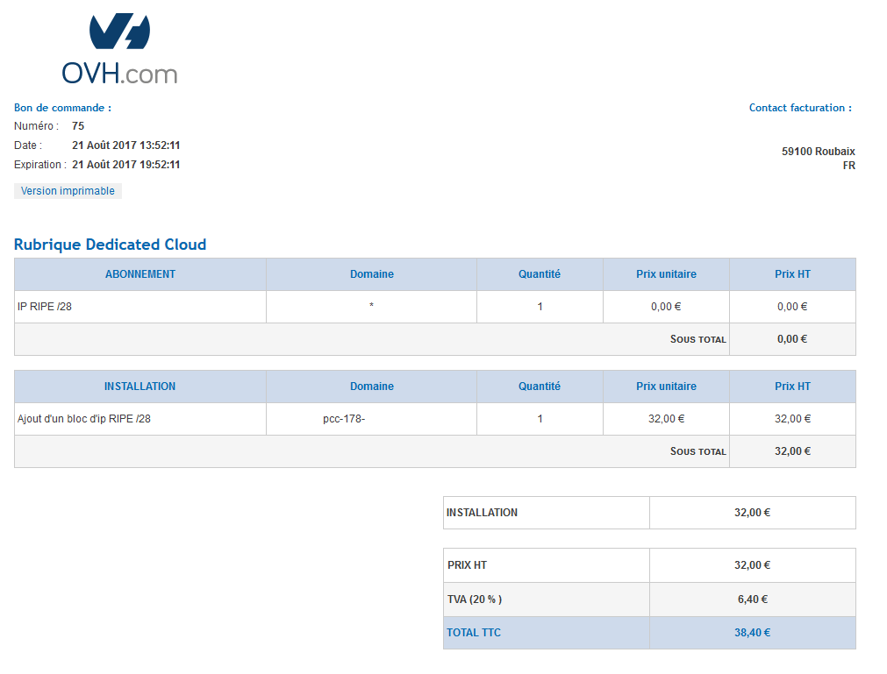

Un bloc IP peut vous servir à rendre vos services accessibles sur interne. En effet, vous pouvez ensuite utiliser une IP pour accéder à une VM, voire même lier un domaine à l'IP pour plus de praticité. L'IP peut être configurée sur une VM en accès directe, vous sur une VM qui fera office de firewall en entrée de réseau.

La **commande** d'un bloc IP supplémentaire pour votre Private Cloud se déroule depuis votre espace client dans la partie "Dédié", rubrique "IP", via le bouton "**Commander des IP additionnelles**".

{.thumbnail}

Dans le menu déroulant choisissez le nom de votre **Private Cloud**.

{.thumbnail}

Au niveau de l'**étape 2** vous aurez plusieurs champs à remplir :

- Taille du Bloc IP (de /28 à /24)
- Pays du bloc IP, important dans certains cas pour le référencement de vos services (un site à affluence française aura un meilleure référencement en France si l'IP est française également)
- Nom du réseau (information visible dans le whois du bloc ip)
- Nombre de clients estimés
- Description du réseau (information visible dans le whois du bloc ip)
- Usage

Un bloc IP en /28 correspondra à 16 IPs publiques, dont 5 seront réservées pour la gestion du réseau, vous permettant d'en utiliser 11. Dans l'exemple d'un bloc /27, vous disposez de 32 IPs dont 5 sont toujours réservées pour la gestion du réseau, vous permettant d'en utiliser 28.

N'hésitez pas à consulter notre guide sur le [plugin OVH Network]({legacy}7766560) afin de savoir quelles sont les IPs réservées de votre bloc ainsi que leur utilisation.

{.thumbnail}

Les frais d'activation d'un bloc sont de 2€HT/IP. Ainsi, pour un bloc en /28 comprenant 16 IPs, vous aurez un bon de commande de 32€HT à payer avant livraison.

Les frais de renouvellement des IPs sont gratuits.

{.thumbnail}

{.thumbnail}

A l'étape finale, vous pouvez vérifier le récapitulatif de votre commande.

{.thumbnail}

Vous obtenez alors le bon de commande de votre bloc IP. Si celui-ci est conforme à votre souhait, il vous suffit de le payer avec les moyens de paiement proposés en bas de page afin que celui-ci ne soit livré.

{.thumbnail}

