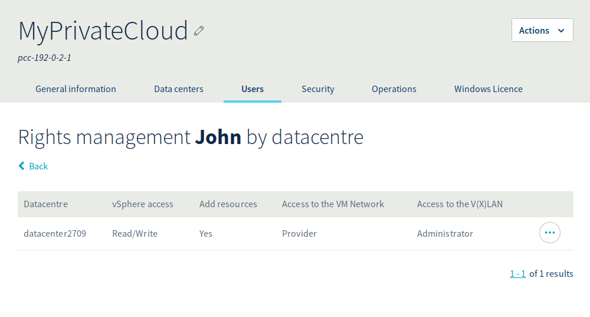
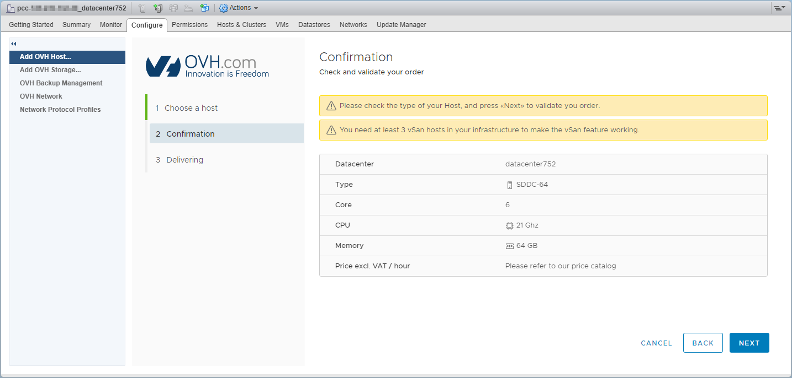

**Dernière mise à jour le 01/08/2018**

## Objectif

L'offre Private Cloud permet d'ajouter des ressources en facturation horraire.
**Ce guide décrit comment ajouter une ressource horraire depuis l'interface vSphere du Private Cloud** 

## Prérequis

* Posséder un Private Cloud.
* Il faut que l'utilisateur connecté ait le droit "Ajout de ressources" pour le datacenter concerné dans le manager OVH.

{.thumbnail}

## En pratique

### Sélection de la ressource

Afin d'accéder à l'interface d'ajouts de ressources horaires, vous devez sélectionner le Cluster, puis cliquer sur l'onglet "Manage",

{.thumbnail}

pour notre exemple nous choisissons d'ajouter un host en ressources horaires, une fois votre choix effectué, cliquer sur le bouton "Next"

Pour ajouter un datastore il faut sélectionner l'onglet "Add OVH Storage"

{.thumbnail}

### Validation de la commande

Afin de valider et finaliser votre commande, il est nécessaire de cliquer de nouveau sur le bouton "Next"

{.thumbnail}

### Suivi de l’installation

Une fois celle-ci validée, vous pouvez suivre l'avancement de l'ajout de la ressource.

{.thumbnail}

De plus une tâche apparaîtra dans les tâches récentes de votre vSphere.
Cette tâche vous permettra de suivre aussi l'avancée de l'ajout de la ressource.

## Aller plus loin

Échangez avec notre communauté d’utilisateurs sur <https://community.ovh.com/>.
