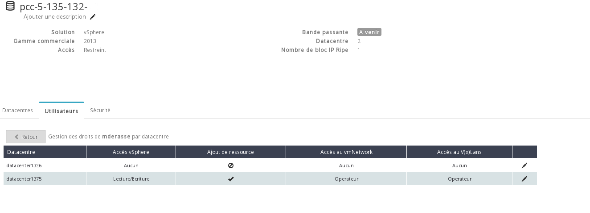
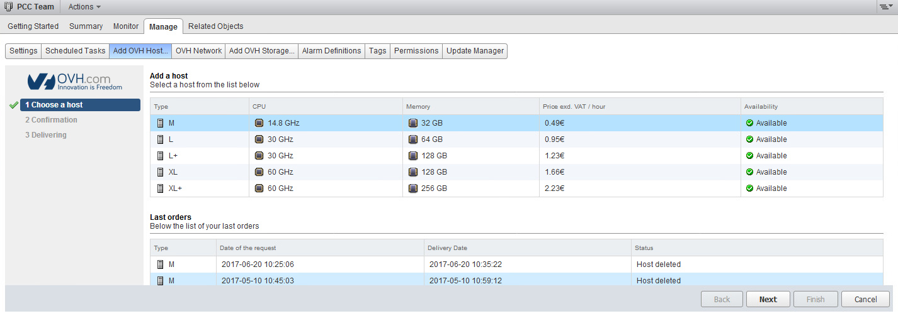
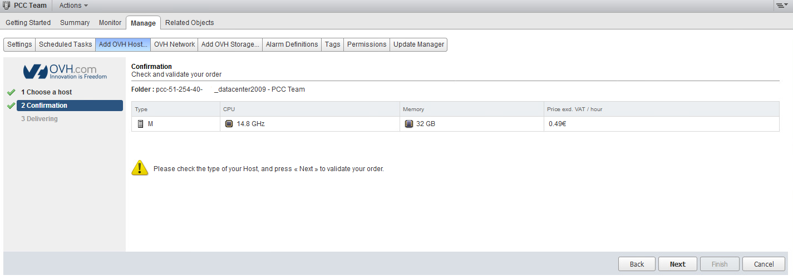
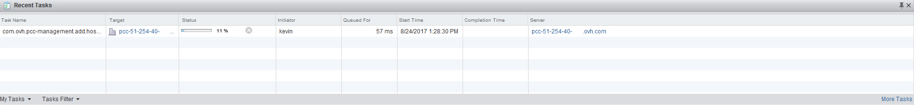

Prérequis :
-----------

- Il faut que l'utilisateur connecté ait le droit "Ajout de ressources" pour le datacenter concerné dans le manager OVH.

{.thumbnail}

Sélection de la ressource
-------------------------

Afin d'accéder à l'interface d'ajouts de ressources horaires, vous devez sélectionner le Cluster, puis cliquer sur l'onglet "Manage",

pour notre exemple nous choisissons d'ajouter un host en ressources horaires, une fois votre choix effectué, cliquer sur le bouton "Next"

Pour ajouter un datastore il faut sélectionner l'onglet "Add OVH Storage"

{.thumbnail}

Validation de la commande
-------------------------

Afin de valider et finaliser votre commande, il est nécessaire de cliquer de nouveau sur le bouton "Next"

{.thumbnail}

Suivit de l’installation
------------------------

Une fois celle-ci commandée, une tâche apparaîtra dans les tâches récentes de votre vSphere.Cette tâche vous permettra de suivre l'avancée de l'ajout de la ressource.

{.thumbnail}
