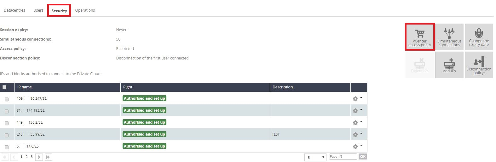
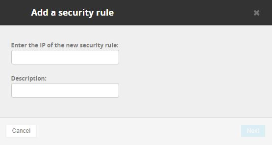

**Last updated 30th June 2020**

## Objective

Access to your Private Cloud can be restricted by allowing only certain IP addresses or ranges to connect to it.

**This guide explains how to authorise IP addresses for vCenter access in the OVHcloud Control Panel.**

## Requirements

- a [Hosted Private Cloud infrastructure](https://www.ovhcloud.com/en-sg/enterprise/products/hosted-private-cloud/)
- access to the [OVHcloud Control Panel](https://ca.ovh.com/auth/?action=gotomanager)

## Instructions

If you have set the [vCenter access policy](../modify-vcenter-access-policy) to "Restricted", you need to add the IP addresses that will be allowed to connect to the service.

In your OVHcloud Control Panel, open the "Server" section, then select your service under `Private Cloud`{.action} in the left-hand navigation bar.

From the main page of the service, switch to the `Security`{.action} tab, then click on `Add a new IP address range`{.action}.

{.thumbnail}

In the new Window, enter an IP address (range) that should be allowed access. You can also add a description to make the organisation of the whitelist easier.

{.thumbnail}

Click on `Next`{.action} when you have filled in the fields, then click on `Confirm`{.action} to apply your changes. Connections from this IP address (range) will now be possible.

## Go further

Join our community of users on <https://community.ovh.com/en/>.
