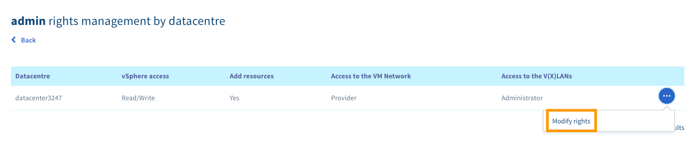
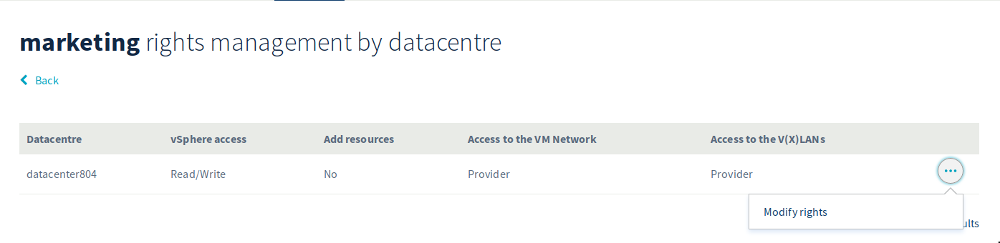
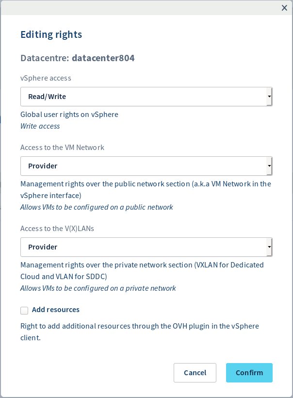

**Last updated 29th June 2020**

## Objective

The purpose of this guide is to explain the user rights management regarding the OVHcloud Hosted Private Cloud solution.

**Learn how to manage user rights on your infrastructure.**

## Requirements

- a [Hosted Private Cloud infrastructure](https://www.ovhcloud.com/en-ca/enterprise/products/hosted-private-cloud/)
- access to the [OVHcloud Control Panel](https://ca.ovh.com/auth/?action=gotomanager)

## Instructions

In your OVHcloud Control Panel, open the "Server" section, then select your service under `Private Cloud`{.action} in the left-hand navigation bar.

From the main page of the service, click on the `Users`{.action} tab. Click on `...`{.action} in the row of the user concerned to open the context menu.

{.thumbnail}

From this menu, you can change the rights of your vSphere users per data centre.

{.thumbnail}

| Access | Possible right | Description |
|---|---|---|
| vSphere access | None / Read-only / Read & Write | Global user rights on vSphere |
| Access to the VM Network | None / Read-only / Provider | Management rights over the public network section (a.k.a VM Network in the vSphere interface) |
| Access to the V(X)LANs | None / Read-only / Provider / Administrator | Management rights over the private network section (VxLan and VLAN) |
| Add resources | Yes / No | Right to add additional resources through the OVHcloud plugin in the vSphere client (Host, Datastore, Veeam Backup) |

{.thumbnail}

## Go further

Join our community of users on <https://community.ovh.com/en/>.
