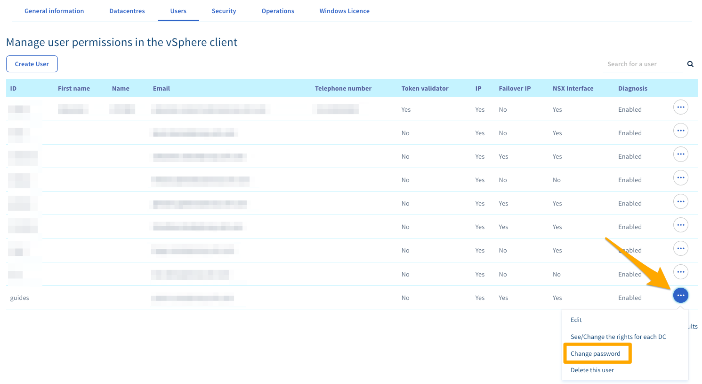

**Last updated 17th June 2020**

## Objective

vSphere client user permissions and passwords are managed from the OVHcloud Control Panel.

**Learn how to change your user password**

## Requirements

- access to the [OVHcloud Control Panel](https://ca.ovh.com/auth/?action=gotomanager)
- a user account created from the OVHcloud Control Panel. For more information, read [this guide](../control-panel-ovh-private-cloud/#users)

## Instructions

### Change Password

Log in to your [OVHcloud Control Panel](https://ca.ovh.com/auth/?action=gotomanager){.external}, go to `Server`{.action} (1), click `Private Cloud`{.action} (2) and select your server from the list (3). Click the `Users`{.action} (4) tab.

{.thumbnail}

Click the `(...)`{.action} button to the right of the user concerned and then click `Change Password`{.action}.

{.thumbnail}

Enter a new password and confirm it.

{.thumbnail}

> [!primary]
> If you do not enter a password, a randomly generated password will be emailed to the user's associated address.
>

> [!warning]
>
>We recommend that you follow these few best practices to ensure that your infrastructure is not compromised. Your password must:
>
> - Have at least 8 characters.
> - Have at least 3 character types.
> - Not to be drawn from the dictionary.
> - Not include personal information.
> - Not be used for multiple access.
> - Be stored in a password vault.
> - Be changed every 3 months.
> - Be different from previous passwords.
>

## Go further

[Introduction to the OVH Private Cloud Control Panel](../control-panel-ovh-private-cloud/)

[Setting and managing an account password](https://docs.ovh.com/gb/en/customer/manage-password/)

Join our community of users on <https://community.ovh.com/en/>.
