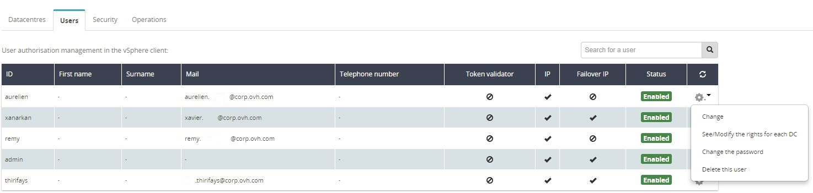

Cette action se déroule dans l'[espace client OVH (Manager)](https://www.ovh.com/manager){.external-link}.

Dans la section **Dédié** → **Private Cloud**, sélectionner l'onglet **Utilisateurs**. Repérer l'utilisateur puis cliquer sur l'action "**Changer le mot de passe"** dans la liste des actions disponibles.

{.thumbnail}

{.thumbnail}

Il est possible de générer automatiquement un mot de passe qui sera envoyé par e-mail en laissant les deux champs vides.

Il est aussi possible [d'associer un email à un utilisateur]({legacy}1441987) afin que l'email du mot de passe soit directement envoyé à cet email.

> [!warning]
>
>Afin de ne pas compromettre la sécurité de votre infrastructure, nous vous recommandons de suivre ces quelques bonnes pratiques lorsque vous choisissez votre mot de passe, il doit :
>
> - Comporter au minimum 8 caractères.
> - Comporter au minimum 3 types de caractères.
> - Ne pas être tiré du dictionnaire.
> - Ne pas comporter d'information personnelle.
> - Ne pas être utilisé pour plusieurs accès.
> - Etre stocké dans un coffre-fort de mots de passe.
> - Etre changé tous les 3 mois.
> - Etre différent des mots de passe précédents.
>

