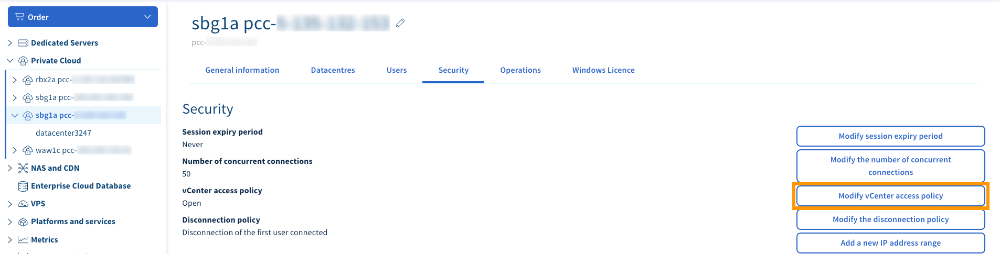
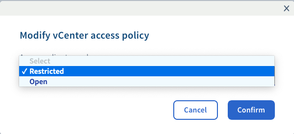

**Last updated 30th June 2020**

## Objective

To enhance security for your Hosted Private Cloud infrastructure, you can restrict and manage the access to vCenter.

**This guide explains how to change the access policy for vCenter in the OVHcloud Control Panel.**

## Requirements

- a [Hosted Private Cloud infrastructure](https://www.ovhcloud.com/en-ca/enterprise/products/hosted-private-cloud/)
- access to the [OVHcloud Control Panel](https://ca.ovh.com/auth/?action=gotomanager)

## Instructions

In your OVHcloud Control Panel, open the "Server" section, then select your service under `Private Cloud`{.action} in the left-hand navigation bar.

From the main page of the service, switch to the `Security`{.action} tab, then click on `Modify vCenter access policy`{.action}.

{.thumbnail}

In the new Window, choose "Open" or "Restricted" from the drop-down list and click `Confirm`{.action} to apply your selection.

{.thumbnail}

> [!primary]
>
> If you have set the access policy to "Restricted", follow up by consulting the guide on [Authorising IP addresses for vCenter access](../authorise-ip-addresses-vcenter).
> 

## Go further

[Authorising IP addresses for vCenter access](../authorise-ip-addresses-vcenter)

Join our community of users on <https://community.ovh.com/en/>.
