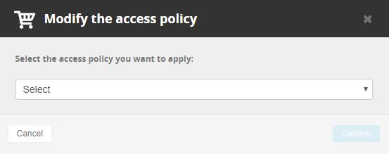

L'opération se réalise depuis votre [espace client (Manager).](https://www.ovh.com/manager){.external-link}

Section **"Dédié"** puis **"Private Cloud"**, sélectionner l'infrastructure correspondante. Ensuite rendez-vous dans l'onglet **"Sécurité"** puis cliquer sur **"Politique d'accès au vCenter"**.

{.thumbnail}

Changer la politique par la politique souhaitée :

{.thumbnail}

Attention
---------

Ne pas oublier de [rajouter les IPs qui seront autorisées à se connecter]({legacy}1442255).
