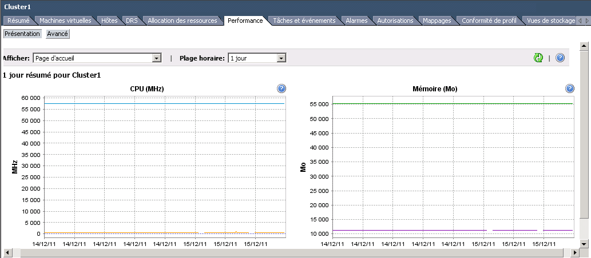
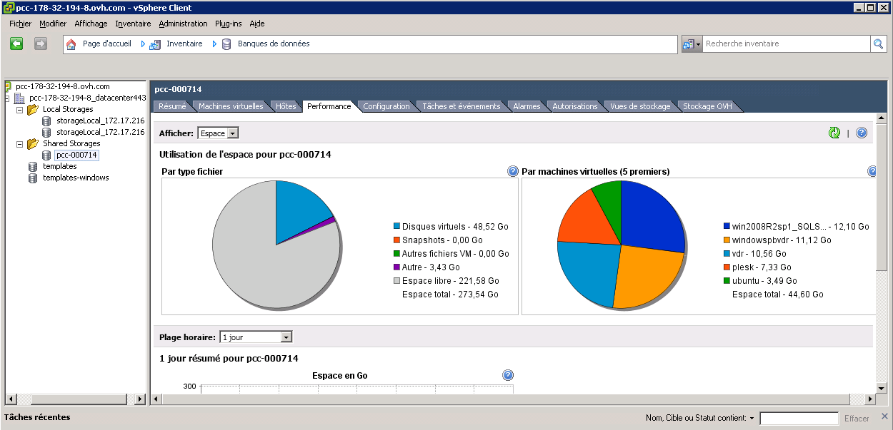

## 
Ohjeessa kuvataan, miten diagnosoida, jos VM:ssä todetaan merkittävää hitautta.

Sinun on käytettävä vSphere-asiakasohjelmaa joko oman paikallisen asiakasohjelman kautta tai käyttäen RDP-yhteyttä, jonka sait meiltä PCC:n aktivoinnin yhteydessä.

## VM:ien tarkistus:
Aluksi valitse ongelmia aiheuttava VM ja mene välilehdelle "Suorituskyky". Täällä näkyy VM:n suorittimen, muistin jne. käyttögraafien yhteenveto. Jos graafeissa näkyy huomattava resurssin käyttö, ongelma todennäköisimmin johtuu VM:stä.
Tässä tapauksessa voit lisätä VM:ään resursseja sen jälkeen, kun olet ensin tarkastanut, ettei ole mitään rajoituksia välilehdellä VM:n parametrien resurssit (oikea hiiren klikkaus VM:n  päällä > Edit Settings > Ressources).

## Klusterin/Resurssipoolin tarkistus
Klusterissa tai resurssipoolissa mene "Suorituskyky"-välilehdelle, josta näet resurssien suoritus- ja käyttögraafit:

{.thumbnail}
Osiossa "Resurssien allokointi" näkee tiedot vapaiden resurssien VM:ien kokonaiskäytöstä:

{.thumbnail}
Kaksi erilaista tapausta:

- Jos host on liian kuormitettu, voit manuaalisesti siirtää VM:n eri hostille, tai tehdä siirron lennossa vMotionia käyttäen. Jos käytössä on Enterprise-lisenssi, voit käyttää DRS-toimintoa, jonka avulla voit hoitaa operaation automaattisesti hostin resurssien käytön mukaisesti.

- Jos kaikkien hostien kuormitus on erittäin merkittävä, on niitä lisättävä Private Cloud - tai Storage-välilehdellä .

## Storagen tarkistus
VM:n resurssijärjestelmien lisäksi voi seurata Storagen tilaa. Ollessasi Datastore-näkymässä, valitse NAS ja "Suorituskyky"-välilehti

{.thumbnail}

## Verkon tarkistus
Viimeisenä voi tarkastaa verkon tilan.
Hallinnassa voi katsoa käytetyn kaistannopeuden sekä VLANissa käyttöön otetut rajoitukset:

- Hallinta v5 > Private Cloud > Yhteenveto/Koti.

