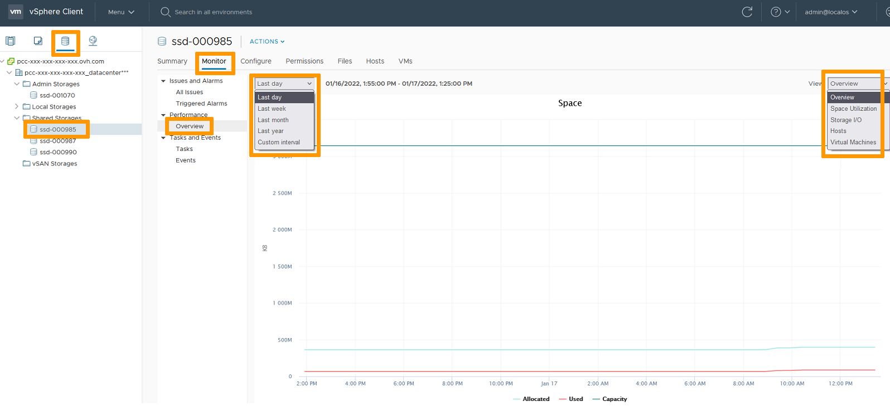

**Dernière mise à jour le 17/01/2022**

## Objectif

Utiliser les outils de surveillance de vSphere pour dépanner une VM.

**Ce guide est un cas d'étude avec toutes les étapes pour atteindre l'objectif**

## Prérequis

- Être contact administrateur du [Hosted Private Cloud infrastructure](https://www.ovhcloud.com/fr/enterprise/products/hosted-private-cloud/), pour recevoir des identifiants de connexion.
- Avoir un identifiant utilisateur actif (créé dans l'[espace client OVHcloud](https://www.ovh.com/auth/?action=gotomanager&from=https://www.ovh.com/fr/&ovhSubsidiary=fr))

## En pratique

Vous avez à dispositions trois niveaux de surveillance dans vSphere:
- VM
- Cluster
- Stockage

### Surveillance VM

Dans l'interface vSphere, allez dans le Tableau de bord `Hôtes et clusters`{.action}. 
Naviguez jusqu'à votre VM et selectionnez la. 
L'onglet `Surveiller`{.action} montre une `Présentation`{.action} des performances. 
Vous pouvez choisir les mesures en temps réel ou definir une chronologie pour voir l'évolution des performances. 
Vous pouvez modifier la vue pour creuser des sujets spécifiques.

{.thumbnail}

La section `Utilisation`{.action} aidera également vos investigations.

### Surveillance Cluster

Dans l'interface vSphere, allez dans le Tableau de bord `Hôtes et clusters`{.action}. 
Naviguez jusqu'à votre cluster et selectionnez le. 
L'onglet `Surveiller`{.action} montre une `Présentation`{.action} des performances. 
Vous pouvez choisir les mesures en temps réel ou definir une chronologie pour voir l'évolution des performances. 
Vous pouvez modifier la vue pour creuser des sujets spécifiques.

{.thumbnail}

Les sections `Allocation des ressources`{.action} et `Utilisation`{.action} aideront également vos investigations.

> [!primary]
>
> Les pools de resources sont accessibles et surveillés à l'identique des clusters.
> 

### Surveillance Stockage

Dans l'interface vSphere, allez dans le Tableau de bord `Stockage`{.action}. 
Naviguez jusqu'à votre datastore et selectionnez le. 
L'onglet `Surveiller`{.action} montre une `Présentation`{.action} des performances. 
Vous pouvez choisir les mesures en temps réel ou definir une chronologie pour voir l'évolution des performances. 
Vous pouvez modifier la vue pour creuser des sujets spécifiques.

{.thumbnail}

## Aller plus loin

Échangez avec notre communauté d'utilisateurs sur <https://community.ovh.com>.
