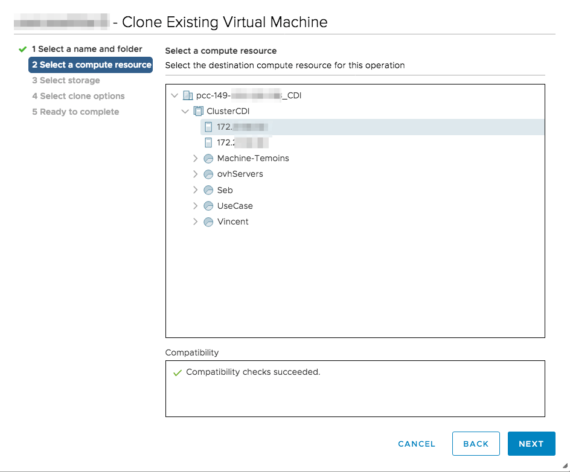
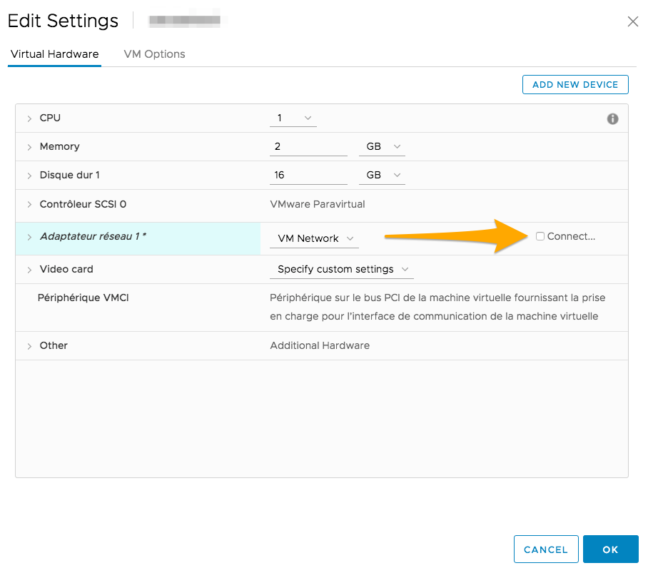

**Last updated 8th July 2020**

## Objective

Cloning a VM creates a copy of the source VM.

**This guide explains how to clone a VM.**

## Requirements

- a [Hosted Private Cloud infrastructure](https://www.ovhcloud.com/asia/enterprise/products/hosted-private-cloud/)
- a user account with access to [vSphere](../login-vsphere-interface/) (created in the [OVHcloud Control Panel](https://ca.ovh.com/auth/?action=gotomanager))
- a VM in your cluster

## Instructions

In your [vSphere interface](../login-vsphere-interface/), navigate to the `Hosts and Clusters` tab of your Private cloud.

Right-click on the VM to be cloned and click on `Clone`{.action}, then `Clone to virtual machine...`{.action}.

{.thumbnail}

## Select a name and folder

Name this new VM and set its location in your tree.

{.thumbnail}

### Select a compute resource

Specify the cluster, host, vApp, or resource pool for this VM.

{.thumbnail}

### Select storage

Set the storage location (disk space) for this VM. 

The virtual disk type is on "Thin Provision", which means that a virtual disk will be created but will only use the actual disk space used on the storage, regardless of the disk space previously used on the source VM.

More information about disk types can be found in [this guide](../choosing-disk-type/){.external-link}.

You will be able to choose, via the `VM Storage Policy` row, the default storage policy if you have datastores, or a custom policy if you have [vSAN hosts](../vmware-vsan/){.external-link}, or the [VM encryption](../vm-encrypt/){.external-link} option.

{.thumbnail}

### Select clone options

This step allows you to set the network configuration to apply to this VM.

- If you do not check anything, this will not change the network configuration of the new VM compared to the source.

- `Customize the virtual machine's hardware`{.action}: This option allows you to specify the new configurations you want to implement on this new VM.

{.thumbnail}

> [!warning]
>
> If you did not customise the virtual machine, it is necessary to change the clone configuration before starting it, in order to avoid an IP/MAC conflict. 
>
> In this case, you simply need to uncheck the network adapter in the virtual machine settings once it has been cloned, just before starting it.
>

{.thumbnail}

## Go further

Join our community of users on <https://community.ovh.com/en/>.
