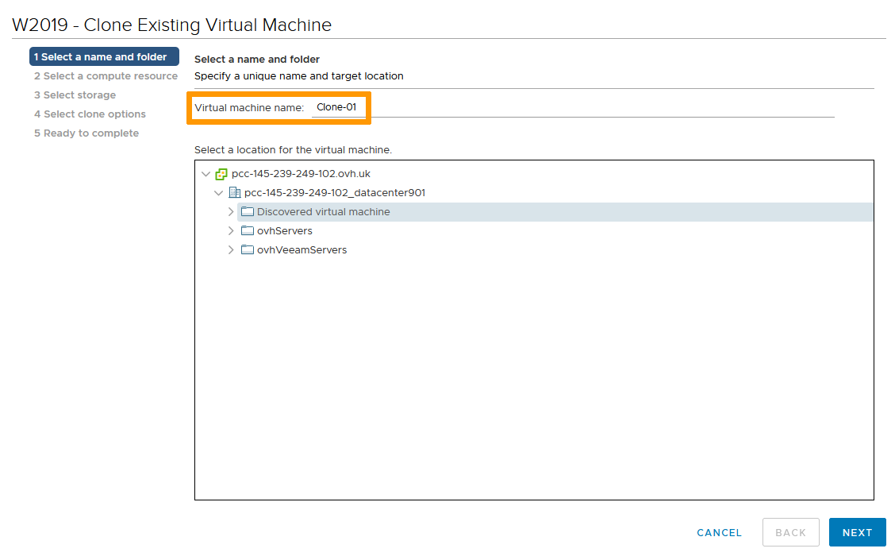
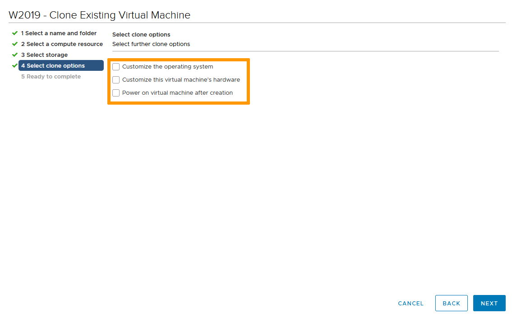
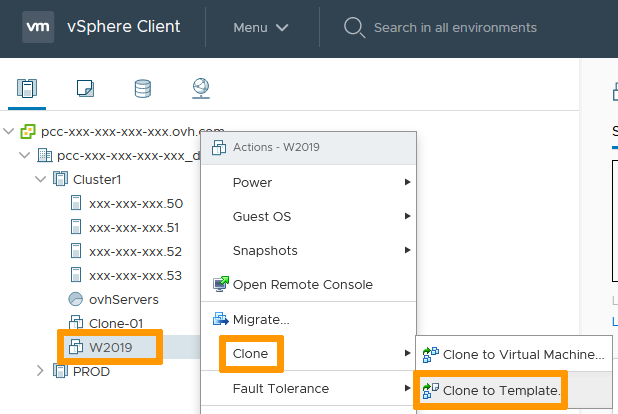
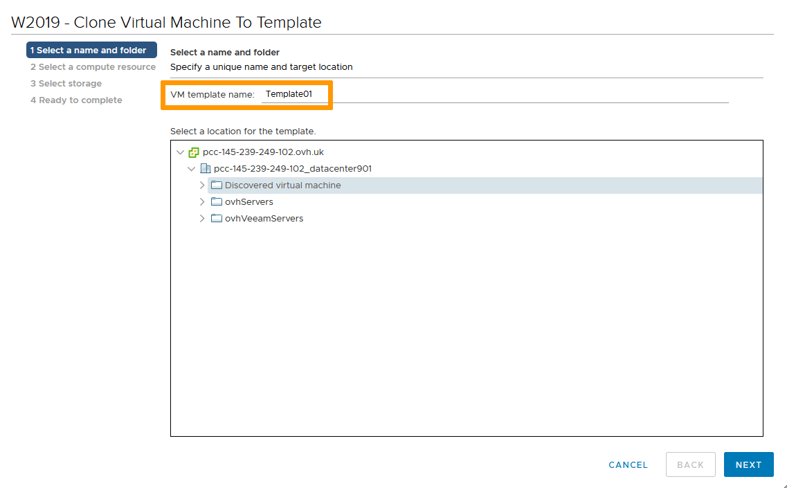

**Dernière mise à jour le 12/01/2022**

## Objectif

VMware offre la possibilité de cloner une VM pour créer une nouvelle VM ou un modèle.

**Ce guide explique comment exécuter ces tâches.**

## Prérequis

- Être contact administrateur de l'infrastructure [Hosted Private Cloud](https://www.ovhcloud.com/fr/enterprise/products/hosted-private-cloud/), pour recevoir des identifiants de connexion.
- Avoir un identifiant utilisateur actif (créé dans l'[espace client OVHcloud](https://www.ovh.com/auth/?action=gotomanager&from=https://www.ovh.com/fr/&ovhSubsidiary=fr))

## En pratique

### Cloner une VM

Cloner permet un déploiement rapide et facile de VMs similaires. 
Vous pouvez cloner une VM vers une autre VM ou vers un modèle. 
Cloner vers une VM est un moyen rapide de dupliquer une VM et ses paramètres. 
Cloner vers un modèle est un meilleur moyen pour créer une copie originale qui servira à déployer de multiples VMs.

#### Cloner vers une VM

Dans l'interface vSphere, rendez-vous dans le tableau de bord `Hôtes et clusters`{.action}. 
Naviguez jusqu'à votre VM, faites un clic-droit sur celle-ci et, dans le menu `Cloner`{.action}, sélectionnez `Cloner vers une machine virtuelle`{.action}.

{.thumbnail}

Nommez le clone et sélectionnez son datacenter. 
Cliquez sur `Suivant`{.action}.

{.thumbnail}

Sélectionnez une ressource de calcul. 
Cliquez sur `Suivant`{.action}.

{.thumbnail}

Sélectionnez le lieu de stockage. 
Cliquez sur `Suivant`{.action}.

{.thumbnail}

Sélectionnez les options nécessaire pour le clone.

- Personnaliser le système d'exploitation lancera sysprep lors de la première utilisation de la VM.
- Personnaliser le matériel de cette machine virtuelle permet de modifier les caractéristiques techniques de la VM (taille de disque, RAM, éléments réseau...).
- Mettre sous tension la machine virtuelle après la création n'est pas recommandé. Certains changements à froid peuvent être necessaires avant de lancer la VM pour éviter des conflits.

Cliquez sur `Suivant`{.action}.

{.thumbnail}

Vérifiez puis cliquez sur `Terminer`{.action}.

{.thumbnail}

Le processus de clonage s'enclenche et, à l'issue de celui-ci, la nouvelle VM sera disponible.

> [!primary]
>
> Si le clone a été effectué sans personalisation, assurez-vous que vous pouvez démarrer la VM sans danger. Par exemple, si la VM d'origine a une IP fixe, désactivez la carte réseau du clone pour éviter un conflit d'adresses IP.

#### Cloner vers un modèle

Dans l'interface vSphere, rendez-vous dans le tableau de bord `Hôtes et clusters`{.action}. 
Naviguez jusqu'à votre VM, faites un clic-droit sur celle-ci et, dans le menu `Cloner`{.action}, sélectionnez `Cloner vers un modèle`{.action}.

{.thumbnail}

Nommez le modèle et selectionnez son datacenter. 
Cliquez sur `Suivant`{.action}.

{.thumbnail}

Sélectionnez une ressource de calcul. 
Cliquez sur `Suivant`{.action}.

{.thumbnail}

Sélectionnez le lieu de stockage. 
Cliquez sur `Suivant`{.action}.

{.thumbnail}

Vérifiez puis cliquez sur `Terminer`{.action}.

{.thumbnail}

Le processus de clonage va s'exécuter. 
Aucune VM n'est directement visible mais le nouveau modèle est utilisable dans l'option "Déployer depuis un modèle".

{.thumbnail}

## Aller plus loin

Échangez avec notre communauté d'utilisateurs sur <https://community.ovh.com>.
