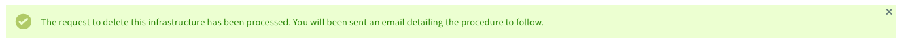

**Last updated 8th July 2020**

## Objective

If your Private Cloud offer no longer suits you, or if you have ordered a new infrastructure to replace the old one, you can request the termination of this infrastructure, once all your data is recovered.

**Find out how to cancel your Private Cloud offer** 

## Requirements

- a [Hosted Private Cloud infrastructure](https://www.ovhcloud.com/en-gb/enterprise/products/hosted-private-cloud/)
- access to the [OVHcloud Control Panel](https://www.ovh.com/auth/?action=gotomanager)

## Instructions

The Private Cloud offer is without obligation. However, as set out in the [Special Terms of Service](https://www.ovh.co.uk/support/termsofservice/Special_Conditions_for_Dedicated_Cloud_2014.pdf){.external}, any month that has begun is due and payable in advance.

>[!warning]
>
> Before canceling your offer, please be careful to retrieve all the data you wish to keep. Indeed, termination will result in the complete deletion of your Private Cloud and all the data it contains.
>

### Step 1: request termination from OVHcloud client space

Log in to your [OVHcloud Control Panel](https://www.ovh.com/auth/?action=gotomanager){.external}, go to `Server`{.action} (1), click on `Private Cloud`{.action} (2) and select your offer from the list (3).

In the "Service Management" table of the "General Information" tab, click the button `...`{.action} (4) to the right of the renewal date. Finally, click on `Delete Service`{.action} (5).

{.thumbnail}

Please be aware that this action will remove any data on the infrastructure as soon as the termination is confirmed. No pro rata refund will be made if the infrastructure is terminated before the end of the month.

Click on `Confirm`{.action} to request termination.

{.thumbnail}

You will then receive a confirmation notice of your request. The procedure for confirming the termination is sent to you by e-mail, to the address linked to the OVHcloud account.

{.thumbnail}

### Step 2: confirm termination

Following your request, a termination confirmation email is sent to you at the address linked to the OVHcloud account.

You can also find this email in your OVHcloud client space. Click on your name at the top right and then on `Service emails`{.action}.

{.thumbnail}

The subject of the email is:

> **Deleting your Private Cloud cpc-xxx-xxx-xxx-xxx**".

The email contains a clickable link that will allow you to confirm the termination of your offer.

> [!primary]
>
> Please note that this link is valid for **72 hours**. We therefore advise you to make your request for termination from the 25th of the month.
>

You can also validate the termination request through the following OVHcloud API:

> [!api]
>
> @api {POST} /dedicatedCloud/{serviceName}/confirmTermination
>

You will then need to fill in the validation token available in the termination confirmation email.

## Go further

Join our community of users on <https://community.ovh.com/en/>.