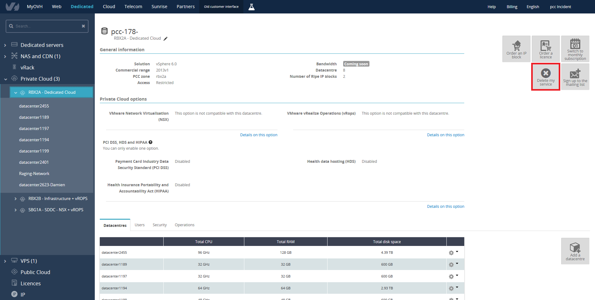

**Dernière mise à jour le 14/02/2019**

## Préambule

Votre offre Private Cloud ne vous convient plus ou vous avez commandé une nouvelle infrastructure remplaçant l'ancienne, vous devez alors demander la résiliation de cette ancienne infrastructure une fois toutes vos données récupérer.

## En pratique

Cette solution est sans engagement cependant comme indiqué dans les **[CGV](http://www.ovh.com/fr/support/documents_legaux/conditions_particulieres_dedicated_cloud_2014.pdf){.external-link}** du **Private Cloud** tout mois commencé est dû et payable d’avance.

La résiliation de l'offre se passe depuis l'[espace client OVH](https://www.ovh.com/manager){.external-link}.

Rendez-vous dans la partie `Dédié`, catégorie `Private Cloud` afin d'avoir accès au bouton `...`{.action} situé dans les informations générales, à coté du nom.

{.thumbnail}

Prenez connaissance du fait que cela suspendra l'infrastructure et supprimera toute donné présente sur l'infrastructure dès finalisation. Aucun remboursement au prorata ne sera effectué si l'infrastructure est résiliée avant la fin du mois.

Suite à votre demande, nos équipes transmettent un formulaire de résiliation par email avec comme sujet "**Suppression de votre Private Cloud pcc-xxx-xxx-xxx-xxx**".

Dans le contenu de ce message, un lien est disponible pour afficher le formulaire de résiliation. Enfin il suffit de vous identifier avec votre compte client et mot de passe pour confirmer votre résiliation.

> [!primary]
>
> Attention ce formulaire est accessible pendant **72 heures**, nous vous conseillons de transmettre votre requête à partir du 25 du mois.
>

## Aller plus loin

Échangez avec notre communauté d'utilisateurs sur <https://community.ovh.com>.