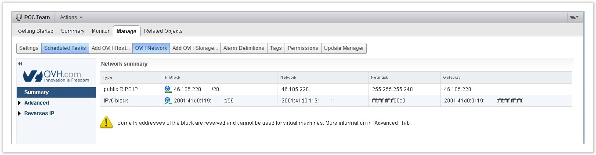
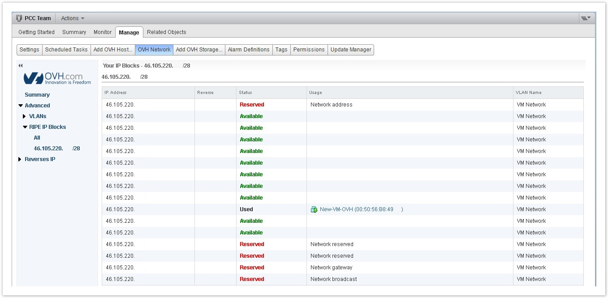
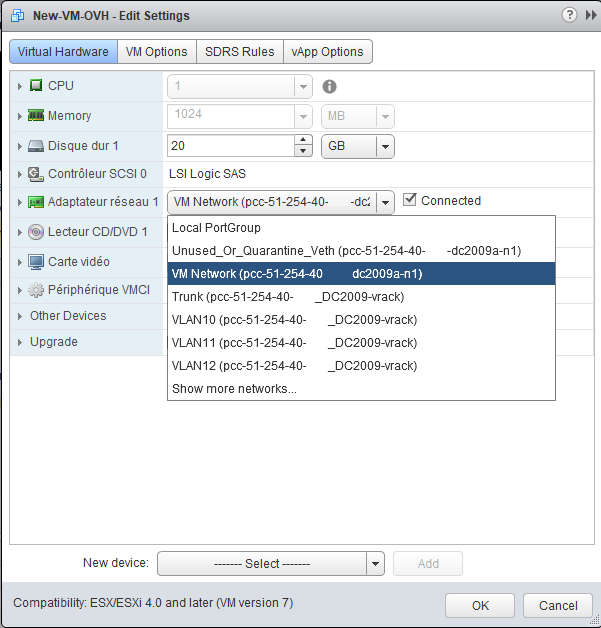

**Dernière mise à jour le 28/11/2017**

## Objectif

Après avoir créé une machine virtuelle (VM) dans votre infrastructure, vous pouvez lui attribuer une IP publique ou privée.

**Ce guide vous explique comment réaliser cette configuration.**

## Prérequis

- Avoir créé une machine virtuelle.
- Disposer d'un bloc d'IP.

## En pratique

### Récupérer les informations

Vous pouvez récupérer les informations de votre bloc d'adresses IP publiques directement depuis le client vSphere, en vous rendant dans la section `Hosts and Clusters”`{.action}. Cliquez ensuite sur votre cluster et choisissez l’onglet `Manage`{.action} puis `OVH Network`{.action}.

{.thumbnail}

Sur chaque bloc livré par OVH, 5 adresses IP sont réservées à la configuration du réseau et ne doivent jamais être utilisées pour vos machines virtuelles. Il s'agit de la première et des quatre dernières IP du bloc.

Un bloc IP Private Cloud est organisé comme suit :

- la première adresse IP marquée comme réservée (`Reserved`) correspond à l'adresse de réseau ;
- les IP suivantes sont utilisables pour vos machines virtuelles. Elles sont indiquées comme disponibles (`Available`) si aucune VM ne les exploite ou comme utilisées (`Used`) dans le cas contraire ;
- les quatre dernières IP du bloc sont réservées, deux sont dédiées aux routeurs OVH pour le fonctionnement du bloc et les deux autres sont employées pour la passerelle et le broadcast.

{.thumbnail}

### Configurer une IP publique

Afin de configurer une IP publique sur votre machine virtuelle, vous devez au préalable avoir choisi l’interface `VMNetwork`{.action} dans les paramètres de la carte réseau de votre VM :

{.thumbnail}

#### Linux

Voici un exemple de configuration sur la distribution Debian 8 :

{.thumbnail}

```sh
auto eth0
iface eth0 inet static
address 46.105.220.xxx
netmask 255.255.255.240
broadcast 46.105.220.xxx
gateway 46.105.220.xxx
dns-nameservers 213.186.33.99
```

Montez la carte à l’aide d’un `ifup` de votre interface.

Vous pourrez vérifier également la configuration avec un `ifconfig`.

Si votre machine virtuelle ne trouve pas le réseau, pensez à vérifier que la carte réseau est configurée sur *VMNetwork* et non sur *LocalPortGroup* ou un VLAN et que la case de connexion de la carte est cochée.

#### Windows

Voici un exemple de configuration sur Windows 2012 R2.

Dans le `panneau de configuration`{.action} vous devrez aller dans `Réseau et Internet`{.action} puis `Centre réseau et partage`{.action} et enfin `Modifier l'adaptateur réseau`{.action}.

Pour aller plus vite, vous pouvez cliquer sur le champ de recherche Windows et écrire `Run` (ce qui correspond à appuyer simultanément sur la touche *Windows* de votre clavier et la touche *R*). La console d’exécution Windows s’ouvrira et vous pourrez entrer la commande suivante :

```shell
ncpa.cpl
```

Il faut ensuite effectuer un clic droit sur la carte réseau correspondant au VMNetwork et `Propriétés`{.action). Sélectionnez alors `Protocole TCP/IP v4`{.action} et cliquez de nouveau sur 'Properties' puis renseignez les informations de votre IP comme suit :

{.thumbnail}

```sh
Adresse IP : 46.105.220.xxx
Masque de sous-réseau : 255.255.255.240
Paserelle par défaut : 46.105.220.yyy
Serveur DNS : 213.186.33.99
```

### Configurer une IP privée

La configuration d'une IP privée est similaire à celle d'une IP publique. Vous devez toutefois utiliser la carte réseau configurée pour votre VLAN ou votre VXLAN.

Dans le choix de votre interface, vous pouvez éditer les paramètres suivants :

- sur un SDDC, une interface de VLAN (10 à 20 par défaut, vous pouvez en créer davantage en consultant [ce guide](https://docs.ovh.com/fr/private-cloud/creation-vlan/){.external} ;

- sur un Private Cloud, une interface VXLAN (vxw-dvs…). Si vous avez besoin de plus de VXLAN, vous pouvez ouvrir un ticket auprès du support.


#### SDDC

Dans les paramètres de votre machine virtuelle, vous devez utiliser un VLAN :

{.thumbnail}

#### Private Cloud

Dans les paramètres de votre machine virtuelle, vous devez utiliser un VXLAN :

{.thumbnail}

#### Linux

Voici un exemple de configuration sur la distribution Debian 8 :

{.thumbnail}

En éditant le fichier d'interfaces, vous pouvez indiquer une IP privée sur la plage IP de votre choix :

```sh
auto eth0
iface eth0 inet static
address 192.168.70.1
netmask 255.255.255.0
gateway 192.168.70.254
```

Montez la carte à l’aide d’un `ifup` de votre interface.

Vous pouvez également vérifier la configuration avec un `ifconfig`.

#### Windows

Voici un exemple de configuration sur Windows 2012 R2 :

Dans le `panneau de configuration`{.action}, allez dans `Réseau et Internet`{.action} puis `Centre réseau et partage`{.action} et enfin `Modifier l'adaptateur réseau`{.action}.

Pour aller plus vite, vous pouvez cliquer sur le champ de recherche Windows et écrire `Run` (ce qui correspond à appuyer simultanément sur la touche *Windows* de votre clavier et la touche *R*). La console d’exécution Windows s’ouvrira et vous pourrez entrer la commande suivante :

```shell
ncpa.cpl
```

Il faut ensuite effectuer un clic droit sur la carte réseau correspondant au VMNetwork et `Propriétés`{.action). Sélectionnez ensuite `Protocole TCP/IP v4`{.action} et cliquez de nouveau sur 'Properties' puis renseignez les informations de votre IP comme suit :

{.thumbnail}

En modifiant cette interface, vous pouvez indiquer une IP privée sur la plage IP de votre choix :

```sh
Adresse IP : 192.168.70.2
Masque de sous-réseau : 255.255.255.0
Paserelle par défaut : 192.168.70.254
```


## Aller plus loin

Échangez avec notre communauté d'utilisateurs sur <https://community.ovh.com>.
