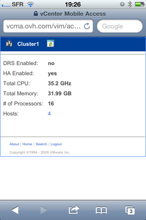
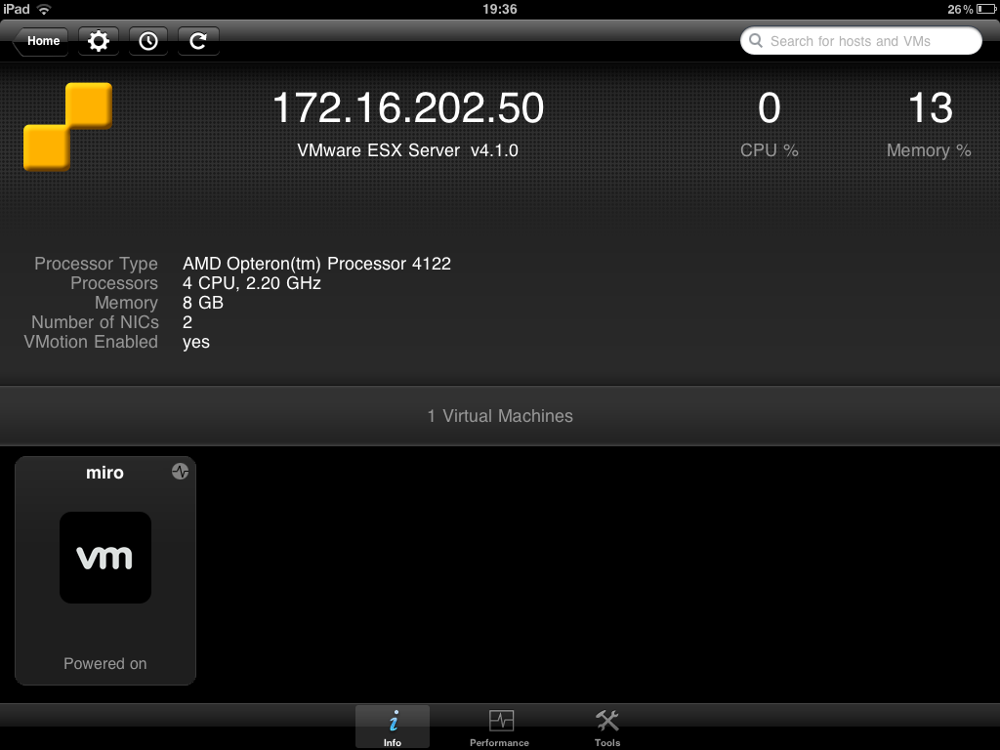
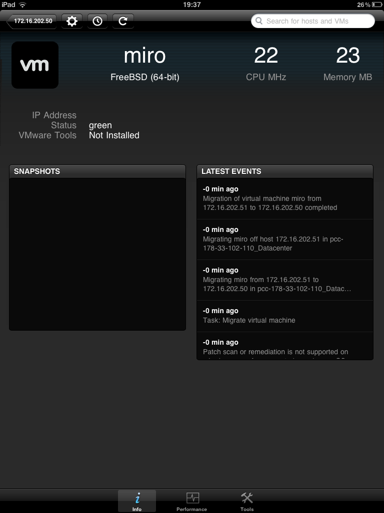
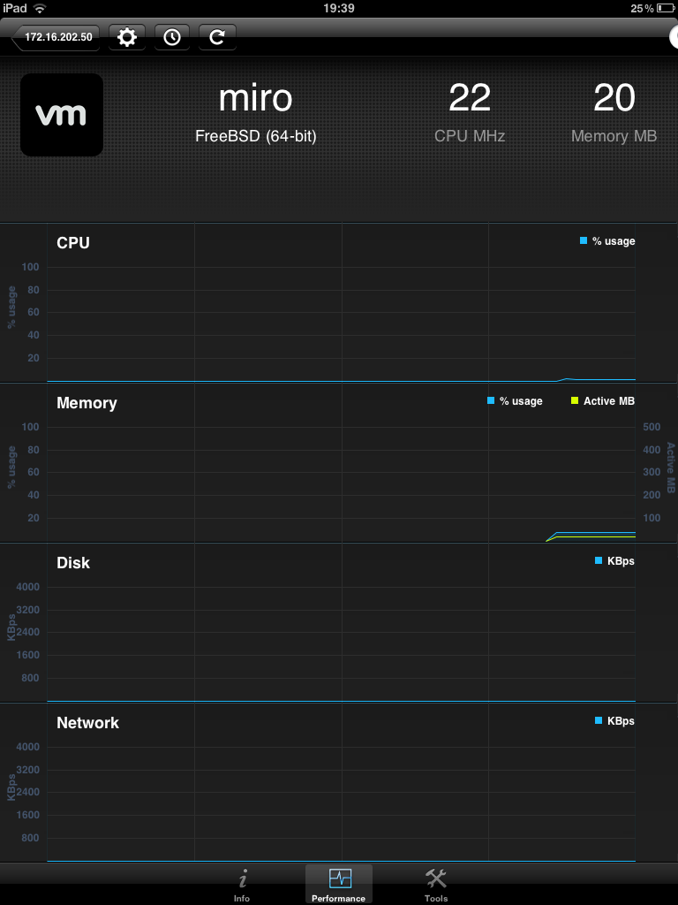

## 
In order to access the mobile Dedicated Cloud you will need a smartphone or iPad. On the iPad, in addition to the web interface, you can use the "VMware vSphere Client" application that you can get in the App Store for free.

## 
From the web browser of your smartphone, go to [https://vcma.ovh.com](https://vcma.ovh.com):

{.thumbnail}
On the identification page, specify the name of your PCC and your login details:

{.thumbnail}
You have now access to all information of your PCC: your hosts, your VMs or the resources you've used:

{.thumbnail}

## 
First configure your iPad in "Settings". You must enter the OVH server name: vcma.ovh.com

{.thumbnail}
You can run the application once you have configured your iPad. You will need to enter the login details you received by email:

{.thumbnail}
Once you are connected, you can find all your PCC hosts, resources used and the VMs:

{.thumbnail}
In each VM, you can find the resources used and the last events. You can also restore an earlier Snapshot:

{.thumbnail}
The "performance" section will display all CPU and RAM resources, as well as the network disk used by your PCC:

{.thumbnail}

