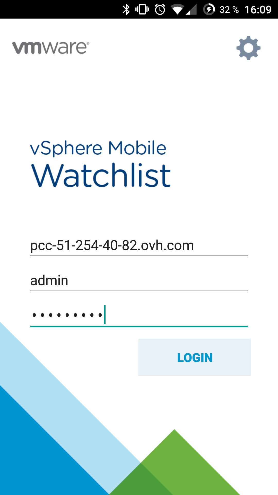
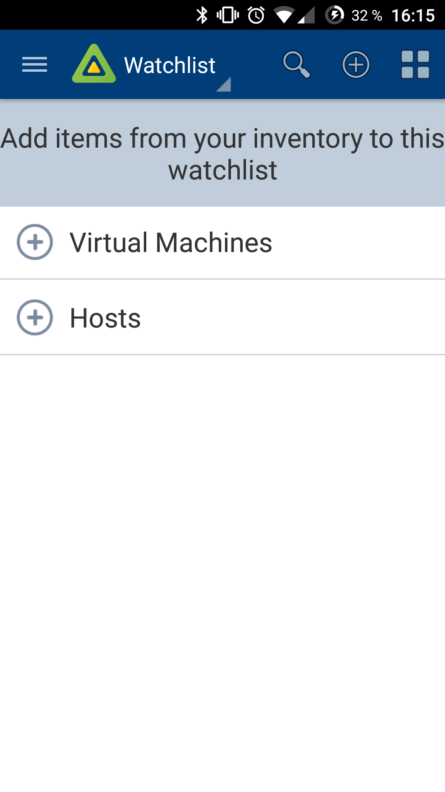
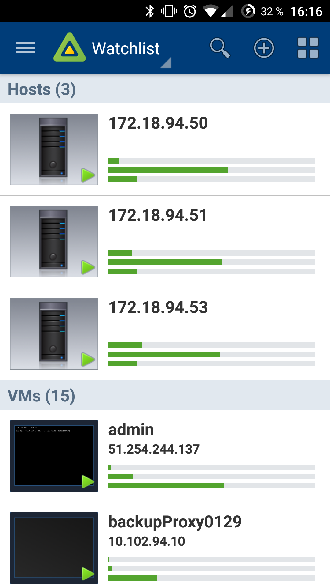
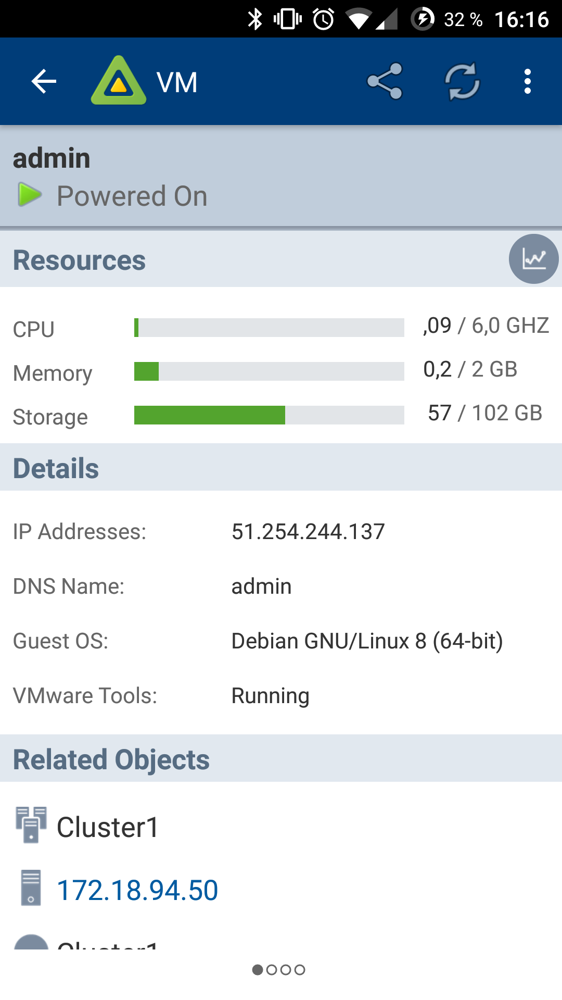
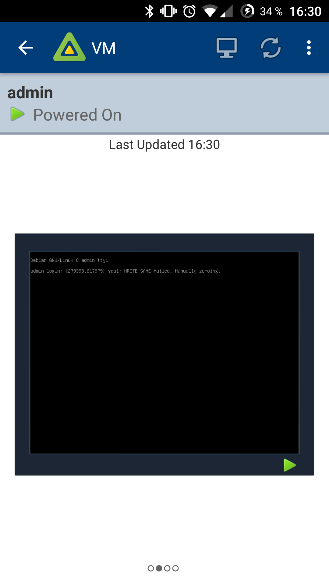
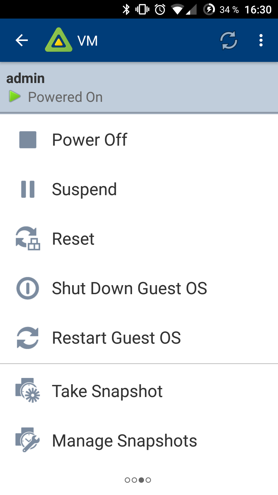
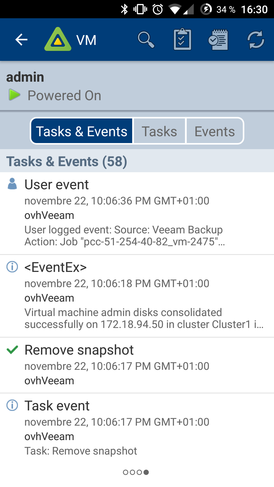
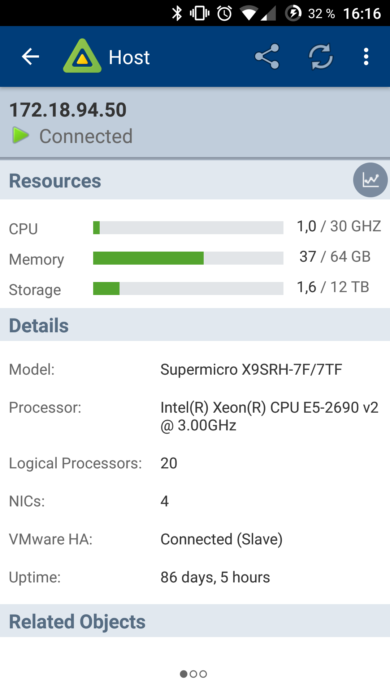
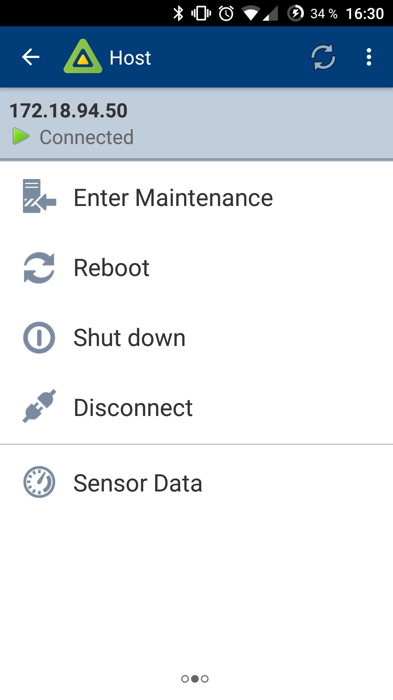
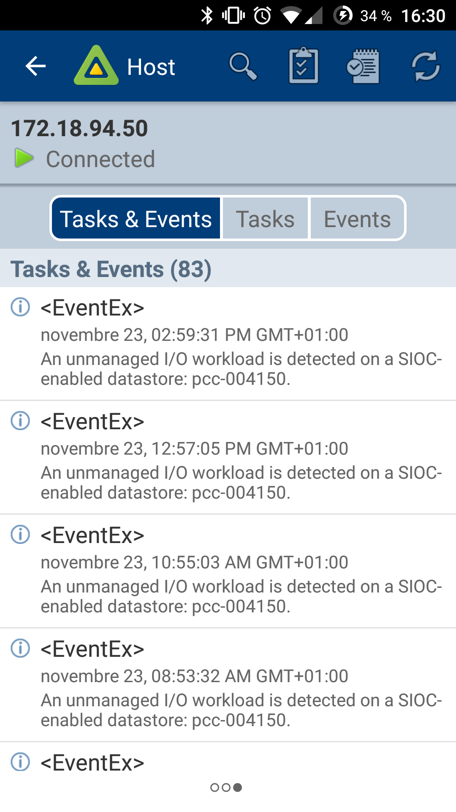

Afin de pouvoir accéder à votre Private Cloud en mobilité il vous faut un smartphone ou une tablette Android ou iOS (iPhone, iPad).

- Pour **Android,** rendez-vous dans le Play Store et installez l'application **vSphere Mobile Watchlist** : <https://play.google.com/store/apps/details?id=com.vmware.beacon&hl=fr>

<!-- -->

- Pour **iOS** (iPhone, iPad), rendez-vous dans l'App Store et installez l'application **VMware vSphere Mobile Watchlist** : <https://itunes.apple.com/fr/app/vmware-vsphere-mobile-watchlist/id792869677>

Sur la page d’identification, spécifier l'adresse de votre Private Cloud ainsi que vos identifiants

{.thumbnail}

Par défaut votre "Watchlist" ne contient aucune ressource. Utilisez le bouton "+" en haut à droite pour afficher les ressources de votre choix (Hosts et Machines virtuelles) dans l'interface puis sélectionnez les.

{.thumbnail}

Vous avez maintenant accès à une vision globale des informations des ressources que vous avez choisi.

{.thumbnail}

Vous pouvez obtenir des informations plus détaillées sur chacune de vos ressources en cliquant dessus. En "slidant" de gauche a droite vous pouvez également accéder aux différentes options de la ressource que vous avez sélectionné.

{.thumbnail}{.thumbnail}{.thumbnail}{.thumbnail}

{.thumbnail}{.thumbnail}{.thumbnail}
