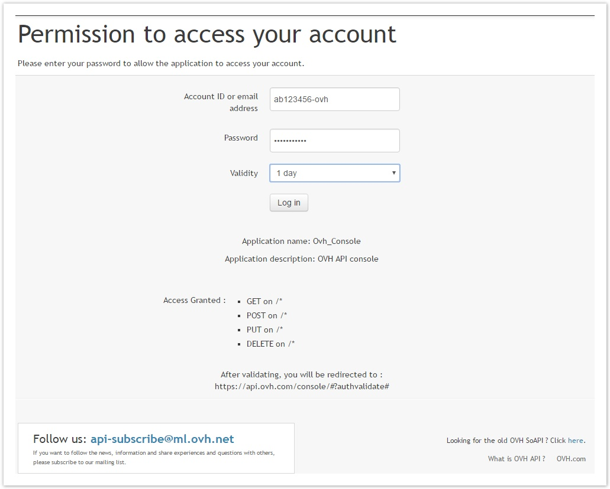
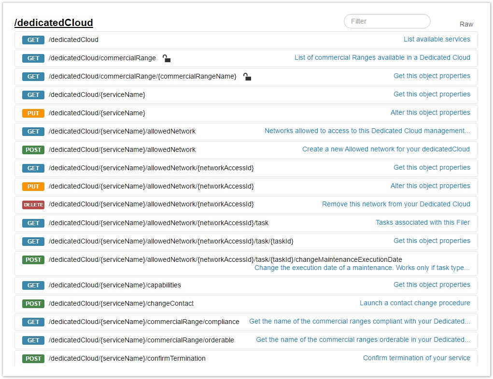
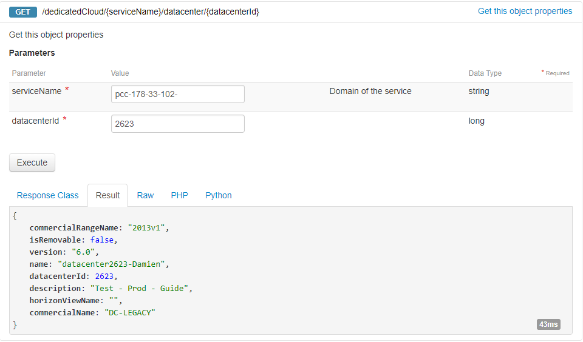
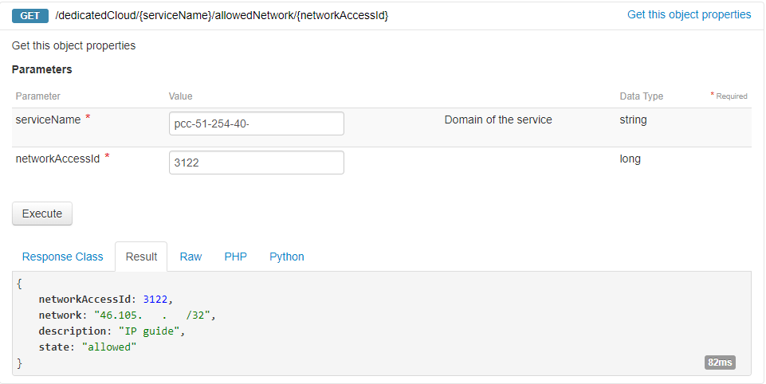
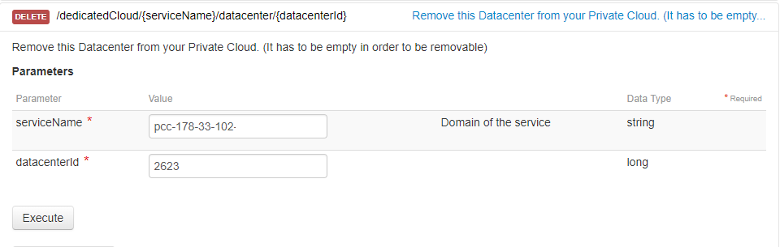

**Dernière mise à jour le 14/02/2019**

## Objectif

L’API OVH permet de réaliser certaines actions parfois non disponibles dans l’espace client OVH.

Elle permet également d’automatiser certaines actions.

**Ce guide montre plusieurs exemples.**

## Connexion à L’API

Rendez-vous sur l’API [ovh.com](http://ovh.com){.external-link} : [http://api.ovh.com](http://api.ovh.com/){.external-link}

{.thumbnail}

Cliquez sur “Explore the OVH API”.

Une fois sur l’interface, cliquez sur le lien login.

{.thumbnail}

Entrez votre nic-handle et votre mot de passe. Les logins sont les mêmes que pour l’espace client OVH.

{.thumbnail}

## Utilisation de l’API

Rendez vous dans la partie dedicatedCloud.

{.thumbnail}

Cliquez sur la partie /dedicatedCloud/ Vous trouverez différents appels possibles (GET, PUT, POST, DELETE).

### GET

L'appel GET permet de sortir des informations sur votre infrastructure, cela n'effectura aucune modification.

Exemple : cliquez sur la partie /dedicatedCloud/{serviceName} et renseignez votre Private Cloud dans le champ. Après avoir cliqué sur “Execute”, le résultat sera similaire à :

{.thumbnail}

### PUT

L'appel PUT, permet de modifier un existant.

Exemple : Après avoir récupéré les informations sur mon datacentre avec l'appel suivant : /dedicatedCloud/{serviceName}/datacenter/{datacenterId}

{.thumbnail}

Je modifie la description avec l'appel PUT : /dedicatedCloud/{serviceName}/datacenter/{datacenterId}

{.thumbnail}

Et voici les informations mise à jour :

{.thumbnail}

### POST

L'appel POST, permet de créer une nouvelle entrée.

Exemple : Je souhaite autoriser une IP pouvant se connecter au client vSphere avec l'appel suivant : /dedicatedCloud/{serviceName}/allowedNetwork

{.thumbnail}

L'IP est ajouté est vérifiable avec l'appel suivant : /dedicatedCloud/{serviceName}/allowedNetwork/{networkAccessId} (le networkAccessId est visible dans l'appel précedent).

{.thumbnail}

### DELETE

L'appel DELETE permet de supprimer une entrée.

Exemple : Je souhaite supprimer un datacentre virtuel, ce dernier étant vide, l'appel suivant permet de le supprimer : /dedicatedCloud/{serviceName}/datacenter/{datacenterId}

{.thumbnail}

## Utilisation annexe

L'API OVH peut être utilisé en complément du [SDK vSphere](https://pccdocs.ovh.net/display/VS/Installation+VMware+API+Perl) afin d'automatiser toute votre infrastructure.

## Aller plus loin

Échangez avec notre communauté d'utilisateurs sur <https://community.ovh.com>.