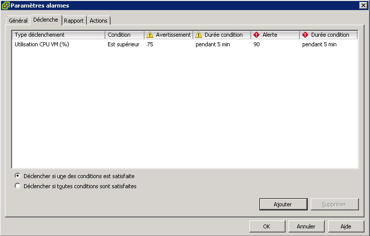

## 
You must use the vSphere Client by accessing it using your own local client, or by using the RDP that we provided to you when activating your PCC.

## 
You can create an alert on all elements of your Private Cloud including the Private Cloud itself, clusters, VM datastores, the network ...
To do this, right click on the Private Cloud or anything else you wish to watch, then select "Alarm" and finally "Add Alarm".

{.thumbnail}
On the "General" tab, indicate the name of your alert and select the alarm type:

{.thumbnail}
The "Trigger" tab, enables you to specify the monitoring settings and alert conditions. The "Add" button allows you to customise the rules.
You can monitor the RAM of a host, for example, by specifying the maximum threshold before its status switches to alert and for which you will receive an email warning.

{.thumbnail}
The "Reporting" tab allows you to specify a margin to take into account before triggering the alarm, but also its repetition frequency.
If for example your host goes over 95% of use for more than 5 minutes you will be notified by e-mail.

On the "Action" tab, you can define the action to be taken once the alarm is detected i.e.: send an mail, stop a VM, or an execution command.

{.thumbnail}

