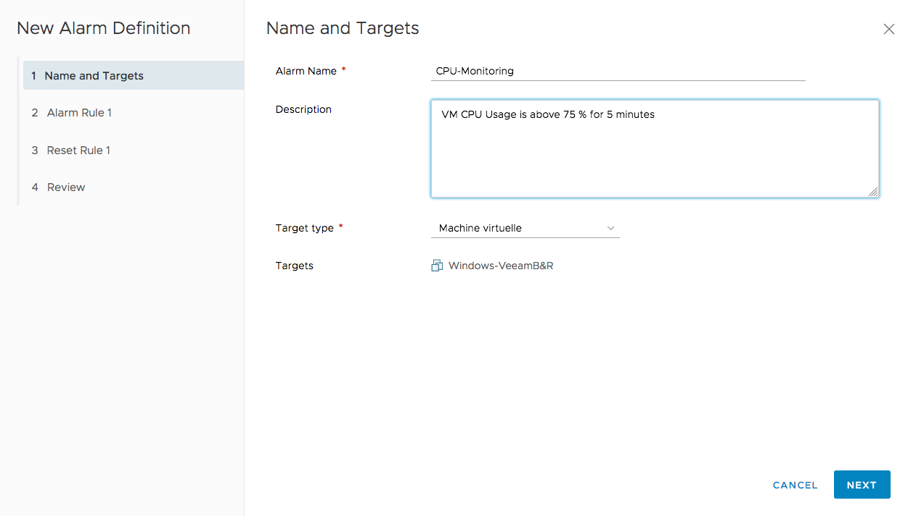

**Last updated 8th July 2020**

## Objective

Il est possible de créer une alerte sur tous les éléments de votre Private Cloud : le datacentre lui-même, les clusters, les VM, les datastores, le réseau...

**Ce guide explique comment créer des alertes.**

## Requirements

- a [Hosted Private Cloud infrastructure](https://www.ovhcloud.com/en-gb/enterprise/products/hosted-private-cloud/)
- be connected to your [vSphere interface](../login-vsphere-interface/).

## Instructions

### Create alert

To create an alert, right-click on the datacenter or any other item you want to monitor, and then click `Alarms`{.action} and `New Alarm Definition`{.action}.

{.thumbnail}

### Set name and target

The first step is to name the alert and set its target. You can also add a description.

{.thumbnail}

### Set alert rules

The second step is to define the rules of the alert and the actions it triggers.

The `IF` field allows you to set an alert trigger from a selection of variables. Depending on the variable chosen, a list of arguments will be offered.

The `THEN` field allows you to indicate that the alert is triggered with a certain degree of criticality and will result in actions such as sending an email, executing a script or shutting down a VM.

{.thumbnail}

This allows you to monitor the RAM of a host, for example, by specifying a threshold not to exceed before its status goes on alert and you receive a warning email.

> [!primary]
> You can add several rules to your alert by clicking `ADD ANOTHER RULE`{.action}.
>

### Suspend alert

The third step allows you to set the end of the alert criteria and trigger new actions.

{.thumbnail}

### Alert Summary

The last step shows you a summary of the rules defined. You can activate the alarm by checking the cursor or choose to activate it later by right-clicking the selected item and then clicking `Alarms`{.action} and `Enable Alarm Actions`{.action}.

{.thumbnail}

You can also configure the frequency of repeat alerts in this step.

## Go further

Join our community of users on <https://community.ovh.com/en/>.
