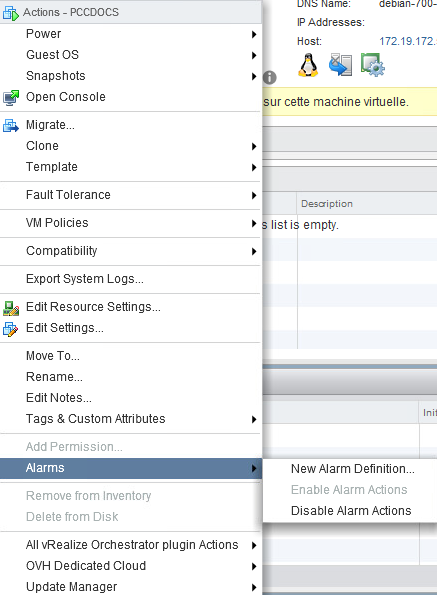
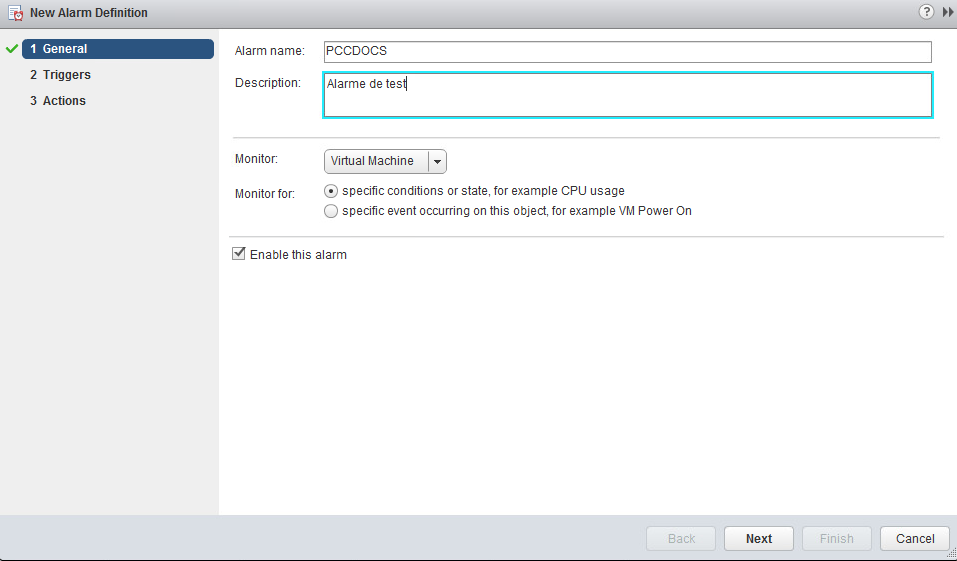
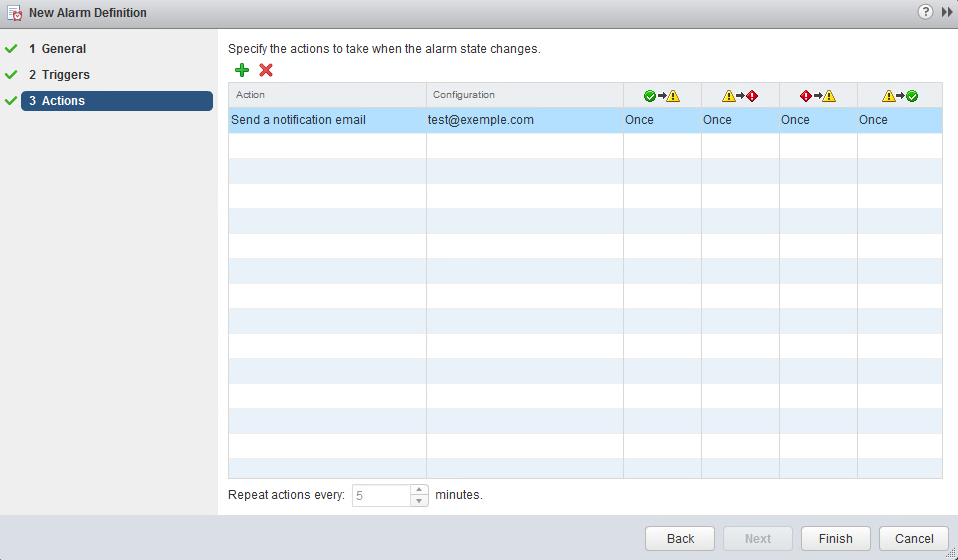

**Dernière mise à jour le 28/01/2019**

## Objectif

Il est possible de créer une alerte sur tous les éléments de votre Private Cloud : le datacentre lui-même, les clusters, les VM, les datastores, le réseau...

**Ce guide explique comment les créer.**

## En pratique

Pour Créer une alerte, faites un clic droit sur le datacenter ou tout autre élément à surveiller, puis sélectionner `Alarms` et enfin `New Alarm Definition`{.action}.

{.thumbnail}

## Création de l'alarme

Sur l’onglet `General`, indiquez le nom de votre alerte, et sélectionnez le type d’alarme :

{.thumbnail}

## Les déclencheurs (Triggers)

L’onglet `Triggers`, vous permet d’indiquer les paramètres que vous allez surveiller, ainsi que les conditions d’alerte. Le bouton `+`{.action} vous permet de personnaliser la règle. Vous pouvez ainsi surveiller la RAM d’un host par exemple, en indiquant un seuil à ne pas dépasser avant que son statut ne passe en alerte et que vous ne recevrez un e-mail d'avertissement.

{.thumbnail}

## Les actions

Sur l’onglet `Actions`, vous allez définir l’action à mener une fois l’alarme détectée : un envoi de mail, un arrêt de VM par exemple. 

Vous pouvez également configurer via cet onglet la fréquence de répétition des alertes:

{.thumbnail}

## Aller plus loin

Échangez avec notre communauté d'utilisateurs sur <https://community.ovh.com>.