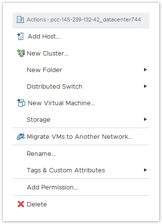
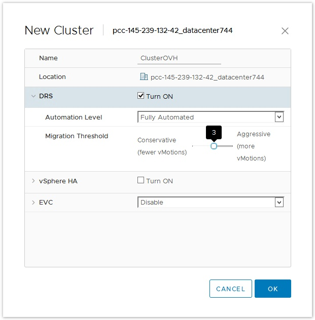
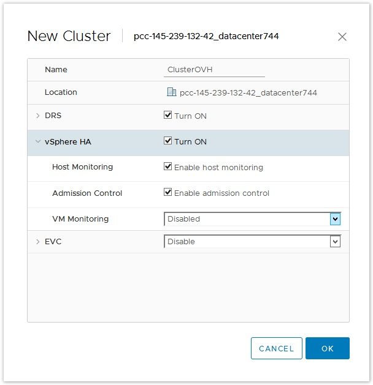
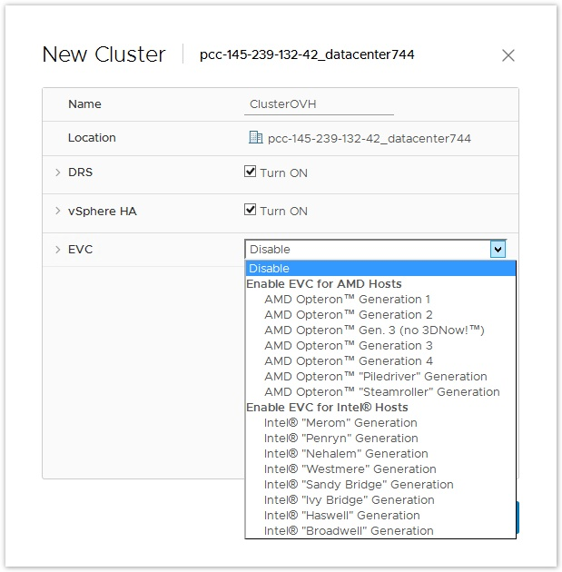
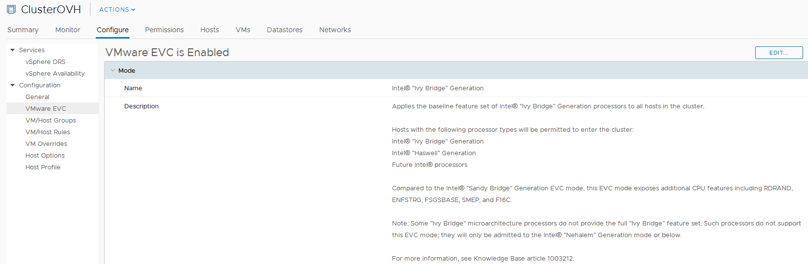

**Dernière mise à jour le 10 janvier 2019**

## Objectifs

Il est possible de créer plusieurs clusters dans votre infrastructure afin de segmenter vos activités.

**Ce guide explique les différentes options.**

## Création du cluster

Afin de créer un cluster, faites un clic-droit sur votre datacentre vituel.

Cliquez ensuite sur "New Cluster...".

{.thumbnail}

Une nouvelle fenêtre apparaîtra.

Vous pourrez donner un nom à votre cluster et configurer les options de base.

> [!success]
>
> Ces options peuvent être modifier par la suite, lorsque le cluster est crée, mais il est préférable de le faire lors de création.
> 

### DRS

L'option DRS permet de répartir automatiquement les VMs en fonction de la charge présente sur les hôtes.

> [!success]
>
> Vous pouvez retrouver plus d'informations sur la KB VMware suivante : 
> [https://kb.vmware.com/s/article/2149938](https://kb.vmware.com/s/article/2149938)
> 

Cochez la case pour activer l'option et choisissez le mode de migration.

{.thumbnail}

- En mode "manuelle", DRS ne déplacera pas les VMs, vous devrez gérer le déplacement et la répartition de vos VMs de manière autonome.

- En mode "partiellement automatisé", DRS vous conseillera sur des migrations de vos VMs, mais ne les fera que si vous validez le déplacement.

- En mode "Entièrement automatisé", DRS déplacera les VMs automatiquement sans validation de votre part, et en fonction de la charge présente sur les hôtes.

Dans les deux modes "automatisé", il est possible de régler le seuil de migration sur cinq niveaux, de modéré à élevé (1 étant le plus modéré, et 5 le plus élevé).

Plus le seuil est élevé, plus le service DRS sera sensible à l'équilibre du cluster.

### HA

L'option HA permet de redémarrer des machines virtuelles en cas de dysfonctionnement survenant sur un hôte.

> [!success]
>
> Vous pouvez retrouver plus d'informations sur la KB VMware suivante : 
> [https://kb.vmware.com/s/article/2148003](https://kb.vmware.com/s/article/2148003)
> 

> [!warning]
>
> Si le service HA n'est pas activé, les SLA ne seront pas applicables.
> 

{.thumbnail}

- Après avoir créé un cluster, la "surveillance d'hôte" permet à l'hôte maître du cluster HA de répondre aux défaillances des hôtes ou des machines virtuelles et à l'isolation du réseau de gestion. La priorité de redémarrage et la réponse d'isolement des hôtes et des VMs déterminent comment vSphere HA répond aux défaillances des hôtes et aux isolations.

- Le "contrôle d'admission" permet de spécifier si les machines virtuelles peuvent être démarrées si elles violent les contraintes de disponibilité. Le cluster réserve des ressources pour permettre le basculement de toutes les machines virtuelles en cours d'exécution sur le nombre d'hôtes spécifié.

- La fonction "surveillance des machines virtuelles" utilise les informations de signal de pulsation capturées par VMware Tools comme proxy pour la disponibilité des systèmes d'exploitation clients. Cette fonction permet à vSphere HA de réinitialiser ou de redémarrer automatiquement les machines virtuelles qui ont perdu leur capacité de produire un signal de pulsation.

### EVC

L'option EVC (Enhanced vMotion Compatibility) permet de déplacer des machines virtuelles à chaud entre des hôtes disposant de processeurs avec des générations différentes.

> [!primary]
>
> OVH pouvant mettre à disposition des hôtes disposant de processeur de génération différente, il est important d'activer cette option sur votre cluster afin de ne pas être bloquer dans la migration de machines virtuelles.
> 

> [!success]
>
> Vous pouvez retrouver plus d'informations sur les KB VMware suivantes : 
>
> [https://kb.vmware.com/s/article/1005764](https://kb.vmware.com/s/article/1005764)
> 
> [https://kb.vmware.com/s/article/1003212](https://kb.vmware.com/s/article/1003212)
>

#### Dedicated Cloud

Si vous disposez d'un Private Cloud de la gamme Dedicated Cloud, vous devrez choisir le mode "AMD Opteron Gen. 3 (no 3DNow!)" visable dans la partie pour les hôtes AMD.

#### SDDC

Si vous disposez d'un Private Cloud de la gamme SDDC, vous devrez choisir le mode "Intel  "Ivy Bridge" Generaton" visible dans la partie pour les hôtes Intel.

#### Avant création

Il vous suffit de choisir la génération correspondante selon la gamme de l'offre Private Cloud que vous avez.

{.thumbnail}

#### Après création

L'activation de l'EVC après a création du cluster se fait dans les paramètres du cluster.

{.thumbnail}

> [!warning]
>
> Attention, l'activation du mode EVC ne peut se faire que sur un cluster n'ayant pas de VM démarré. Sur un cluster en production, deux solutions sont possibles : 
> 
> - Extinction de toutes les VMs, et activation du mode EVC sur le cluster.
>
> - Migration vers un autre cluster en déplaçant les VMs au fur et à mesure :
>
> A - Création d'un autre cluster avec le mode EVC activé (sur la bonne génération)
> 
> B - Mise en maintenance d'un hôte et déplacement de l'hôte sur ce cluster
>
> C - Extinction d'une VM et déplacement vers le nouveau cluster
>
> D - Répétez l'opération B et C jusqu’à ce que l'ancien cluster soit vide.
>

## Aller plus loin

Échangez avec notre communauté d'utilisateurs sur <https://community.ovh.com>.