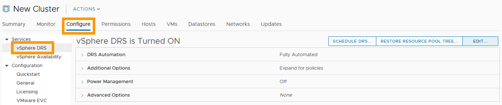
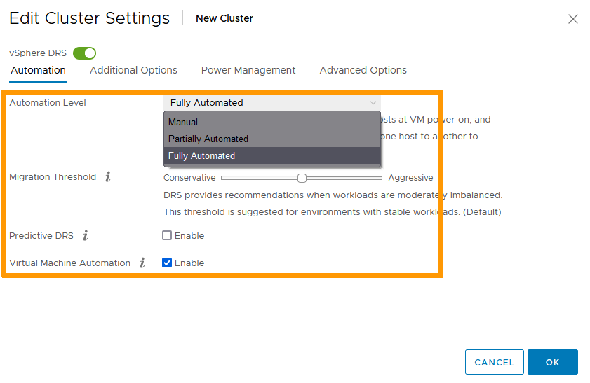

**Last updated 8th February 2022**

## Objective

You can set up multiple clusters in your environment to segment your activities. 
Learn how to create them and configure their functionalities (DRS, HA & EVC).

**This guide offers a step by step study case to achieve the objective.**

## Requirements

- Being an administrative contact of your [Hosted Private Cloud infrastructure](https://www.ovhcloud.com/pl/enterprise/products/hosted-private-cloud/) to receive login credentials
- A user account with access to vSphere (created in the [OVHcloud Control Panel](https://www.ovh.com/auth/?action=gotomanager&from=https://www.ovh.pl/&ovhSubsidiary=pl))

## Instructions

### Cluster creation

In the vSphere interface menu, go to the `Hosts and Clusters`{.action} dashboard.

{.thumbnail}

Right click your Datacenter. 
Select `New Cluster`{.action}.

{.thumbnail}

In the pop-up window, name your cluster and select the relevant options you want set. 
Click `OK`{.action} when done.

{.thumbnail}

> [!warning]
>
> vSAN requires vSAN compatible hosts. Find more details [here](https://docs.ovh.com/pl/private-cloud/manager-ovh-private-cloud/) on how to order them if needed.
> 

### DRS

DRS spreads the compute load accross your hosts. 
If you activated the option, it is set on "Fully Automated" by default.

Select your cluster. In the `Configure`{.action} tab, select `vSphere DRS`{.action} and click `Edit`{.action}.

{.thumbnail}

Three options are available to you:

- Manual Mode. DRS generates both power-on placement recommendations, and migration recommendations for virtual machines. Recommendations need to be manually applied or ignored.
- Partially Automated. DRS automatically places virtual machines onto hosts at VM power-on. Migration recommendations need to be manually applied or ignored.
- Fully Automated. DRS automatically places virtual machines onto hosts at VM power-on, and virtual machines are automatically migrated from one host to another to optimize resource utilization.

Automated modes also allow to set the sensitivity of the service, from the most conservative to the most aggressive threshold. 
Click `OK`{.action} when done.

{.thumbnail}

### HA

High Availability allows for redundancy so a failing host will not impact the services running in your VMs. 
If you activated the option, it is set on its default settings.

To modify them, select your cluster. In the `Configure`{.action} tab, select `vSphere HA`{.action} and click `Edit`{.action}.

{.thumbnail}

The response types for the different host failures can be custom set to your needs. 
Click `OK`{.action} when done.

{.thumbnail}

### EVC

EVC (Enhanced vMotion Compatibility) allows for migration of live VMs between hosts.

Prior to activating the functionality, check your hosts summary pages to determine their types.

{.thumbnail}

Select your cluster. In the `Configure`{.action} tab, select `VMware EVC`{.action} and click `Edit`{.action}.

{.thumbnail}

Enable EVC for the type of CPUs your hosts hold. 
Downward compatibility is assured. To help you verify the settings are working, you will see a compatibility validation at the bottom of the window. 
Click `OK`{.action} when done.

{.thumbnail}

> [!warning]
>
> EVC activation can only happen on a cluster with no active VM running. Make sure to turn off or evacuate all VMs before doing it. 
>

## Go further

Join our community of users on <https://community.ovh.com/en/>.
