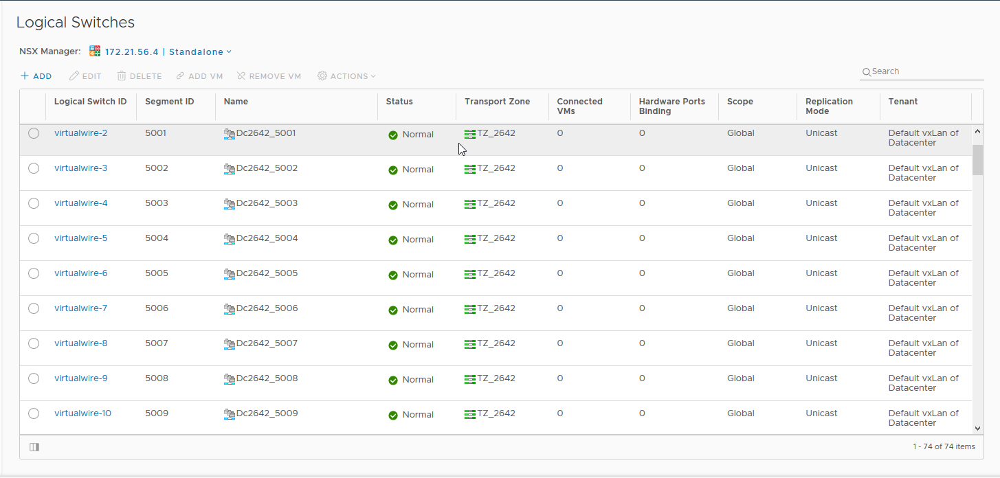
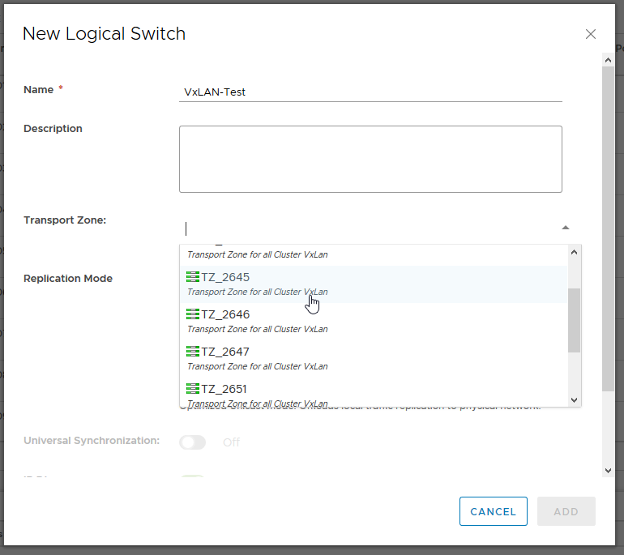
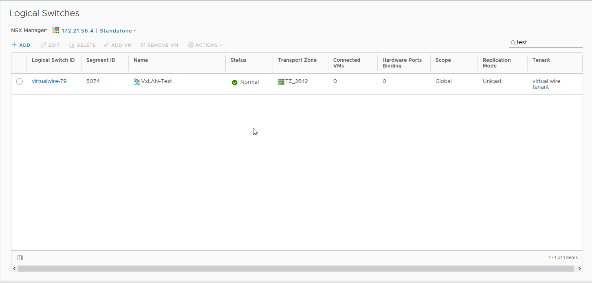

> [!primary]
> Esta traducción ha sido generada de forma automática por nuestro partner SYSTRAN. En algunos casos puede contener términos imprecisos, como en las etiquetas de los botones o los detalles técnicos. En caso de duda, le recomendamos que consulte la versión inglesa o francesa de la guía. Si quiere ayudarnos a mejorar esta traducción, por favor, utilice el botón «Contribuir» de esta página.
>

**Última actualización: 12/10/2020**

## Objetivo

En una infraestructura Hosted Private Cloud, tendrá a su disposición 10 VXLAN de NSX y 11 VLAN con el vRack.

**Esta guía muestra la creación de VPS adicionales.**

## Requisitos

- Tener acceso al cliente vSphere Web (HTML5).

## Procedimiento

Los planes Hosted Private Cloud incluyen dos switchs virtuales distribuidos (vDS). 

Estos *vDS* incluyen varios *portGroups*, cada uno de los cuales tiene su utilidad.

El primer vDS común a ambos productos dispone de dos tipos de *portGroup*: 

- VMnetwork que permite comunicarse a internet.
- VXLAN gestionadas por NSX, que permite aislar las comunicaciones privadas dentro del Hosted Private Cloud.

El segundo vDS solo tiene un tipo de *portGroup*: 

- VLAN que permiten aislar las comunicaciones privadas dentro del Hosted Private Cloud y entre los distintos servicios de OVHcloud compatibles con el vRack (servidor dedicado, Public Cloud..). 

### VxLan - NSX 

En los hosted Private Cloud dispondrá de un primer switch virtual. 

En este switch, 10 VXLAN son creados de base. Concediendo el permiso `NSX` en [la gestión de los usuarios de su área de cliente](../manager-ovh-private-cloud/#usuarios), podrá acceder a la interfaz NSX y así crear VXLAN adicionales.

En primer lugar, acceda a la vista de `Networking and security` de su cliente vSphere y haga clic en `Logical Switches`{.action}.

Haga clic en el botón `+`{.action} para comenzar la creación:

{.thumbnail}

En primer lugar, puede asignarle un nombre a su **portGroup**:

{.thumbnail}

Seleccione la zona de transporte: 

{.thumbnail}

> [!primary]
>
> La zona de transporte controla a qué hosts puede llegar un conmutador lógico. En una infraestructura Hosted Private Cloud, OVHcloud crea una zona de transporte por datacenter virtual.
> Es posible crear una zona de transporte común a los distintos datacenters virtuales o ampliar las existentes.
>
> La forma de plan de control de una zona de transporte está en monodifusión que permite la gestión de la comunicación entre los hosts mediante los controladores NSX.
>

El descubrimiento de direcciones IP permite limitar la saturación del tráfico ARP en los segmentos VXLAN individuales, es decir, entre las máquinas virtuales conectadas al mismo conmutador lógico.

El aprendizaje MAC construye una tabla de aprendizaje VLAN/MAC en cada vNIC. Esta tabla se almacena con los datos dvfilter. En vMotion, dvfilter guarda y restaura la tabla en la nueva ubicación. A continuación, el conmutador genera RARP para todos los registros VLAN/MAC de la tabla. Puede que quiera activar el aprendizaje MAC si utiliza tarjetas de red virtuales que conectan VLAN.

OVHcloud recomienda utilizar únicamente el descubrimiento de direcciones IP.

Una vez introducidos todos los datos, puede confirmar la creación:

{.thumbnail}

Su portGroup ya está creado y funcional. Puede verlo en la vista de los conmutadores lógicos: 

{.thumbnail}

Pero también en la vista de `Networking view`.

{.thumbnail}

### VLAN - vRack

También tiene un switch virtual distribuido (vDS) adicional.

En este switch, se crean 11 VLAN de base (VLAN10 a VLAN20). Concediendo el permiso de `administrador` sobre el `acceso a la V(x)LAN` en [la gestión de los usuarios de su área de cliente](../manager-ovh-private-cloud/#usuarios){.external-link}, podrá crear VLAN adicionales.

En primer lugar, acceda a la vista de `networking` de su cliente vSphere. Despliegue la carpeta **vrack**, haga clic derecho en el puerto **dVS** que termina en *-vrack*. A continuación, haga clic en `New Distributed Port Group`{.action}.

{.thumbnail}

{.thumbnail}

El siguiente paso es asignar un nombre a su **PortGroup**:

{.thumbnail}

A continuación, configure los parámetros recomendados por OVHcloud:

- **Port binding**: Static (reserva y asignación del puerto a una máquina virtual)
- **Port allocation**: Elastic (Permite ampliar en caliente el número de puertos)
- **Number of ports**: 24
- **VLAN type** : VLAN (los demás son [PVLAN](https://kb.vmware.com/s/article/1010691){.external} y Trunk)
- **VLAN ID** : 21 (sabiendo que el ID puede configurarse de 1 a 4096)
- Marque la opción *Customize default policies configuracion*.

{.thumbnail}

Tiene 3 parámetros de seguridad que pueden activarse en función de sus necesidades : 

- *Promiscuous mode* (Elimina todo filtrado de recepción que el adaptador de máquina virtual puede realizar para que el sistema operativo invitado reciba todo el tráfico observado en la red).
- *MAC address changes* (Afecta el tráfico que recibe una máquina virtual. Si la opción está definida en **Accept**, ESXi acepta las solicitudes de modificación de la dirección MAC efectiva en una dirección diferente de la MAC inicial.)
- *Forged transmits* (afecta al tráfico transferido desde una máquina virtual). Si la opción está configurada en **Accept**, ESXi no compara las direcciones MAC de origen con las de efecto).

> [!primary]
>
> El uso más frecuente de estos 3 parámetros es el CARP, especialmente utilizado en **pfSense**.
> 

{.thumbnail}

Permite desactivar el [Traffic shaping](https://docs.vmware.com/en/VMware-vSphere/6.5/com.vmware.vsphere.networking.doc/GUID-CF01515C-8525-4424-92B5-A982489BACE2.html){.external}.

{.thumbnail}

A nivel del Load Balancing, seleccione *Route Based on IP hash* que es el mejor método en cuanto a redundancia y repartición.

> [!warning]
>
> Atención al nivel de configuración del orden de la migración, es necesario poner la conexión montante `lag1` en *Active* (conexión entre la red virtual y la red física), ya que de lo contrario no será posible la comunicación entre los hosts.
>

{.thumbnail}

El `Netflow` está desactivado (informe de actividad sobre los flujos de tráfico).

{.thumbnail}

Deje el valor `Block All Ports` en "No".

{.thumbnail}

A continuación, se mostrará un resumen de los cambios realizados. Haga clic en `Finish` para confirmar la creación.

{.thumbnail}

Aquí observamos que la **VLAN21** está bien disponible y es funcional.

{.thumbnail}

## Más información

Interactúe con nuestra comunidad de usuarios en <https://community.ovh.com/en/>.
