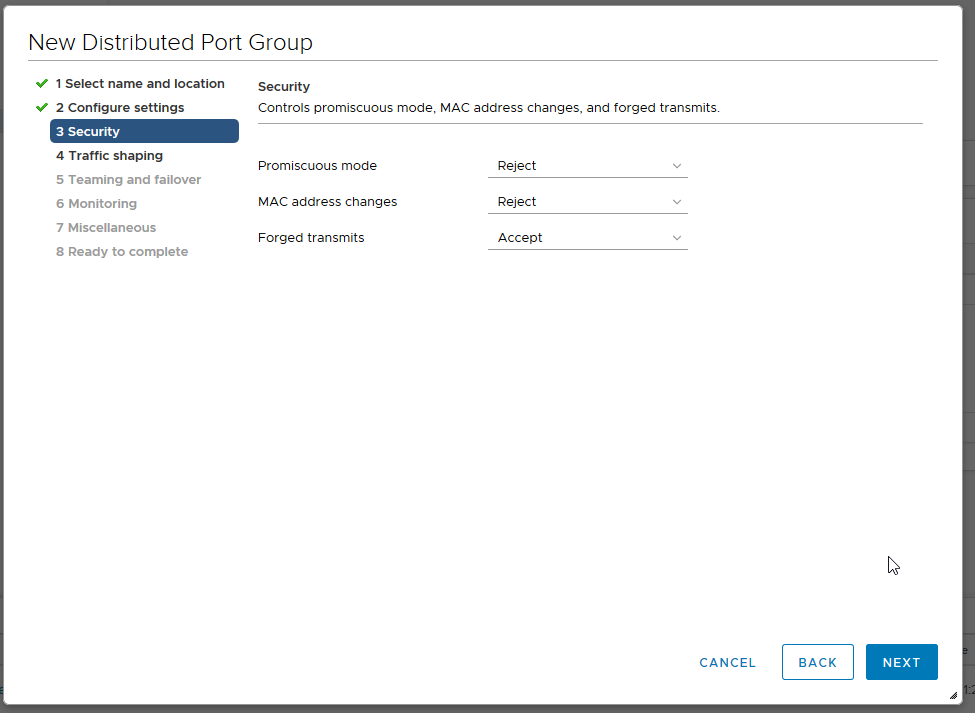

**Last updated 7th February 2022**

## Objective

OVHcloud sets up a base of 11 VLANs on your vRack.

**This guide explains how to create additional VLANs.**

## Requirements

- Being an administrative contact of your [Hosted Private Cloud infrastructure](https://www.ovhcloud.com/pt/enterprise/products/hosted-private-cloud/) to receive login credentials
- A user account with access to vSphere as well as the specific rights for Networking (created in the [OVHcloud Control Panel](https://www.ovh.com/auth/?action=gotomanager&from=https://www.ovh.pt/&ovhSubsidiary=pt))

## Instructions

In the Hosted Private Cloud solutions, VLANs can be used to isolate private communications between different OVHcloud services that are vRack-compatible (Dedicated Server, Public Cloud instance, etc.). 

First, go to your vSphere client's `Networking`{.action} view. Deploy the **vrack** folder then right-click on the **dVS** ending in *-vrack* and finally click on `New Distributed Port Group`{.action}.

{.thumbnail}

The next step is to name your **Port Group**:

{.thumbnail}

Then configure the settings recommended by OVHcloud:

- **Port binding**: Static (reserving and assigning the port to a virtual machine)
- **Port allocation**: Elastic (allows the number of ports to be hot-wired)
- **Number of ports**: 24
- **VLAN type**: VLAN (the others are [PVLAN](https://kb.vmware.com/s/article/1010691){.external} and Trunk)
- **VLAN ID**: 21 (knowing that the ID can be configured from 1 to 4096)
- Check the option *Customize default policies configuration*.

{.thumbnail}

You have 3 security settings that can be activated according to your needs: 

- *Promiscuous mode*: eliminates any filtering that the VM adapter can perform so that the guest operating system receives all observed traffic on the network.
- *MAC address changes*: when set to **Accept**, ESXi will accept requests to change the effective MAC address to an address other than the initial MAC address.
- *Forged transmits*: affects traffic transmitted from a virtual machine. When set to **Accept**, ESXi does not compare the source and effective MAC addresses.

> [!primary]
>
> The most frequent use of these 3 parameters is the CARP, especially used on **pfSense**.
> 

{.thumbnail}

Leave [Traffic shaping](https://docs.vmware.com/en/VMware-vSphere/6.5/com.vmware.vsphere.networking.doc/GUID-CF01515C-8525-4424-92B5-A982489BACE2.html){.external} disabled.

{.thumbnail}

In terms of load balancing, select *Route Based on IP hash*, which is the best method for redundancy and load balancing.

> [!warning]
>
> Be careful when configuring the failover order: It is necessary to set the `lag1` uplink to *Active* (connection between the virtual network and the physical network), otherwise no communication between the hosts will be possible.
>

{.thumbnail}

The `NetFlow` is disabled (traffic flow activity report).

{.thumbnail}

Leave the `Block All Ports` value at "No".

{.thumbnail}

You will then be presented with a summary of the changes. Click `Finish`{.action} to confirm the creation.

{.thumbnail}

Here we can see that **VLAN21** is available and functional.

{.thumbnail}

## Go further

Join our community of users on <https://community.ovh.com/en/>.
