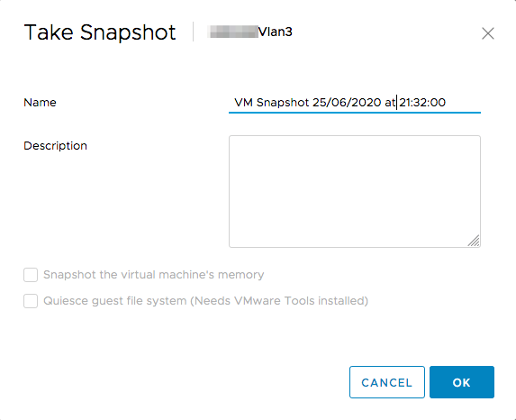

**Last updated 8th July 2020**

## Objective

You can take a snapshot of a virtual machine. Once you have taken the snapshot, you can restore all virtual machines to the most recent snapshot or delete the snapshot.

**This guide explains how snapshots work.**

## Requirements

- a [Hosted Private Cloud infrastructure](https://www.ovhcloud.com/en-gb/enterprise/products/hosted-private-cloud/)
- a user account with access to [vSphere](../login-vsphere-interface/) (created in the [OVHcloud Control Panel](https://www.ovh.com/auth/?action=gotomanager))

## Instructions

Snapshots are useful when you need to return to the same state multiple times, without creating multiple virtual machines. With snapshots, you create restore positions.

This allows you to preserve the basic state of a VM before migrating it to another type of operation.

While snapshots provide a "snapshot" image of the disk that can be used by backup solutions (Veeam, Nakivo), regular erasure of the snapshots present is recommended. If you have a large number of snapshots, they will take up a lot of disk space and penalize the VM in terms of performance.

> [!primary]
> 
> It is not advisable to use snapshots as a method of virtual machine backups.
> 

The snapshot allows you to capture the status of your VM when you launch it. This snapshot includes (as you choose):

- The status of all disks in the virtual machine.
- The contents of the virtual machine's memory.

> [!warning]
> 
> It is not possible to change the size of a disk when a snapshot is taken on a VM.
> 

### Snapshot capture

Right-click on your VM then choose `Snapshots`{.action} and finally `Take Snapshot...`{.action}:

{.thumbnail}

You must now specify the name you want to assign to this snapshot, its description, and if you want the VM memory to be included in the snapshot as well.

Here you can make a snapshot with or without the RAM used by the VM. If you integrate the RAM into the snapshot, this will increase the time it takes to complete the task, but it will prevent you from having to reboot when restoring the snapshot.

Otherwise, since the RAM is not backed up, the task will be faster, but a reboot of the VM will be necessary in case of a recovery.

{.thumbnail}

### Snapshot Management

You can find all snapshots of your VM in the snapshot manager. To do this, right-click on the VM, then choose `Snapshots`{.action} and finally `Manage Snapshots`{.action}:

{.thumbnail}

### Delete a Snapshot

In the snapshot manager, select the snapshot you want to delete and click `Delete`{.action}.

All VM snapshots can be removed in one operation by clicking `Delete All`{.action}.

### Restore a snapshot

In the snapshot manager, select the snapshot to restore and click `Restore`{.action}.

## Go further

Join our community of users on <https://community.ovh.com/en/>.