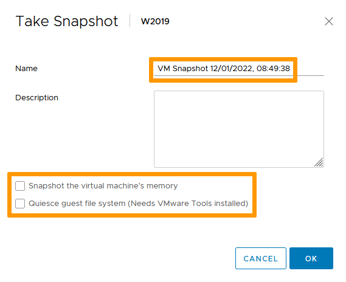
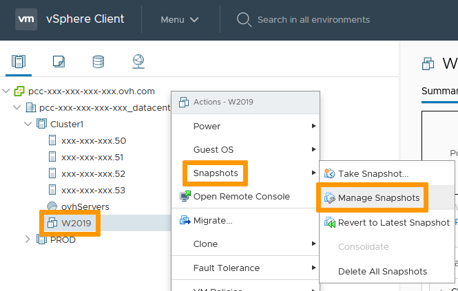
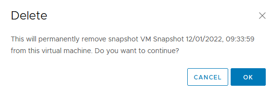
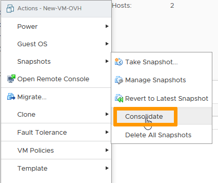
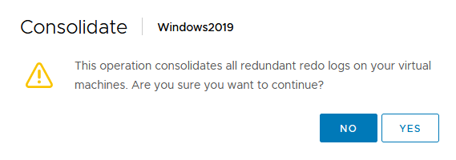

**Last updated 19th January 2022**

## Objective

VMware offers the ability to take snapshots so you can save and possibly go back to a VM's previous state.

**This guide explains how to execute these tasks**

## Requirements

- Being an administrative contact of your [Hosted Private Cloud infrastructure](https://www.ovhcloud.com/it/enterprise/products/hosted-private-cloud/) to receive login credentials
- A user account with access to vSphere (created in the [OVHcloud Control Panel](https://www.ovh.com/auth/?action=gotomanager&from=https://www.ovh.it/&ovhSubsidiary=it))

## Instructions

### Take a Snapshot

A snapshot allows you to capture a VM state. 
It offers a layer of protection for your VM prior to executing changes as it offers the ability to come back to that state if needed.

In the vSphere interface menu, go to the `Hosts and Clusters`{.action} dashboard. 
Navigate to your VM, right-click it and, in the `Snapshot`{.action} menu, select `Take Snapshot`{.action}.

{.thumbnail}

By default, the snapshot will be named after the current date and time. You may edit it to your preference. 
A description may also be added for reference. 
If your VM is running, the snapshot process offers two options:

- Snapshot the virtual machine's memory. This will save the VM Ram state, helping with certain applications that may not have commited changes to disk. It should also make your snapshot crash-resistant, meaning it can be reverted to without powering off the VM.
- Quiesce guest file system (Needs VMware Tools installed). This will bring your VM to a state that is backup suitable: clearing buffers, committing changes to disks... 

If your VM is not running, those options are greyed out. 
*We recommend taking snapshots of a turned off VM and if it is not possible, preferably use the Quiesce option over the memory snapshot for added security.*

Click `OK`{.action} when ready.

{.thumbnail}

Your snapshot is done.

### Manage Snapshots

You can take multiple snapshots of a single VM repeating the process explained above. 
With time, snapshots will consume resources, especially storage, to be maintained and possibly will affect VM performance. 
Below is how to revert, clear or consolidate snapshots.

#### Revert to Snapshot

In the vSphere interface menu, go to the `Hosts and Clusters`{.action} dashboard. 
Navigate to your VM, right click on it and in the `Snapshots`{.action} menu, select `Manage Snapshots`{.action}.

{.thumbnail}

Check the snapshot tree and select the one you wish to go back to. 
Click on `Revert To`{.action}.

{.thumbnail}

Confirm by clicking `OK`{.action}.

{.thumbnail}

You can click `Done`{.action} as your VM has been reverted to the point chosen.

> [!primary]
>
> If you only have a single snapshot or wish to revert to the last taken snapshot, you can speed up the process by choosing `Revert to Latest Snapshot`{.action} in the `Snapshots`{.action} menu.

#### Clear Snapshot

In the vSphere interface menu, go to the `Hosts and Clusters`{.action} dashboard. 
Navigate to your VM, right click on it and in the `Snapshots`{.action} menu, select `Manage Snapshots`{.action}.

{.thumbnail}

Check the snapshot tree and select the one you wish to delete. 
Click on `Delete`{.action}. 
*You can also clear all snapshots by clicking `Delete All`{.action}.*

{.thumbnail}

Confirm by clicking `OK`{.action}.

{.thumbnail}

You can click `Done`{.action} as your snapshot was cleared.

> [!primary]
>
> If you wish to clear all snapshots, you can speed up the process by choosing `Delete All Snapshots`{.action} in the `Snapshots`{.action} menu.

#### Consolidate snapshots

Snapshot consolidation is useful when snapshot disks fail to compress after a delete operation. After consolidation, redundant disks are removed, improving virtual machine performance and saving storage space.

In the vSphere interface menu, go to the `Hosts and Clusters`{.action} dashboard. 
Navigate to your VM, right click on it and in the `Snapshots`{.action} menu, select `Consolidate`{.action}.

{.thumbnail}

Confirm by clicking `YES`{.action}.

{.thumbnail}

You can find more information about consolidation on the [VMware documentation](https://docs.vmware.com/en/VMware-vSphere/6.7/com.vmware.vsphere.vm_admin.doc/GUID-2F4A6D8B-33FF-4C6B-9B02-C984D151F0D5.html){.external}.

## Go further

Join our community of users on <https://community.ovh.com/en/>.
