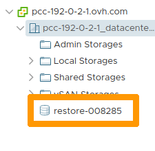

**Last updated 29th March 2021**

## Objective

Following the incident that occurred in the SBG data centre, you can copy the datastores from a PCC concerned by the incident to a destination PCC.

**Find out how to access a datastore copy of one PCC from another PCC using the OVHcloud API.**

## Requirements

- access to the [OVHcloud API](https://api.ovh.com/)
- access to your [vSphere interface](../login-vsphere-interface/)

> [!warning]
>
> If your source PCC has [HDS](https://www.ovhcloud.com/en-gb/enterprise/certification-conformity/hds/) or [PCI-DSS](https://www.ovhcloud.com/en-gb/enterprise/certification-conformity/pci-dss/) certification, your destination PCC must have the same **active** certification in order to retrieve the datastore.
>
> For more information, please refer to our guide on [Healthcare (HDS) or payment services (PCI DSS) compliance activation](../activate-pci-dss-option/).
>

## Instructions

If you are not familiar with using the OVHcloud API, please refer to our [OVHcloud API first steps guide](../../api/first-steps-with-ovh-api/).

### Step 1: Retrieving the datastore filerId

You must first target the `filerId` to migrate.

Log in to [https://api.ovh.com/](https://api.ovh.com/) and use the following call:

> [!api]
>
> @api {GET} /dedicatedCloud/{serviceName}/datacenter/{datacenterId}/filer

Enter the variables:

- serviceName: the name of the source PCC located in SBG (e.g. pcc-192-0-2-15).
- datacenterId: the ID of the source datacentre (e.g. 1337).

### Step 2: Launching the datastore copy

> [!warning]
>
> The destination PCC must be located in one of the following zones: RBX (Roubaix), LIM (Frankfurt) or ERI (London).
>

Once the `filerId` has been identified, use the following call to copy the datastore to the destination PCC:

> [!api]
>
> @api {POST} /dedicatedCloud/{serviceName}/datacenter/{datacenterId}/copyFiler

Enter the variables:

- serviceName: the name of the destination PCC (e.g. pcc-192-0-2-50).
- datacenterId: the ID of the destination datacentre (e.g. 1515).
- filerId: the `filerId` retrieved in the previous step (e.g.: 001234).

Data replication can take several hours. When the replication is complete, you will receive an email confirming that your copy has been successful.

### Step 3: Knowing the status of the copy

In order to follow the datastore copy status, use the following API call:

> [!api]
>
> @api {GET} /dedicatedCloud/{serviceName}/datacenter/{datacenterId}/copyFilerStatus

Enter the variables:

- serviceName: the name of the destination PCC (e.g. pcc-192-0-2-50).
- datacenterId: the ID of the destination datacentre (e.g. 1515).

If a copy has been asked for, the API will return all the copy operations, waiting, in progress or done (progress percentage, current transfer size, task state, etc.).

### Step 4: Accessing the copy from vSphere

In your [vSphere interface](../login-vsphere-interface/), go to the `Storage`{.action} view.

{.thumbnail}

Replication will then appear on all hosts in the destination data centre under the name `restore-XXXXXX` (XXXXXX being the source datastore number).

> [!warning]
>
> The recovered datastore is read-only.
>

For virtual machines, you need to [save them in the vSphere inventory](../vsphere-register-vm-vmx/), then [clone](../clone-a-vm/) them to one of the datastores before you can start them.

## Go further

Join our community of users on <https://community.ovh.com/en/>.
