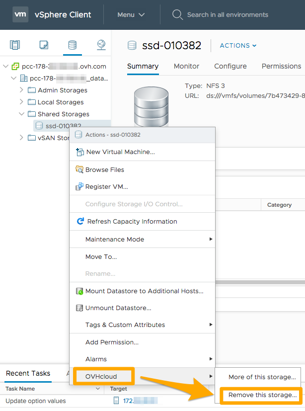

**Stand 24.07.2020**

## Einleitung

In einigen Fällen kann es nützlich sein, einen Datastore aus Ihrem Cluster zu löschen, zum Beispiel, um ihn zu ersetzen oder seine Speicherkapazität zu erhöhen.

**In dieser Anleitung erfahren Sie, wie Sie einen Datastore aus Ihrer Infrastruktur entfernen.**

## Voraussetzungen

* Sie verfügen über ein [Hosted Private Cloud](https://www.ovhcloud.com/de/enterprise/products/hosted-private-cloud/){.external} Angebot.
* Sie haben Zugriff auf das vSphere-Verwaltungsinterface.

## Beschreibung

> [!warning]
>
> Hinweis: Es ist nicht möglich, die **beiden 300 GB bzw. 1,2 TB Datastores**, die in Ihrem Paket inklusive sind, zu löschen. Aus Sicherheitsgründen wird die Löschungsanfrage auch abgewiesen, wenn sich auf dem betreffenden Datastore virtuelle Maschinen (VMs) befinden (die zugehörige Liste wird Ihnen im Bestätigungsfenster angezeigt).
> 

Um einen Datastore zu löschen, klicken Sie zuerst mit der rechten Maustaste auf die entsprechende Ressource. Wählen Sie dann `OVHcloud`{.action} und klicken Sie auf `Remove storage`{.action}.

{.thumbnail}

Daraufhin öffnet sich ein Bestätigungsfenster. Bestätigen Sie mit `Next`{.action}.

{.thumbnail}

Ihre Löschungsanfrage wurde nun registriert.

{.thumbnail}

Sie können den Löschvorgang im Bereich der aktuellen Tasks nachverfolgen.

{.thumbnail}

## Weiterführende Informationen

Für den Austausch mit unserer User Community gehen Sie auf <https://community.ovh.com/en/>.
