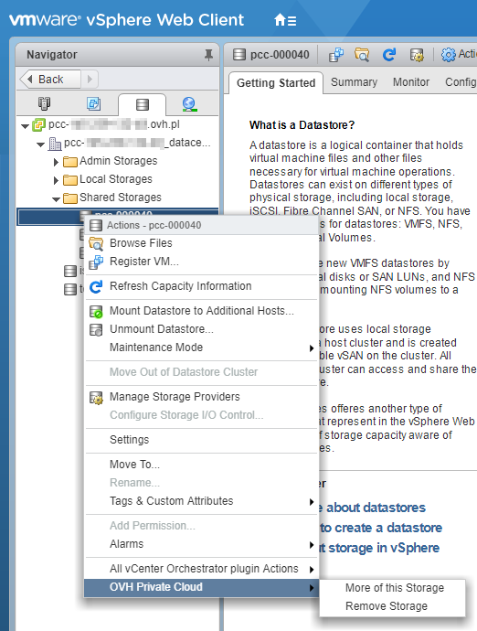

**Last updated 10th August 2018**

## Objective

In certain cases — like replacing a datastore or scaling it up to a higher capacity, for example — it may be useful to remove a datastore from your cluster.

**This guide will show you how to securely remove a datastore from your infrastructure.**

## Requirements

* an [OVH Private Cloud](https://www.ovh.co.uk/private-cloud/){.external} solution
* access to the vSphere management interface

## Instructions

> [!warning]
>
> Please note that you cannot remove the  **two 300 GB or 1.2 TB datastores** included in your pack. For security reasons, the removal request will also be blocked if you have virtual machines (VMs) on the datastore concerned (they will be listed in the confirmation window).
> 

To remove a datastore, right-click on the resource concerned. Then select `OVH Private Cloud`{.action}, and `Remove Storage`{.action}.

{.thumbnail}

A confirmation window will pop up. Confirm by clicking `Next`{.action}.

{.thumbnail}

The removal request will then be processed.

{.thumbnail}

You can also monitor the progress of the datastore removal in `Recent Tasks`{.action}.

{.thumbnail}

## Go further

Join our community of users on <https://community.ovh.com/en/>.
