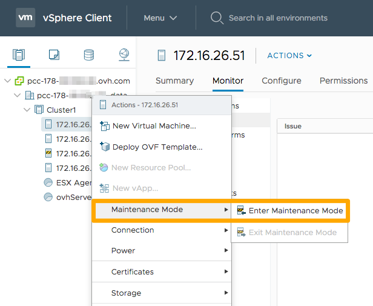
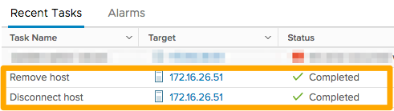

**Last updated July 1st 2020**

## Objective

There are some situations where it may be useful to remove a host server from your cluster — for example, if it is a spare host that you are not using, or if you want to upgrade to a higher range.

**This guide will show you how to securely remove a host server from your infrastructure.**

## Requirements

* an [OVHcloud Hosted Private Cloud](https://www.ovhcloud.com/en-au/enterprise/products/hosted-private-cloud/){.external} solution
* access to the vSphere interface

## Instructions

There are two steps to removing a host server. First you need to switch the resource to maintenance mode, and then you can remove it.

### Enable maintenance mode.

Once you have logged in to vSphere, go to the inventory for your host servers and clusters. Select the host server concerned by right-clicking on it, then click `Maintenance Mode`{.action} and `Enter Maintenance Mode`{.action}. If there are any virtual machines (VMs) working on this host server, they will be automatically saved on to another server in your cluster (if HA (high availability) and DRS are activated).

{.thumbnail}

A window will open asking you to confirm that you would like to switch to maintenance mode.

{.thumbnail}

You can track the progress of the switch to maintenance mode in `Recent Tasks`.

{.thumbnail}

### Remove the host server.

The host server is now in maintenance mode. Right-click on it, then click `OVHcloud`{.action} and `Remove OVH host`{.action}.

{.thumbnail}

Finally, in the window that appears, confirm that you wish to remove it by clicking `Next`{.action}.

{.thumbnail}

The removal request will then be processed.

{.thumbnail}

You can track the progress of the host server removal in `Recent Tasks`.

{.thumbnail}

Within a few minutes, the host server you have removed will no longer appear. 

> [!primary]
>
> If any directories or files are added on to the host server’s local storage in the meantime, the removal will be blocked due to an error. Only base directories and vSwap files will not block this operation.
> 

## Go further

Join our community of users on <https://community.ovh.com/en/>.
