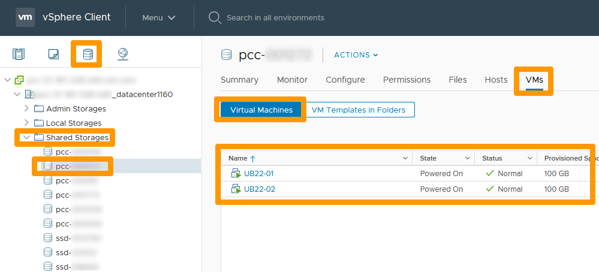
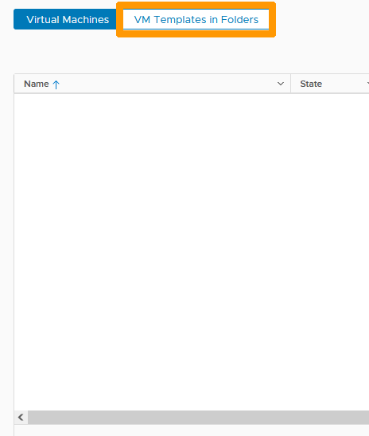
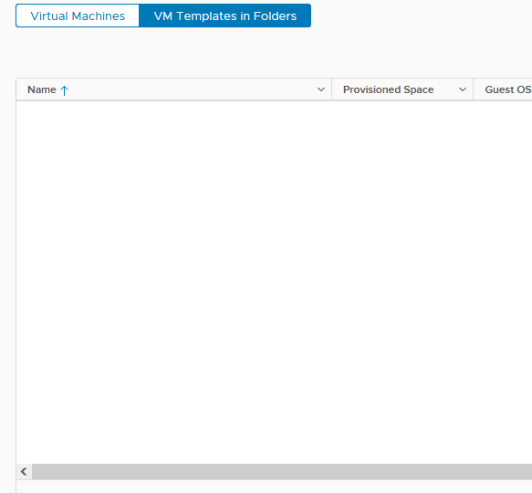
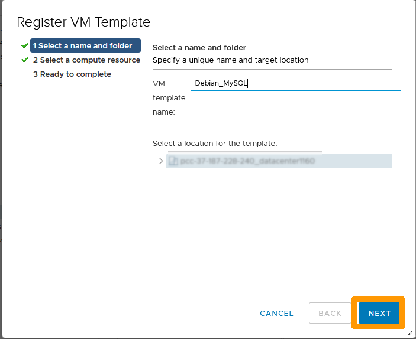
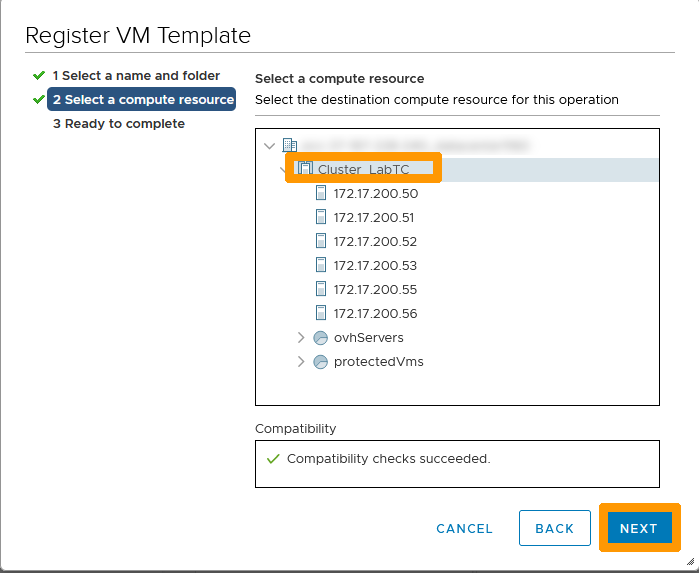
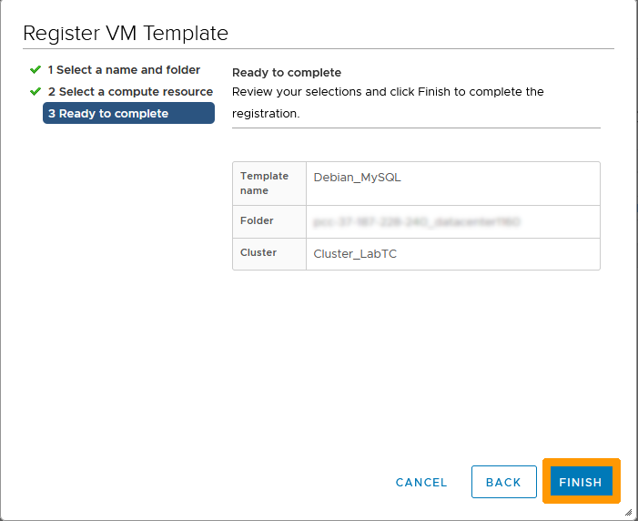

**Dernière mise à jour le 10/01/2023**

> [!warning]
> OVHcloud vous met à disposition des services dont la configuration, la gestion et la responsabilité vous incombent. Il vous appartient donc de ce fait d’en assurer le bon fonctionnement.
>
> Ce guide a pour but de vous accompagner au mieux sur des tâches courantes. Néanmoins, nous vous recommandons de faire appel à un [prestataire spécialisé](https://partner.ovhcloud.com/fr/) si vous éprouvez des difficultés ou des doutes concernant l’administration, l’utilisation ou la mise en place d’un service sur un serveur.
>

## Objectif

Certains stockages ne seront plus disponibles à la fin Mars 2023 car ils ne seront plus maintenus comme indiqué dans ce guide [Cycle de vie du Hosted Private Cloud powered by VMware](https://docs.ovh.com/fr/private-cloud/lifecycle-policy/#datastores-stockage)

Nous allons parcourir l'ensemble des étapes de migration de vos données vers un stockage plus récent et désasctiver votre stockage obsolète.

## Prérequis

- Être contact administrateur de l'infrastructure [Hosted Private Cloud](https://www.ovhcloud.com/fr/enterprise/products/hosted-private-cloud/), afin de recevoir les identifiants de connexion.
- Avoir un identifiant actif dans l'[espace client OVHcloud](https://www.ovh.com/auth/?action=gotomanager&from=https://www.ovh.com/fr/&ovhSubsidiary=fr)
- Avoir un identifiant actif dans vSphere.

## En pratique

### Ajout d'un stockage

Utilisez ce guide pour ajouter un stockage plus important si vous n'avez pas encore souscrit à une offre plus récente [Comment ajouter de l’espace de stockage ?](https://docs.ovh.com/fr/private-cloud/additional-storage/)

### Migration de vos machines virtuelles et des modèles de machines virtuelles

Allez dans votre interface vCenter et vérifiez les machines virtuelles qui se trouvent sur chacun de vos datastore obsolètes.

Cliquez sur l'icône de `stockage`{.action}, choisissez à gauche votre `Datastore`{.action} dans `Shared Storage`{.action},cliquez sur l'onglet `VM`{.action} et restez sur `Machines virtuelles`{.action} pour faire apparaître les machines virtuelles qui se trouvent sur ce stockage obsolète.

{.thumbnail}

Faites un clic-droit sur chacunes des `machines virtuelles`{.action} qui se trouvent sur ce datastore, choisissez `Migrer`{.action} et aidez
-vous de ce guide [VMware Storage vMotion](https://docs.ovh.com/fr/managed-bare-metal/vmware-storage-vmotion-new/#finaliser-le-vmotion) pour effectuer la migration vers un datastore plus récent.

{.thumbnail}

Lorsque vous n'aurez plus de machines virtuelles dans l'onglet, rendez-vous sur `Modèle de VM dans des dossiers`{.action} pour afficher les modèles enregistrés sur votre *datastore*.

{.thumbnail}

Faites un clic droit sur chacun des `modèles`{.action} enregistrés dans votre *datastore* et cliquez sur `Supprimer de l'inventaire`{.action}.

> [!warning]
> Le modèle est supprimé de l'inventaire mais se trouve toujours dans le *datastore*, vous pouvez le récuperer pour le remettre sur un autre datastore ou le supprimer si vous n'en avez plus besoin.
>

{.thumbnail}

La liste des modèles est vide, vous pouvez maintenez déplacez vos modèles sur un autre datastore.

{.thumbnail}

Allez sur l'onglet `Fichiers`{.action}, positionnez-vous sur un `dossier d'un modèle`{.action} et cliquez sur `Déplacez vers`{.action}.

{.thumbnail}

Choisissez un `Datastore`{.action} et cliquez sur `OK`{.action}.

{.thumbnail}

Attendez que la tâche soit terminée.

{.thumbnail}

Choisissez le Datastore de destination du modèle à gauche, allez dans le `Dossier du modèle`{.action}, sélectionnez le `fichier du modèle`{.action} et cliquez sur  `Enregistrer une VM`{.action}.

{.thumbnail}

Cliquez sur `Suivant`{.action}.

{.thumbnail}

Cliquez à nouveau sur `Suivant`{.action}.

{.thumbnail}

Cliquez sur `FINISH`{.action}.

{.thumbnail}

Allez dans l'onglet `VM & modèles`{.action}. pour faire apparaitre votre modèle.

{.thumbnail}

### Suppression du stockage de votre cluster VMware

Dès que vous n'aurez plus de données sur votre stockage il sera alors possible de supprimer votre *datastore*.

Aidez-vous de ce guide pour supprimer votre stockage obsolète [Supprimer un datastore](https://docs.ovh.com/fr/private-cloud/suppression-data-store/)

> [!warning]
> Après avoir supprimé votre *Datastore* il faudra aller dans votre espace client pour arrêter la souscription à ce service.
>

## Aller plus loin

Échangez avec notre communauté d'utilisateurs sur <https://community.ovh.com>.
