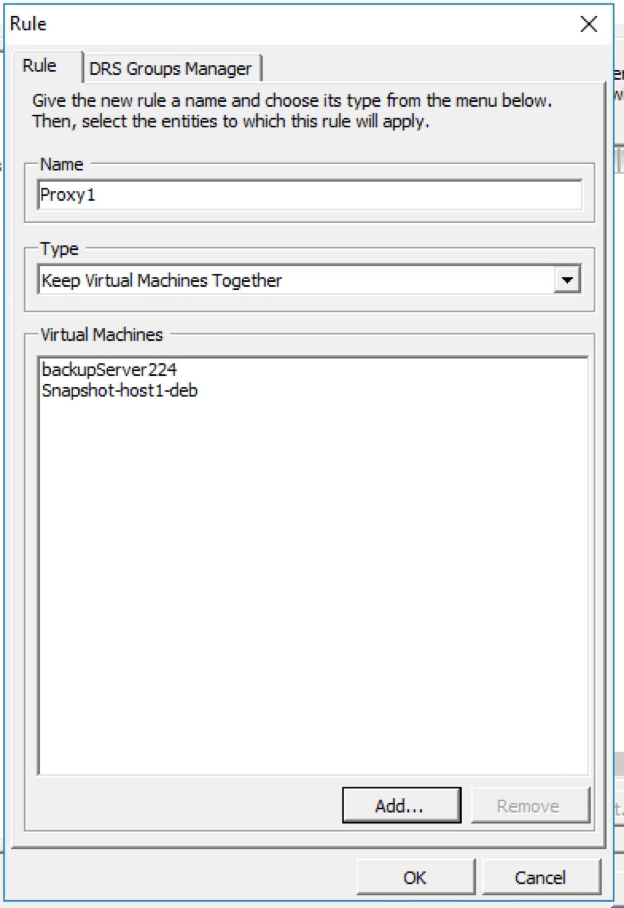
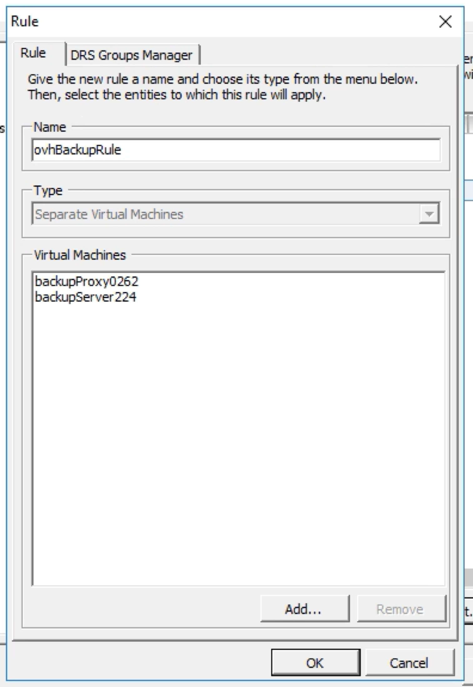
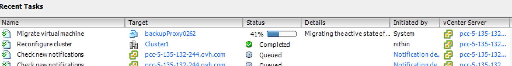

**Last updated 13th November 2018**

## Objective

During the backup process, you may experience a freeze (approx. 30 seconds) or disk lock when deleting the VM snapshot in the NFS datastore.

This disk lock happens because the VMDK snapshot is mounted on the backup proxy, which works on a different host.

This problem will not occur if the virtual machine and the backup proxy are located on the same host.

**This guide will show you how to to implement a bypass solution, using the VMware DRS mechanism.**

## Requirements

- a [Private Cloud](https://www.ovh.co.uk/private-cloud/){.external} solution
- the [Veeam Managed Backup](https://www.ovh.co.uk/private-cloud/options/veeam.xml){.external} option enabled
- access to the vSphere management interface

## Instructions

### Limitations of this solution.

Please note the following before you begin this process:

- In large environments, creating multiple DRS rules can be time-consuming.
- The user must manually add the new VMs into the DRS rules.
- Any VMs that need to be backed up, but are not part of the DRS rules, may still experience freezes.

### Implementing the solution.

To implement this solution, right-click on the relevant cluster, then modify the settings.

Create a DRS rule to **"Keep virtual machines together"** and add VMs with a backup proxy. If you have a large number of VMs to backup, you can create multiple DRS rules, and link them with multiple backup proxies. The OVH algorithm will ensure that the virtual machine backup process is performed by whichever backup proxy is present on the same ESXi host as the VM.

> [!warning]
>
> Adding a new backup proxy will result in an additional cost.
>

In the DRS section, you can add a rule as follows:

{.thumbnail}

Create another DRS rule to **"Separate virtual machines"**, in order to keep backup proxies on different hosts:

{.thumbnail}

Create a VM group, enter the group name, and add the host to this rule:

{.thumbnail}

Note that you must have an anti-affinity rule, so that backup proxies are never on the same host, and as many affinity rules as you have backup proxies.

## Go further

Join our community of users on <https://community.ovh.com/en/>.