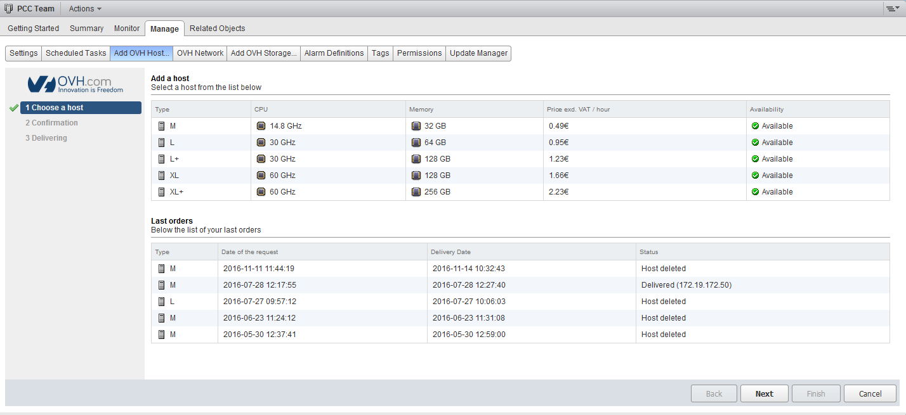
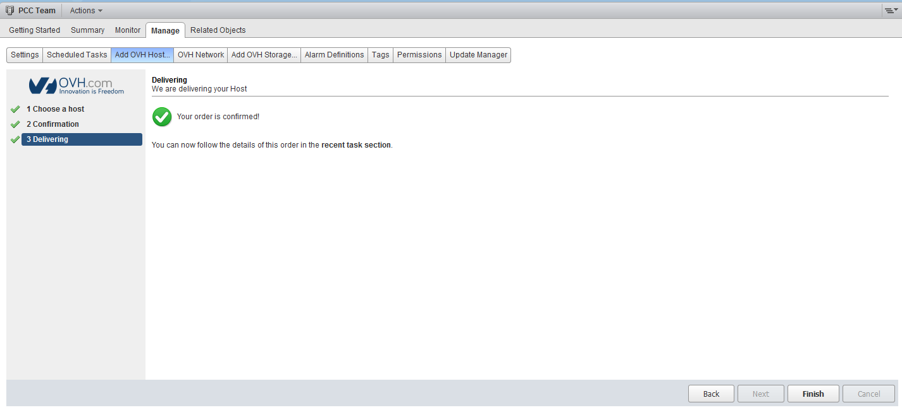
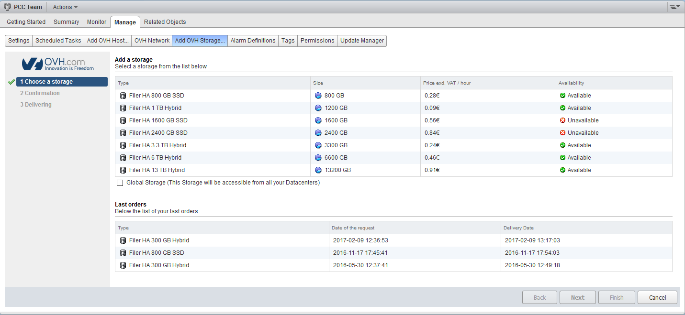
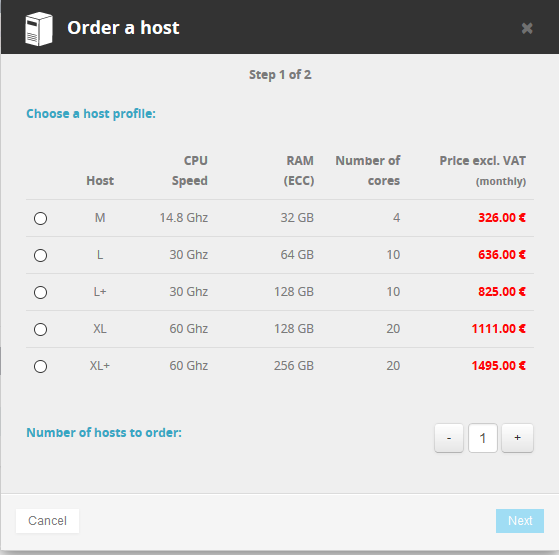
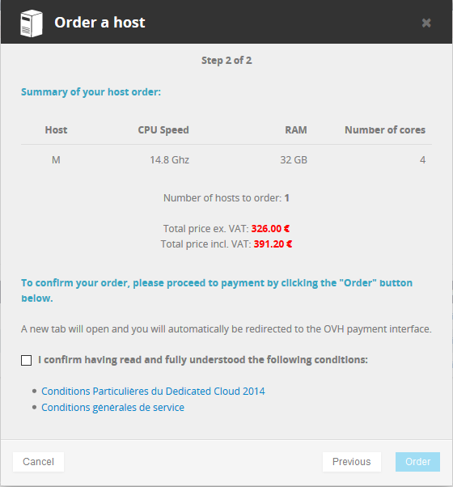
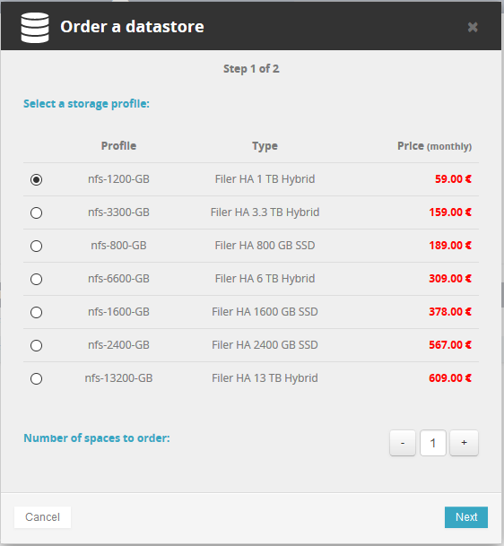
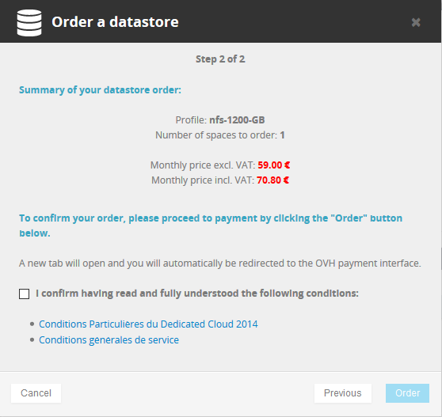
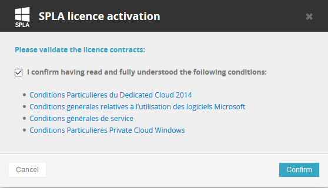
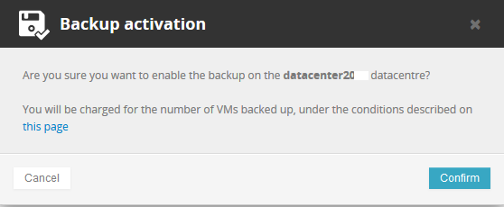

**Dernière mise à jour le 14/02/2019**

## Objectif

L'offre Private Cloud dispose de deux types de facturation (horaire et mensuelle) pour le renouvellement et la commande de ressources supplémentaires.
**Ce guide explique le fonctionnement**

## Facturation de l'infrastructure

La facturation de l'offre Private Cloud s'effectue le premier de chaque mois et de manière automatique.

Lors du renouvellement, un prélèvement est effectué, sur votre compte OVH, renouvelant votre offre pour un mois. A partir de ce point, trois cas sont possibles :

- Votre compte OVH n'est pas crédité, mais vous avez un moyen de paiement renseigné dans votre compte OVH. Une dette sera créée le premier du mois, et elle sera remboursée automatiquement quelques jours plus tard par prélévement sur votre moyen de paiement.

- Votre compte OVH est déjà crédité, il sera débité le premier jour du mois, aucune dette ne sera créée.

- Votre compte OVH n'est pas crédité et vous n'avez pas de moyen de paiement renseigné, dans ce cas vous devrez réaliser un paiement avant le 9 du mois, sinon, votre infrastructure aura son réseau coupé.

Si votre compte est crédité mais pas suffisamment, une dette sera créée correspondant au montant restant. Si un moyen de paiement est enregistré le premier cas s'appliquera, sinon le dernier cas s'appliquera.

## Commande de l'infrastructure

Lorsque vous passez une nouvelle commande, vous vous acquittez d'un mois complet de location de l'infrastructure. Après 1 mois de location, une facture au prorata sera établie afin d'aligner la date de renouvellement au 1er du mois.

### Exemple :

Vous commandez votre infrastructure le 20 mai, votre offre sera créée le 20 mai et expirera le 20 juin.Le 20 juin, vous aurez une facture au prorata qui couvrira la période du 21 au 30 juin, et votre offre aura sa date d'expiration au 1er juillet. Il sera ensuite renouvelé tout les premiers de chaque mois comme expliqué ci-dessus.

## Ressources horaires

Dans votre client vSphere, vous avez la possibilité de commander des ressources (hôtes et datastores) à l'heure, à travers les onglets `Add OVH Host` et `Add OVH Storage`.

### Facturation horaire

La facturation de ces ressources horaires intervient sur la facture du mois suivant.

#### Exemple :

Si vous commandez un hôte le 25 du mois et que vous le supprimez le 29, vous verrez sur la facture du mois suivant la consommation horaire de cet hôte.

Si vous conservez cet hôte le mois suivant, vous verrez également la consommation depuis le 25 et la facturation horaire repartira à zéro le premier du mois.

Si vous conservez un hôte, en facturation horaire tout un mois, le coût horaire sera capé au prix mensuel.

### Commande d'hôte

Sur votre client vSphere, en vous rendant dans l'onglet `Add OVH Host`, vous verrez les différents types d'hôtes compatibles avec votre infrastructure.

Vous retrouverez le récapitulatif de leurs ressources CPU/RAM, leurs disponibilités en temps réel et le prix à l'heure.

Un peu plus bas, vous trouverez un second tableau avec l'historique de vos hôtes.

{.thumbnail}

En cliquant sur "next", vous arriverez sur le récapitulatif et la demande de confirmation de votre commande.

{.thumbnail}

Après avoir cliqué une nouvelle fois sur "next", la commande s'effectuera, vous pourrez ensuite cliquer sur le bouton `finish`{.action} pour revenir à la première page de cet onglet.

{.thumbnail}

### Commande de datastore

La commande de datastore est similaire à celle des hôtes. Rendez-vous dans votre client vSphere, puis sur l'onglet `Add OVH Storage`. Vous retrouverez une liste présentant les datastores compatibles avec votre infrastructure, leur taille, leur disponibilité en temps réel et leur prix à l'heure.

{.thumbnail}

La case `Global Storage` vous permet de rendre le datastore accessible depuis tous les datacentres de votre Private Cloud.

Si vous avez plusieurs datacentres dans votre infrastructure, le datastore sera accessible depuis chacun d'entre eux. Toutefois, il ne pourra pas être utilisé sur plusieurs infrastructures Private Cloud distinctes.

## Ressources mensuelles

La commande de ressources mensuelles se fait depuis l'espace client OVH dans l'onglet `datacenter`{.action} de votre Private Cloud.

## Facturation mensuelle

La facturation mensuelle reprend le même principe que la facturation de l'infrastructure.

La commande d'une ressource mensuelle sera toujours pour un mois, et un prorata sera fait sur la facturation du mois suivant.

### Exemple :

Si vous commandez une ressource le 5 juin, elle aura une date d'expiration au 5 juillet. Lors du renouvellement automatique, le 1er juillet, un prorata sera effectué, et vous payerez la période du 6 au 31 juillet.Elle reprendra ensuite la même facturation que l'infrastructure parente.

### Commande d'hôte

Dans votre espace client OVH, vous pouvez commander un hôte, en cliquant sur le bouton `Commander un host`{.action}, cette fenêtre s'ouvrira, vous laissant le choix des hôtes possibles dans votre infrastructure, avec les ressources CPU/RAM et le prix mensuel HT.

Vous pouvez en commander plusieurs à la fois.

{.thumbnail}

En cliquant sur suivant, vous aurez un résumé de la commande, et vous serez invité à accepter les conditions d'utilisation du service.

{.thumbnail}

Un bon de commande sera édité, et une fois payé, la livraison pourra débuter.

### Commande de datastore

La commande de datastore est en tout point similaire à la commande d'hôtes.

Dans votre espace client OVH, les différents types de datastores seront présents sur la fenêtre ouverte en cliquant sur `Commander un datastore`{.action}.

{.thumbnail}

Puis la confirmation.

{.thumbnail}

Dans l'espace client OVH, il n'y a pas d'indication de disponibilité. Si une ressource n'est pas disponible, la commande restera en attente et de ce fait la période de location ne débutera qu'à la livraison de la ressource.

## Licences Windows

Depuis votre espace client OVH, vous pouvez activer les licences SPLA, afin de [déployer des machines virtuelles Windows, avec une licence OVH](https://docs.ovh.com/fr/private-cloud/deploiement-template-ovh/){.external-link}.

Après avoir cliqué sur le bouton `Activer le SPLA`{.action}, la fenêtre suivante s'ouvrira :

{.thumbnail}

Après avoir confirmé les différentes conditions, vous serez invité a valider un bon de commande gratuit pour que l'option puisse s'activer..

Cette licence sera facturée en début de mois suivant, par rapport aux nombres de machines déployées et allumées dans le mois écoulé.

La facturation se base sur le tableau des tarifs, actualisé au 1er novembre 2016, disponible sur \`cette page de notre site [OVH.com](http://OVH.com){.external-link} &lt;[https://www.ovh.com/fr/private-cloud/options/images-licences.xml&gt;\`\_\_]().

### Exemples :

- Vous avez une infrastructure SDDC, avec deux hôtes L. Sur cette infrastructure, vous démarrez deux machine virtuelles Windows Standard. Dans ce cas, vous serez facturé de 50 € HT (2 x 25 €).

- Vous avez une infrastructure SDDC avec deux hôtes L et deux hôtes XL. Sur cette infrastructure, vous démarrez deux machines virtuelles Windows Standard sur les hôtes L. Au cours du mois, une des machines virtuelles est déplacée sur un hôte XL. Dans ce cas, vous serez facturé de 75€ HT (25 € + 50 €).

- Vous avez une infrastructure Dedicated Cloud avec deux hôtes M. Sur cette infrastructure, vous démarrez 11 machines virtuelles Windows Standard, et vous créez une règle DRS pour que les 11 machines virtuelles soient toujours sur le même host. Dans ce cas, serez facturé de 130 € HT correspondant à une licence "Datacenter"

- Vous avez une infrastructure Dedicated Cloud avec deux hôtes L+. Sur cette infrastructure, vous démarrez trois machines virtuelles Windows Standard et une machine virtuelle Windows Datacenter.

Deux cas peuvent se présenter ici :

1- Les machines virtuelles restent sur le même hôte, dans ce cas, vous serez facturé uniquement de la licence *Datacenter*, soit 260 € HT.

2- Une des machines virtuelles est déplacée sur l'autre hôte, dans ce cas vous serez facturé de la licence *Datacenter* et d'une licence *Standard*, soit 300€ HT (260 € + 40 €).

Une machine virtuelle sera facturée dès son démarrage et pour un mois entier, sans prendre en compte la durée d'utilisation.

## Sauvegarde Veeam

Depuis votre espace client OVH, vous pouvez activer l'option Veeam qui permettra de sauvegarder vos machines virtuelles.

L'activation se fait sur le bouton disponible dans l'onglet `Backup`{.action}. Vous devrez confirmer l'activation sur le fenêtre qui s'ouvrira.

{.thumbnail}

Suite à cela, une machine virtuelle Windows sera déployée sur votre infrastructure avec un coût fixe de 20 € HT, quelle que soit votre gamme et vos types d'hôtes.

Chaque machine virtuelle sauvegardée vous coûtera 10€ HT par mois.

La facturation Veeam est comptabilisée en fin de mois et visible sur la facture du mois suivant.

### Exemple :

Vous ajoutez votre première machine virtuelle à votre sauvegarde le 5 juin.Fin juin, votre sauvegarde sera comptabilisée et vous serez facturé le 1 juillet d'un montant de 30 € HT.

- La facturation Veeam se fait à 10€ HT/VM dès l'activation et le premier du mois. Si vous retirez une machine virtuelle de la sauvegarde dans le courant du mois, elle sera facturée jusqu'a la fin du mois.

- Votre machine virtuelle ajouté le 5 juin est retirée par vos soins le 16 juillet. Fin juillet, votre sauvegarde sera comptabilisée et vous serez facturé le 1er août pour cette machine, mais vous ne le serez plus le 1er septembre.

## Aller plus loin

Échangez avec notre communauté d'utilisateurs sur <https://community.ovh.com>.