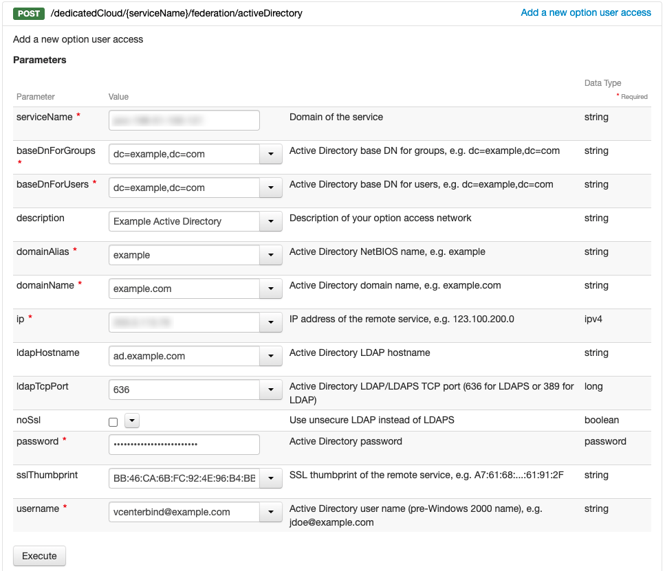
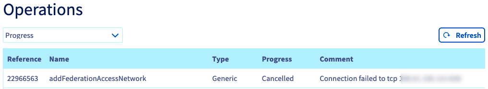
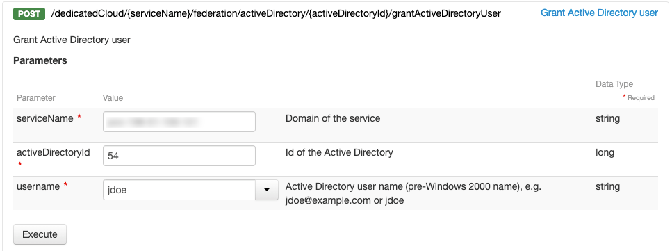
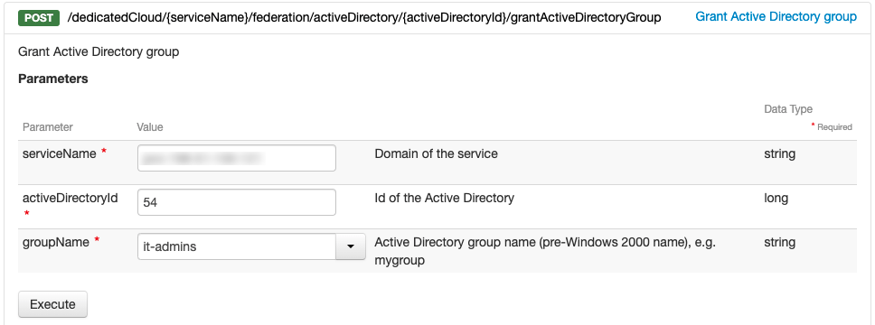

**Last updated 10th February 2022**

## Objective

This guide aims at explaining the details of implementing an Active Directory server as an authentication source on the OVHcloud Hosted Private Cloud.

**Discover how to use your Active Directory server as an authentication source for your vSphere users.**

## Requirements

- A [Hosted Private Cloud offer](https://www.ovhcloud.com/en-ie/enterprise/products/hosted-private-cloud/){.external}.
- An Active Directory service reachable from a public IP address and with a [valid SSL certificate on LDAPS service](https://docs.microsoft.com/en-us/troubleshoot/windows-server/identity/enable-ldap-over-ssl-3rd-certification-authority){.external}.
- A user access on the associated Active Directory with at least read-only access (for LDAPS connection).
- Access to the Hosted Private Cloud vSphere management interface.

## Instructions

### Retrieve needed information

vCenter to Active Directory connection is done using LDAPS protocol exposed by the Active Directory server.

Preparing configuration setup, you need to retrieve the following information:

- Active Directory domain name (FQDN).
- Active Directory domain alias (NetBIOS name).
- Active Directory public IP address.
- Active Directory LDAPS hostname. This is the name used inside the SSL certificate of the LDAPS service, it must resolve to the public IP address of the Active Directory server.
- LDAPS service port (636 by default)
- Base DN (Base Distinguished Name) for users. This is the DN from which users will be searched. For example: dc=example,dc=com
- Base DN (Base Distinguished Name) for groups. This is the DN from which groups will be searched. For example: dc=example,dc=com
- Username and password of a domain user that will be used to connect to the LDAPS server. It must be at least a read-only user on the Active Directory server sections specified on the two "Base DN" fields above. Must be a pre-Windows 2000 username, in the UPN format (user@eample.com).

For more information, you can refer to the [VMware documentation](https://docs.vmware.com/en/VMware-vSphere/6.7/com.vmware.psc.doc/GUID-98B36135-CDC1-435C-8F27-5E0D0187FF7E.html){.external}.

In addition to the previous information, you will need to retrieve the SSL certificate fingerprint (SHA1 Fingerprint) of the Active Directory LDAPS service.

You can retrieve this information with the method of your choice.

- You can use this PowerShell command on the Active Directory server:

```shell
Get-ChildItem -Path Cert:\LocalMachine\MY | Select-Object -property FriendlyName, Subject, NotBefore, NotAfter, @{label='Thumbprint';'Expression'={$_.thumbprint -replace '(..(?!$))','$1:'}}
```

Here, it is the value on the right side of the colon sign:

```shell
> Thumbprint : BB:46:CA:6B:FC:92:4E:96:B4:BB:6E:44:7E:8F:AD:4C:C9:32:AB:AB
```

- You can also use the following OpenSSL command (from a distant Linux/Unix/Mac machine):

```shell
openssl s_client -connect ad.example.com:636 < /dev/null 2>/dev/null | openssl x509 -fingerprint -noout -in /dev/stdin
```

Here, it is the value on the right side of the equal sign:

```shell
> SHA1 Fingerprint=BB:46:CA:6B:FC:92:4E:96:B4:BB:6E:44:7E:8F:AD:4C:C9:32:AB:AB
```

### Allow Active Directory access from the Hosted Private Cloud

Retrieve your Hosted Private Cloud IP address with the method of your choice.

You can use this command on the Active Directory server or any remote Windows machine:

```shell
nslookup pcc-198-51-100-121.ovh.com
```

Here, it is the value at the end of the last line:

```shell
> Address:  198.51.100.121
```

You can alternatively use the following command (from a remote Linux/Unix/Mac machine):

```shell
host pcc-198-51-100-121.ovh.com
```

Here, it is the value at the end of the line:

```shell
> pcc-198-51-100-121.ovh.com has address 198.51.100.121
```

Use the retrieved IP address to allow your Hosted Private Cloud to access the Active Directory LDAPS server (by default on TCP port 636).

This operation can be done on your Active Directory server firewall or your company firewall.

Here is a firewall rule configuration example:

|Remote IP address (source)|Local IP address (destination)|Remote port (source)|Local port (destination)|Protocol|
|---|---|---|---|---|
|198.51.100.121|All addresses|All ports|636|TCP|

Adapt this configuration to your company and apply that rule on your firewall.

### Add your Active Directory server as an authentication source

Setting up an Active Directory as an authentication source is done through the OVHcloud API.

Retrieve your « serviceName » using the following API call:

> [!api]
>
> @api {GET} /dedicatedCloud
>

Then, use the following API call to add your Active Directory server as an authentication source.

You will have to specify information retreived from the previous steps. Do not check the "noSsl" checkbox.

> [!api]
>
> @api {POST} /dedicatedCloud/{serviceName}/federation/activeDirectory
>

{.thumbnail}

Make sure the return operation is successful. You can follow its progress through the [OVHcloud Control Panel](https://www.ovh.com/auth/?action=gotomanager&from=https://www.ovh.ie/&ovhSubsidiary=ie) on your Hosted Private Cloud `Operations`{.action} tab.

> [!primary]
>
> If the provided information is invalid, the operation will be canceled and a message will show the returned error.
>
> {.thumbnail}

### Allow an Active Directory user to access your Hosted Private Cloud

You can allow an Active Directory user to access your Hosted Private Cloud through the OVHcloud API.

Retrieve your « activeDirectoryId » using the following API call:

> [!api]
>
> @api {GET} /dedicatedCloud/{serviceName}/federation/activeDirectory
>

Then, use the following API call to allow an Active Directory user to access your Hosted Private Cloud.

You will have to specify the "pre-Winows 2000" username as it is inside your Active Directory.

> [!api]
>
> @api {POST} /dedicatedCloud/{serviceName}/federation/activeDirectory/{activeDirectoryId}/grantActiveDirectoryUser


{.thumbnail}

Make sure the return operation is successful. You can follow its progress through the [OVHcloud Control Panel](https://www.ovh.com/auth/?action=gotomanager&from=https://www.ovh.ie/&ovhSubsidiary=ie) on your Hosted Private Cloud `Operations`{.action} tab.<br>
If the provided information is invalid, the operation will be canceled and a message will show the returned error.

Once allowed, the user and its permissions will be manageable directly from you OVHcloud Control Panel as any other Hosted Private Cloud user.

> [!primary]
>
> By default, the user does not have any permission on your Hosted Private Cloud. It will be able to connect to your Hosted Private Cloud but it will not have any access. You can adjust the permissions from the OVHcloud Control Panel.
>

### Allow an Active Directory group to access your Hosted Private Cloud

You can allow directly an Active Directory user set (group) to access your Hosted Private Cloud through the OVHcloud API.

Retrieve your « activeDirectoryId » using the following API call:

> [!api]
>
> @api {GET} /dedicatedCloud/{serviceName}/federation/activeDirectory
>

Then, use the following API call to allow an Active Directory group to access your Hosted Private Cloud.

You will have to specify the "pre-Winows 2000" group name as it is inside your Active Directory.

> [!api]
>
> @api {POST} /dedicatedCloud/{serviceName}/federation/activeDirectory/{activeDirectoryId}/grantActiveDirectoryGroup


{.thumbnail}

Make sure the return operation is successful. You can follow its progress through the [OVHcloud Control Panel](https://www.ovh.com/auth/?action=gotomanager&from=https://www.ovh.ie/&ovhSubsidiary=ie) on your Hosted Private Cloud `Operations`{.action} tab.<br>
If the provided information is invalid, the operation will be canceled and a message will show the returned error.

Once allowed, the group and its permissions will be manageable directly from your OVHcloud Control Panel as any other Hosted Private Cloud user.

> [!primary]
>
> By default, the group does not have any permission on your Hosted Private Cloud. Its members will be able to connect to your Hosted Private Cloud but they will not have any access. You can adjust the permissions from the OVHcloud Control Panel.
>

## Go further

Join our community of users on <https://community.ovh.com/en/>.
