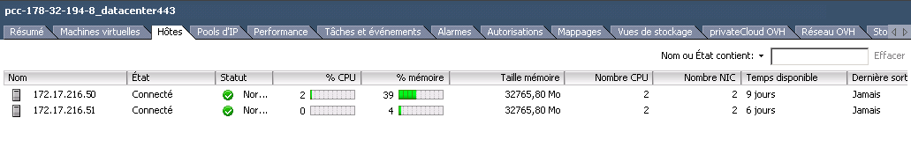
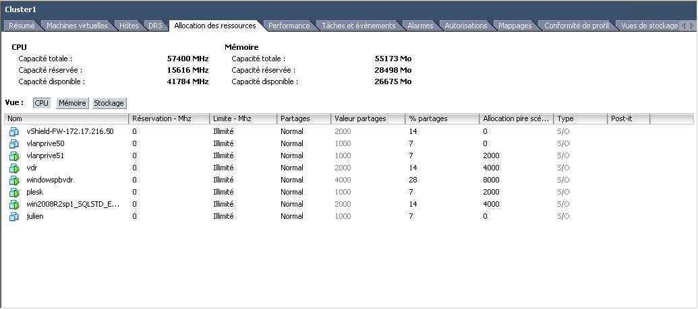
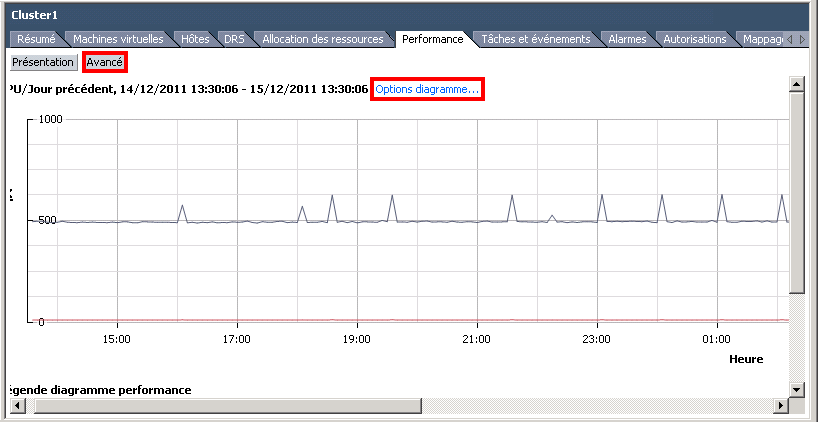
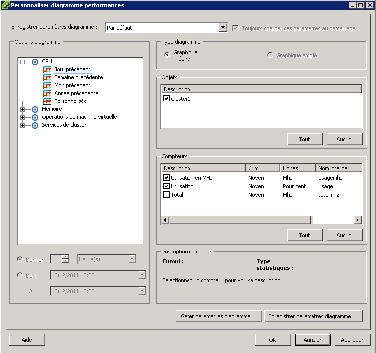
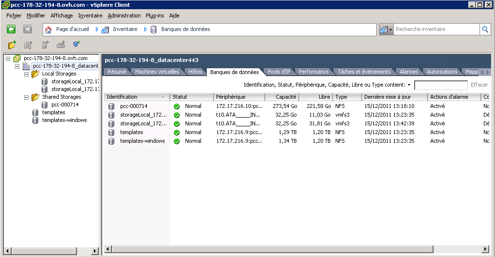

## 
Here, we can see how to monitor the resources of your Private Cloud.
You must use the vSphere Client, or access it by using your own client installed on your machine, or by using the RDP connection that we provided you when you activated your PCC.

## On the Hosts
You can get an overview of your host resources by visiting your PCC, then on the host tab:

{.thumbnail}

## On a cluster or on a pool of resources.
You can see all the information resources for your PCC by going to the tab "Resource Allocation".
Here, you will find all available resources: RAM, CPU, storage space. This view allows you to isolate any abnormal load, caused by a VM on one of the hosts or on a virtual datacentre. You can set disk access limits (I/O) for your storage. You can also give priority to each of your VMs, but also manage the limits of your resources for your VM, to prevent certain VMs from monopolising too many resources and degrade the overall performance. Furthermore, it's also possible to manage resources for a VM pool.

{.thumbnail}

## Resource graphics for your hosts or clusters
On the "Performance" tab, you will find the graphics to install on your cluster or host:

{.thumbnail}
You can use the "Advanced" button then the "Chart Option" to customise all the graphics.
You can select the time range to display, or even the type of graphics to do more precise analysis of this data:

{.thumbnail}
Customising the graphics:

{.thumbnail}

## On your storage
By visiting the Datacentre section, then on the datastore (or database) tab, you will see all your storage. You can monitor the space used on your entire infrastructure:

{.thumbnail}

