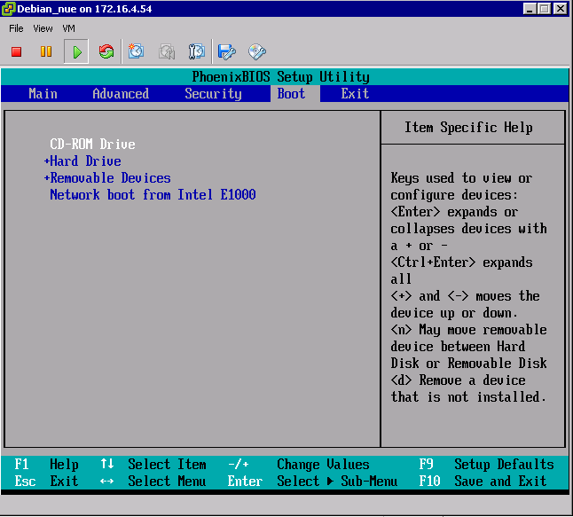
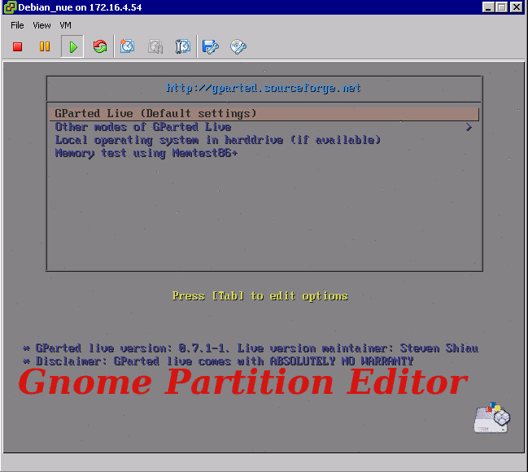
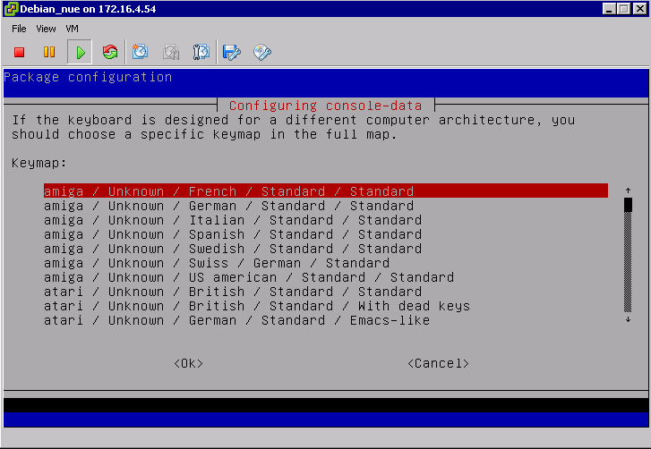
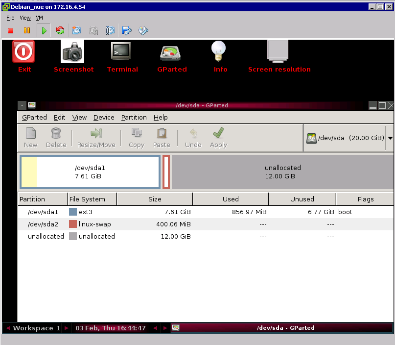

## 
Before proceeding with this type of operation, we recommend you backup your data or clone the virtual machine.

## For Linux
For Linux distributions. You must use a repartitioning utility. There are several ways to do this:

- [7tools Partition Manager](http://www.7tools.com/pm/index.htm)
- [DFSee](http://www.dfsee.com/dfsee/index.php)
- [EASEUS Partition Manager](http://www.partition-tool.com)
- [GParted LiveCD](http://gparted.sourceforge.net/livecd.php)
- [Partition Logic](http://partitionlogic.org.uk)
- [Paragon Partition Manager](http://www.partition-manager.com)
- [Ranish Partition Manager](http://www.ranish.com/part)
- [System Rescue CD](http://www.sysresccd.org/Main_Page)

For this guide, we opted for GParted, you can find it in the templates that we offer in .iso format.

You now have three methods to boot from the GParted Live CD.

- When starting the VM, when the VMware progress bar appears, press "Esc" to go to the boot order, and select "CD-Rom".
- To achieve this each time, you can change the display time of the VMware bar in "Options" then "Boot Option", then increase the value of the "Power On Boot Delay" in the settings of your VM.
- Still in the Properties, in the  "Options" tab in "Boot Options", check "Force BIOS setup". Once you have validated it, reboot your VM. After updating the disk, go to the CD properties of your VM and select the .iso GParted file.

You must also enable the "Connect at power on" option.
Once in the "Boot" section of the BIOS, and using the arrow keys go to the CD-ROM reader and the "+" key on the keyboard to highlight the hard drive. Thus, your VM will boot using the GParted CD:

{.thumbnail}
Now go to "Exit". Select "Exit Saving Changes" and validate:

{.thumbnail}
You are now on the boot page of GParted. Validate the GParted Live option:

{.thumbnail}
Now select the keyboard and the language that you are using:

{.thumbnail}
You are now on the GParted graphic interface:

{.thumbnail}
First you must move your swap. Click on it and select "resize". Then, enter "0" in "Free space following (MiB)".
Now select the partition you want to enlarge and click "resize". Increase the partition using the arrow next to the free space until you get the desired size.
So far, nothing has changed in your disk. You must now apply the changes by clicking "Apply". All tasks defined above are now updated.
You can now validate the end of operations, and perform a reboot of your VM with a double click on "Exit".
Your VM will reboot. Your OS will use all the new space that you have allocated.

## For Windows
You must use the Windows Disk Manager. Go to "Server Manager", then "Storage" and "Disk Management". On our disk 0 with the C: volume, 20GB of space is now available. Right-click on the C: volume and choose "Extend Volume ...".
Now specify the space you want to add. In our case, we will allocate all available space. Then confirm the operation.
All disk space is now well assigned to your C: drive

## WARNING!
OVH accepts no liability for any eventual damage to the integrity of your data when using one of these utilities.

